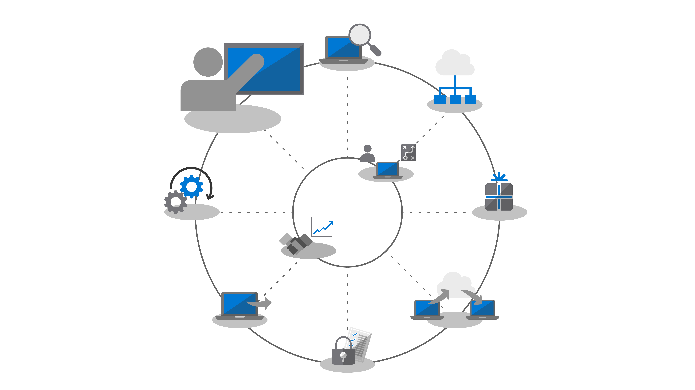
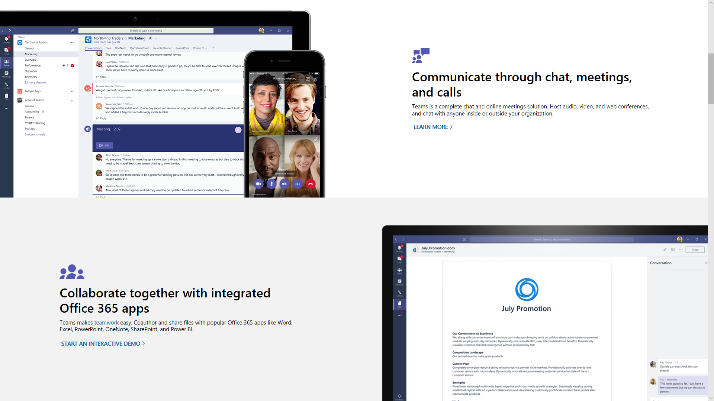
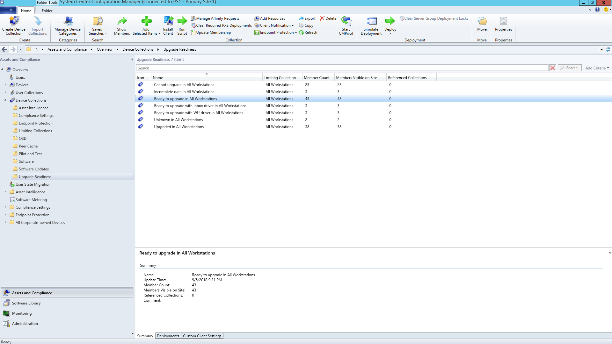

# Step 8: User Communications and Training

<table>
<thead>
<td></td>
<td>
<strong>Step 8: User Communication and Training</strong>

Make sure your users are informed about new experiences and new ways of working as you shift your PCs to Windows 10 and Microsoft 365 Apps for enterprise. Learn how to take advantage of user adoption assistance with Microsoft FastTrack, training materials and communication templates, as well as new ways to monitor user acceptance and usage.
</td>
<td></td>
</thead>
</table>

>[!NOTE]
>User Communications and Training is the eighth step in our recommended deployment process wheel by covering tips and recommendations to inform and prepare users. To see the full desktop deployment process, visit the [Desktop Deployment Center](https://aka.ms/HowToShift).
>

Informing and preparing your users for modern workplace experiences spanning Office 365, Windows 10, and new security and compliance controls with Azure Active Directory is critical to driving adoption. The trick here is to figure out how to introduce updates -- when some users may fear disruptions to their productivity or changes in their workflow, or if they have to learn new things.

The good news is if you are moving from Windows 7 and Office 2010 or Office 2013, there will be a lot of people familiar with Windows 10 and newer versions of Office running on their personal devices, and all this will help reduce the impact of change.

## Getting ready for new experiences

Starting with Office, if you're deploying Microsoft 365 Apps for enterprise for the first time, this is when you can communicate the benefits of signing in to Office apps and saving files to OneDrive or SharePoint locations to enable easier sharing, reduce file branching and enable real-time co-authoring.

Detailed communication and training templates are available for these and other local or browser-based apps, like Teams and Planner.

We also give guidance for new in-app capabilities like attaching OneDrive linked files in Outlook or using the new Morph slide transitions and Designer features in PowerPoint.

For Windows 10, we help you to familiarize your users with optional and default capabilities like Windows Hello to log in securely using biometrics, Start updates to personalize your Windows experience, Timeline to easily get back to what you were working on, Cortana and more.

There are also visible security and compliance controls that your users may be exposed to. Enterprise Mobility + Security which comprises Azure AD and Microsoft Intune, integrates additional capabilities with Windows 10 and Office 365 that you can target for your desktop upgrade.

[Microsoft Enterprise Mobility + Security](https://www.microsoft.com/cloud-platform/enterprise-mobility-security)

For example, if you've enabled Multi-factor Authentication, this uses Azure AD --and protects user sign-in to resources by leveraging a phone app or PIN to securely access services. And Azure Information Protection makes it easy for users to classify and label documents.

[Set up multi-factor authentication for users](https://support.office.com/article/set-up-multi-factor-authentication-for-office-365-users-8f0454b2-f51a-4d9c-bcde-2c48e41621c6)

These are just a handful of new capabilities that will be experienced by your users and some may catch them by surprise – either in a positive or less positive way. And these surprises – especially if they alter the normal work flow – can result in more calls and tickets for you or your helpdesk.

## Proactive Preparation and Measured Roll-outs

To help minimize the risk associated with changes in the user experience, we recommend two complementary approaches:

  - Proactive communication to your users so they know what to expect

  - Use of deployment rings to control the rate of deployment

### Phased Deployment

Phased deployment using deployment rings is the concept of starting with small groups then broadened deployment scale in a measured way over time. Normally by the time a communication and training plan is drafted, these rings and their members should be formed. This way, you can reduce potential risk and validate your approach as you continually open the deployment valve, or pause activities if needed, for example, when you see more helpdesk calls come in than expected.

Deployment rings are best created in cooperation with business units and their managers. You'll want an understanding of critical dates and times to avoid when deploying or making changes. Without careful planning and buy-in from stakeholders, it will be difficult to get users on-board and comfortable with any changes coming their way.

### Phase 1: The IT Team and Early Adopter Insiders 

It's usually best to begin your deployment with the IT team and enthusiastic early adopters, who volunteer for early access. With these "insiders" you can test your communications, the impacts of change and the effectiveness of your communications and training. During this phase, IT runs small pilots, learns troubleshooting and automation techniques to help during broader deployment phases.

It's important to have engaged members in the initial pilot phase, to make sure they are documenting their observations and feeding back to the process. Also, it's good to have champions outside the IT team that help extend organic, word-of-mouth communication of new capabilities, and they'll often be first line of support when users in later phases need help.

### Phase 2: Pilot 

Once you feel good about the first phase, you can target a larger set of users for your second, pilot phase. This should comprise a representative mix of user roles, device types, Windows apps and Office add-ins. The data returning from these groups will be used via Analytics to target the initial waves for phase 3, the broader deployment.

Remember, all PCs in this phase and future phases should be logging up to the Analytics service, so you can collect diagnostic data about device and app health as well as bandwidth savings from Delivery Optimization and use of Windows Hello login.

For this phase it is especially important to communicate changes and help users take advantage of new capabilities. Users can often de-prioritize or ignore email or other communications coming from IT – so it helps to meet with management to get their help in communicating change and drive adoption of new tools and technology.

You'll also need their input on timeframes to avoid, so you can minimize user disruption – for example the finance team may be particularly sensitive at the end of fiscal quarters or product development teams during a product launch.

In parallel to planning for devices, users, departments and timing, you can start to build your communication and training plans, as well as begin compiling content or engaging outside resources to help train users.

#### Microsoft FastTrack 

To help your effort in pulling together training content, you can access a comprehensive set of short, video-based training with step-by-step instructional guidance on the Microsoft FastTrack Productivity Library.

[Microsoft FastTrack Productivity Library](https://www.microsoft.com/microsoft-365/success/?rtc=2)

There are hundreds of topics, based on what's important to your organization, including: creating more impactful content, sharing sites and content, transforming teamwork and unlocking productivity with modern devices.

Also, if you are using Microsoft 365 or Office 365, there is good chance that you're eligible for help with driving user adoption via Microsoft's FastTrack service. Representatives guide you through adoption best practices as you go through the Microsoft 365 – Windows, Office and EMS – rollout process.

#### Microsoft IT Showcase 

Microsoft's IT Showcase series is another great resource for Windows 10 deployment-related content. It includes timelines and schedules, digital promotion templates, email templates and Intranet content. These are based on materials used for Microsoft's own deployment of Windows 10 and has been modified for any organization to use.

[Preparing your organization for a seamless Windows 10 deployment](https://www.microsoft.com/itshowcase/windows10deployment)

These components and services together can be fine-tuned during the pilot phase. And as you start to realize what's resonating with users on the training side of things, which devices to target and via Analytics and which devices or user groups to avoid or delay, you can begin to broaden your deployment in later phases using a data- and experience-driven approach.

As your pilot expands, you'll want to document and publish frequently asked questions and self-service content to help proactively reduce support tickets and helpdesk activities.

### Phase 3 and beyond: Broad Production deployment 

By the time you reach broad deployment phases, you'll have refined your processes, communication, training and self-service tools. Now you can use the diagnostic data collected to target more and more PCs.

Deploy at a rate that is manageable to your IT department, help desk, users and network capacity. You can always go back to Step 2 in the deployment process wheel to optimize your network even further using peer to peer cache, LEDBAT and other techniques to facilitate faster transfer of deployment-related data.

In addition to the diagnostic data that you monitor via the analytics tools, you can also monitor Office 365 and Microsoft 365 service usage in a granular way with detailed usage reports in by workload in the admin center and using the admin dashboards via Power BI. These are great tools to help set and track goals as you roll-out new tools for working together – like Microsoft Teams – or new ways to share files – like OneDrive.

New technology acceptance and adoption will go on long after every PC in your organization has Windows 10 and Microsoft 365 Apps for enterprise installed. And users won't necessarily change how they work – without taking the time to inform and train them of new capabilities. Finally, with the new servicing models providing new capabilities on an ongoing semi-annual schedule for Windows and optionally a monthly schedule for Office, communication will be continual.

## Previous Step 

## [Step 7: Windows and Office Servicing](https://aka.ms/mdd7)
