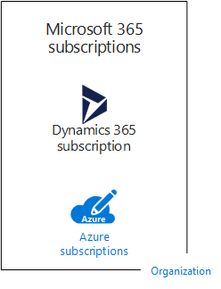
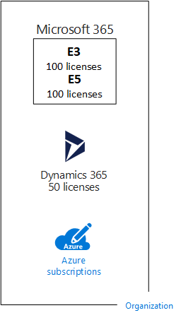
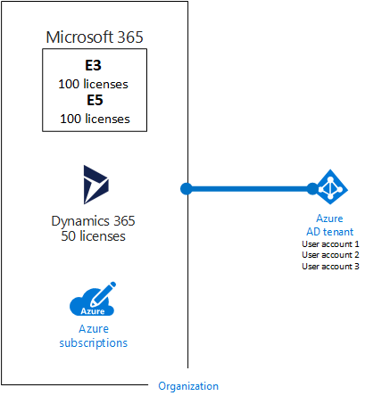
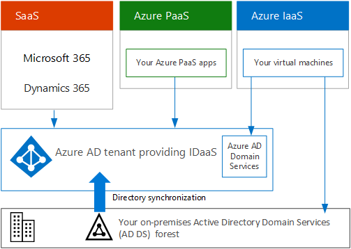

# Subscriptions, licenses, accounts, and tenants for Microsoft's cloud offerings

Microsoft provides a hierarchy of organizations, subscriptions, licenses, and user accounts for consistent use of identities and billing across its cloud offerings:
  
- Microsoft 365 and Microsoft Office 365
- Microsoft Azure
- Microsoft Dynamics 365

## Elements of the hierarchy

Here are the elements of the hierarchy:
  
### Organization

An organization represents a business entity that is using Microsoft cloud offerings, typically identified by one or more public Domain Name System (DNS) domain names, such as contoso.com. The organization is a container for subscriptions.
  
### Subscriptions

A subscription is an agreement with Microsoft to use one or more Microsoft cloud platforms or services, for which charges accrue based on either a per-user license fee or on cloud-based resource consumption.

- Microsoft's Software as a Service (SaaS)-based cloud offerings (Microsoft 365 and Dynamics 365) charge per-user license fees. 
- Microsoft's Platform as a Service (PaaS) and Infrastructure as a Service (IaaS) cloud offerings (Azure) charge based on cloud resource consumption.

You can also use a trial subscription, but the subscription expires after a specific amount of time or consumption charges. You can convert a trial subscription to a paid subscription.
  
Organizations can have multiple subscriptions for Microsoft's cloud offerings. Figure 1 shows a single organization that has multiple Microsoft 365 subscriptions, a Dynamics 365 subscription, and multiple Azure subscriptions.

**Figure 1: Example of multiple subscriptions for an organization**

  
### Licenses

For Microsoft's SaaS cloud offerings, a license allows a specific user account to use the services of the cloud offering. You are charged a fixed monthly fee as part of your subscription. Administrators assign licenses to individual user accounts in the subscription. For the example in Figure 2, the Contoso Corporation has a Microsoft 365 E5 subscription with 100 licenses, which allows to up to 100 individual user accounts to use Microsoft 365 E5 features and services.
  
**Figure 2: Licenses within the SaaS-based subscriptions for an organization**

>[!Note]
>A security best practice is to use separate user accounts that are assigned specific roles for administrative functions. These dedicated administrator accounts do not need to be assigned a license for the cloud services that they administer. For example, a SharePoint administrator account does not need to be assigned a Microsoft 365 license.
>

For Azure PaaS-based cloud services, software licenses are built into the service pricing.
  
For Azure IaaS-based virtual machines, additional licenses to use the software or application installed on a virtual machine image might be required. Some virtual machine images have licensed versions of software installed and the cost is included in the per-minute rate for the server. Examples are the virtual machine images for SQL Server 2014 and SQL Server 2016.
  
Some virtual machine images have trial versions of applications installed and need additional software application licenses for use beyond the trial period. For example, the SharePoint Server 2016 Trial virtual machine image includes a trial version of SharePoint Server 2016 pre-installed. To continue using SharePoint Server 2016 after the trial expiration date, you must purchase a SharePoint Server 2016 license and client licenses from Microsoft. These charges are separate from the Azure subscription and the per-minute rate to run the virtual machine still applies.
  
### User accounts

User accounts for all of Microsoft's cloud offerings are stored in a Microsoft Entra tenant, which contains user accounts and groups. A Microsoft Entra tenant can be synchronized with your existing Active Directory Domain Services (AD DS) accounts using Microsoft Entra Connect, a Windows server-based service. This is known as directory synchronization.
  
Figure 3 shows an example of multiple subscriptions of an organization using a common Microsoft Entra tenant that contains the organization's accounts.
  
**Figure 3: Multiple subscriptions of an organization that use the same Microsoft Entra tenant**

  
### Tenants

For SaaS cloud offerings, the tenant is the regional location that houses the servers providing cloud services. For example, the Contoso Corporation chose the European region to host its Microsoft 365, EMS, and Dynamics 365 subscriptions for the 15,000 workers in their Paris headquarters.
  
Azure PaaS services and virtual machine-based workloads hosted in Azure IaaS can have tenancy in any Azure datacenter across the world. You specify the Azure datacenter, known as the location, when you create the Azure PaaS app or service or element of an IaaS workload.
  
A Microsoft Entra tenant is a specific instance of Microsoft Entra ID containing accounts and groups. Paid or trial subscriptions of Microsoft 365 or Dynamics 365 include a free Microsoft Entra tenant. This Microsoft Entra tenant does not include other Azure services and is not the same as an Azure trial or paid subscription.
  
### Summary of the hierarchy

Here is a quick recap:
  
- An organization can have multiple subscriptions.

  - A subscription can have multiple licenses.

  - Licenses can be assigned to individual user accounts.

  - User accounts are stored in a Microsoft Entra tenant.

Here is an example of the relationship of organizations, subscriptions, licenses, and user accounts:
  
- An organization identified by its public domain name.

  - A Microsoft 365 E3 subscription with user licenses.

    A Microsoft 365 E5 subscription with user licenses.

    A Dynamics 365 subscription with user licenses.

    Multiple Azure subscriptions.

  - The organization's user accounts in a common Microsoft Entra tenant.

Multiple Microsoft cloud offering subscriptions can use the same Microsoft Entra tenant that acts as a common identity provider. A central Microsoft Entra tenant that contains the synchronized accounts of your on-premises AD DS provides cloud-based Identity as a Service (IDaaS) for your organization.
  
**Figure 4: Synchronized on-premises accounts and IDaaS for an organization**

  
Figure 4 shows how a common Microsoft Entra tenant is used by Microsoft's SaaS cloud offerings, Azure PaaS apps, and virtual machines in Azure IaaS that use Microsoft Entra Domain Services. Microsoft Entra Connect synchronizes the on-premises AD DS forest with the Microsoft Entra tenant.
  
## Combining subscriptions for multiple Microsoft cloud offerings

The following table describes how you can combine multiple Microsoft cloud offerings based on already having a subscription for one type of cloud offering (the labels going down the first column) and adding a subscription for a different cloud offering (going across the columns).
  
||**Microsoft 365**|**Azure**|**Dynamics 365**|
|:-----|:-----|:-----|:-----|:-----|
|**Microsoft 365**   |NA    |You add an Azure subscription to your organization from the Azure portal.    |You add a Dynamics 365 subscription to your organization from the Microsoft 365 admin center.    |
|**Azure**   |You add a Microsoft 365 subscription to your organization.    |NA    |You add a Dynamics 365 subscription to your organization.    |
|**Dynamics 365**   |You add a Microsoft 365 subscription to your organization.    |You add an Azure subscription to your organization from the Azure portal.    |NA    |

An easy way to add subscriptions to your organization for Microsoft SaaS-based services is through the admin center:
  
1. Sign in to the Microsoft 365 admin center ([https://admin.microsoft.com](https://admin.microsoft.com)) with your **User Admin** account.

2. From the left navigation of the **Admin center** home page, click **Billing**, and then **Purchase services**.

3. On the **Purchase services** page, purchase your new subscriptions.

The admin center assigns the organization and Microsoft Entra tenant of your Microsoft 365 subscription to the new subscriptions for SaaS-based cloud offerings.
  
To add an Azure subscription with the same organization and Microsoft Entra tenant as your Microsoft 365 subscription:
  
1. Sign in to the Azure portal ([https://portal.azure.com](https://portal.azure.com)) with your Microsoft 365 **Microsoft Entra DC admin** account.

2. In the left navigation, click **Subscriptions**, and then click **Add**.

3. On the **Add subscription** page, select an offer and complete the payment information and agreement.

If you purchased Azure and Microsoft 365 subscriptions separately and want to access the Microsoft 365 Microsoft Entra tenant from your Azure subscription, see the instructions in [Add an existing Azure subscription to your Microsoft Entra tenant](/azure/active-directory/fundamentals/active-directory-how-subscriptions-associated-directory).

## See also

[Microsoft cloud for enterprise architects illustrations](../solutions/cloud-architecture-models.md)
  
[Architectural models for SharePoint, Exchange, Skype for Business, and Lync](architectural-models-for-sharepoint-exchange-skype-for-business-and-lync.md)
  
[Hybrid solutions](hybrid-solutions.md)

## Next step

[Assessing Microsoft 365 network connectivity](assessing-network-connectivity.md)
