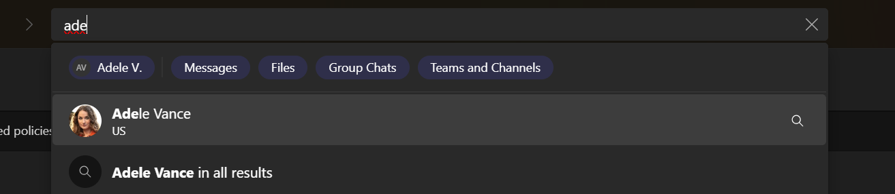

# Synchronize users in multitenant organizations in Microsoft 365

For users in your tenant to be able to collaborate with those in other tenants, you must synchronize your users to the other tenants.

There are two ways to set up user synchronization:

- Share your users with other tenants in a multitenant organization by using the Microsoft 365 admin center (covered in this article)
- [Configure user synchronization in Microsoft Entra ID](/azure/active-directory/multi-tenant-organizations/cross-tenant-synchronization-configure)

Both methods use cross-tenant synchronization in Microsoft Entra ID.

If you want to synchronize the same users with all the other tenants in a multitenant organization, we recommend sharing users in the Microsoft 365 admin center. This creates the necessary configurations in Microsoft Entra ID for you.

If you want to synchronize different users to different tenants or use Entra groups to determine which users are in scope for provisioning, then you must configure cross-tenant synchronization directly in Microsoft Entra ID.

While you can create multiple cross-tenant synchronization configurations for a single external tenant, we recommend that you only use one for ease of administration.

If you already have B2B member users synchronized with tenants that are part of the MTO, those users will immediately become MTO members upon MTO formation.

> [!NOTE]
> It might take up to 24 hours for synced users to be available in Microsoft 365 services such as Teams and SharePoint.

For more information about cross-tenant synchronization, see [What is cross-tenant synchronization?](/azure/active-directory/multi-tenant-organizations/cross-tenant-synchronization-overview).

If you have issues with user synchronization check the [provisioning logs in Microsoft Entra ID](/azure/active-directory/reports-monitoring/concept-provisioning-logs).

## User property synchronization

When you set up user synchronization with another tenant in a multitenant organization, the following user properties are synchronized:

|Property|Property|
|:-------|:-------|
|accountEnabled|physicalDeliveryOfficeName|
|alternativeSecurityIds|postalCode|
|city|preferredLanguage|
|country|showInAddressList|
|department|state|
|displayName|streetAddress|
|employeeId|surname|
|givenName|telephoneNumber|
|IsSoftDeleted|userPrincipalName|
|jobTitle|UserType (member)|
|mailNickname|manager|

You can change the properties that are synchronized after the synchronization has been configured. For more information, see [Configure cross-tenant synchronization](/azure/active-directory/multi-tenant-organizations/cross-tenant-synchronization-configure#step-9-review-attribute-mappings).

#### Profile card experience

The [profile card](https://support.microsoft.com/office/e80f931f-5fc4-4a59-ba6e-c1e35a85b501) is a feature that allows users to view information about another user, such as email, phone number, and office location. It's available in most Microsoft 365 apps like Teams, Outlook, SharePoint and Viva Engage. Users in multitenant organizations can see information about users in other tenants that are part of the multitenant organization. What users can see depends on what data is being synchronized between the tenants. (Note that some properties [require additional configuration](/entra/identity/multi-tenant-organizations/cross-tenant-synchronization-overview#attributes) to be displayed.)

The [new Teams desktop client](/microsoftteams/new-teams-desktop-admin) fetches some data directly from the other tenants in the multitenant organization to create a richer experience. In a multitenant organization, when a user looks at the profile card for a user in another tenant in Teams, the name, contact information, and job information is available in 1:1 chats and shared channels without the need for property synchronization to be configured. (These properties are retrieved by Microsoft Entra cross-tenant access and Teams external access.) To see these properties elsewhere in Teams, such as channels, group chats, and chats with guest accounts, you need to include them as part of user synchronization.

In a multitenant organization, the profile picture is always available and is retrieved from the user's home tenant.

For the most consistent profile card experience, keep in mind the following:

- Don't change property values as they're synced, or users will see different values in different tenants.
- [LinkedIn account connections](/entra/identity/users/linkedin-integration) configurations may vary across tenants.

## Users synchronized to your tenant from other tenants

Users synchronized to your tenant from other tenants in your multitenant organization are synchronized as [Microsoft Entra members rather than guests](/azure/active-directory/external-identities/user-properties).

As members, people from other tenants have a more seamless collaboration experience. This includes access to files using [*people in your organization* sharable links](/sharepoint/shareable-links-anyone-specific-people-organization). (Consider using [sensitivity labels](/purview/sensitivity-labels) if you need to limit who can access a file with a *people in your organization* link.)

If some people from the other tenant already have guest accounts in your directory, the synchronization process doesn't change their user type to member by default. You can change these users' user type to member by [updating the user properties in Microsoft Entra ID](/azure/active-directory/fundamentals/how-to-manage-user-profile-info) or updating your cross-tenant synchronization configuration mappings in [Microsoft Entra ID](/entra/identity/multi-tenant-organizations/cross-tenant-synchronization-configure#step-9-review-attribute-mappings) to support converting from guest to member at scale.

## Set up initial user synchronization for a multitenant organization

> [!IMPORTANT]
> Microsoft recommends that you use roles with the fewest permissions. Using lower permissioned accounts helps improve security for your organization. Global Administrator is a highly privileged role that should be limited to emergency scenarios when you can't use an existing role.

To synchronize identities to other tenants in a multitenant organization:

1. Sign in to the [Microsoft 365 admin center](https://admin.microsoft.com) as a global administrator.
1. Expand **Settings** and select **Org settings**.
1. On the **Organization profile** tab, select **Multitenant collaboration**.
1. Select **Share users**.
1. Select **Select users to share**.
1. Select **Save**.
1. Select **Yes** to confirm.

This creates a cross-tenant synchronization configuration in Microsoft Entra ID for each tenant in your multitenant organization. The synchronization configurations are named *MTO_Sync_\<TenantID\>*.

## Set up user synchronization with newly added tenants

If you add additional tenants to your multitenant organization, you need to set up user synchronization with those tenants.

> [!IMPORTANT]
> Microsoft recommends that you use roles with the fewest permissions. Using lower permissioned accounts helps improve security for your organization. Global Administrator is a highly privileged role that should be limited to emergency scenarios when you can't use an existing role.

To set up user synchronization with newly added tenants:

1. Sign in to the [Microsoft 365 admin center](https://admin.microsoft.com) as a global administrator.
1. Expand **Settings** and select **Org settings**.
1. On the **Organization profile** tab, select **Multitenant collaboration**.
1. Select **Share users**.
1. Select **Share current user scope**.
1. Select **Yes** to confirm.

## Change which users are synchronized with other tenants

You can change which users are synchronized to other tenants in your multitenant organization.

> [!IMPORTANT]
> Microsoft recommends that you use roles with the fewest permissions. Using lower permissioned accounts helps improve security for your organization. Global Administrator is a highly privileged role that should be limited to emergency scenarios when you can't use an existing role.

To change which users are synchronized to other tenants:

1. Sign in to the [Microsoft 365 admin center](https://admin.microsoft.com) as a global administrator.
1. Expand **Settings** and select **Org settings**.
1. On the **Organization profile** tab, select **Multitenant collaboration**.
1. Select **Share users**.
1. Select **Edit shared users**.
1. Update the users that you want to sync to other tenants and then select **Save**.
1. Select **Yes** to confirm.

This procedure updates the *MTO_Sync_\<TenantID\>* synchronization configurations in Microsoft Entra ID for each tenant in your multitenant organization.

## Set up calendar sharing for tenants in your MTO

Calendar sharing allows users in each multitenant organization (MTO) tenant to view free/busy (time only) calendar availability information.

> [!NOTE]
> Calendar sharing via Multitenant collaboration portal is currently not available in Microsoft 365 GCC, GCC High, DoD, or Microsoft 365 China (operated by 21Vianet).
> [!IMPORTANT]
> Microsoft recommends that you use roles with the fewest permissions. Using lower permissioned accounts helps improve security for your organization. Global Administrator is a highly privileged role that should be limited to emergency scenarios when you can't use an existing role.

To manage free/busy calendar sharing for tenants in your MTO:

1. Sign in to the [Microsoft 365 admin center](https://admin.microsoft.com) as a global administrator.
1. Expand **Settings** and select **Org settings**.
1. On the **Organization profile** tab, select **Multitenant collaboration**.
1. Select **Manage settings**.
1. Select **Edit calendar settings** under **Calendar**.
1. Select tenants to enable free/busy calendar sharing.
1. Select **Save changes**.

The calendar sharing feature for MTO utilizes [Organization relationships in Exchange Online](/exchange/sharing/organization-relationships/organization-relationships). The organization relationship will share all users calendar availability and must also be set up by the other tenants in your MTO for free/busy information to be shared.

## Set up MTO user labels in Teams for tenants in your MTO

MTO group admins can now configure an optional label for each tenant that will be displayed alongside MTO synced user's display name in Teams. This allows MTO synced users to be distinguishable within the MTO in Teams interactions.

> _Fig 1: Teams people card shows MTO user label "US"_

> _Fig 2: Teams search experience shows MTO user label “US”_

Only MTO owners can manage the MTO user labels. Label changes may take some time to process and will only apply to active tenants.

> [!IMPORTANT]
> Microsoft recommends that you use roles with the fewest permissions. Using lower permissioned accounts helps improve security for your organization. Global Administrator is a highly privileged role that should be limited to emergency scenarios when you can't use an existing role.

To manage MTO user labels for tenants in your MTO:

1. Sign in to the [Microsoft 365 admin center](https://admin.microsoft.com) as a global administrator.
1. Expand **Settings** and select **Org settings**.
1. On the **Organization profile** tab, select **Multitenant collaboration**.
1. Select **Manage settings**.
1. Select **Edit** under **Tenant label**.
1. Select either:

   1. No label.

   1. Use the multitenant organization name for all tenants.

   1. Custom (assign a label for each tenant, which cannot be blank).

1. Select **Save changes**.

## Related topics

[Troubleshooting tips for multitenant organizations](/azure/active-directory/multi-tenant-organizations/cross-tenant-synchronization-configure#troubleshooting-tips)

[Known issues for provisioning in Microsoft Entra ID](/azure/active-directory/app-provisioning/known-issues?pivots=cross-tenant-synchronization)

[Plan for multitenant organizations in Microsoft 365](plan-multi-tenant-org-overview.md)

[Set up a multitenant org in Microsoft 365](set-up-multi-tenant-org.md)

[Join or leave a multitenant organization in Microsoft 365](join-leave-multi-tenant-org.md)

[Scoping users or groups to be provisioned with scoping filters](/azure/active-directory/app-provisioning/define-conditional-rules-for-provisioning-user-accounts?pivots=cross-tenant-synchronization)
