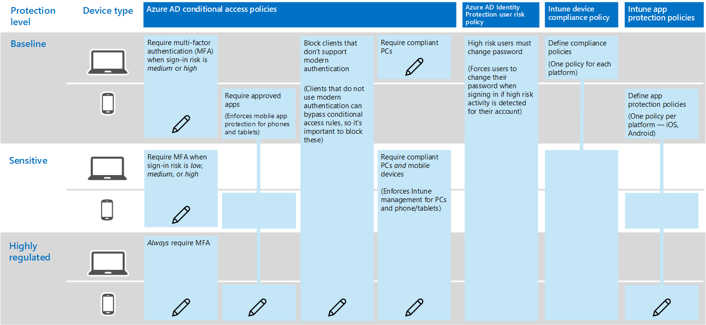

# Policy recommendations for securing Teams chats, groups, and files

This article describes how to implement the recommended identity and device-access policies to protect Teams chats, groups, and content such as files and calendars. This guidance builds on the [Common identity and device access policies](identity-access-policies.md), with additional information that's Teams-specific. Because Teams integrates with our other products, there will be reference out to [Policy recommendations for securing SharePoint sites and files](sharepoint-file-access-policies.md) and [Policy recommendations for securing email](secure-email-recommended-policies.md).

These recommendations are based on three different tiers of security and protection for SharePoint files that can be applied based on the granularity of your needs: baseline, sensitive, and highly regulated. You can learn more about these security tiers, and the recommended client operating systems, referenced by these recommendations in the [Identity and device access configurations](microsoft-365-policies-configurations.md).

Additional recommendations specific to Teams deployment are included in this article, to cover specific authentication circumstances, including for users outside your organization, and you will need to follow this guidance for a complete security experience.

## Updating common policies to include Teams

The following diagram illustrates the set of recommended policies for protecting chat, groups and content in Teams.

If you included SharePoint Online when you created the common policies, you only need to create policy rules around guest and external access, and stuff.

This is a table of rules to follow, it's from a link I'll put in here.

|Protection level|Policies|More information|
|:---------------|:-------|:----------------|
|**Baseline**|[Require MFA when sign-in risk is *medium* or *high*](#require-mfa-based-on-sign-in-risk)| |
|        |[Block clients that don't support modern authentication](#block-clients-that-dont-support-modern-authentication)|Clients that do not use modern authentication can bypass conditional access rules, so it's important to block these|
|        |[High risk users must change password](#high-risk-users-must-change-password)|Forces users to change their password when signing in if high-risk activity is detected for their account|
|        |[Define app protection policies](#define-app-protection-policies)|One policy per platform (iOS, Android, Windows).|
|        |[Require approved apps](#require-approved-apps)|Enforces mobile app protection for phones and tablets|
|        |[Define device compliance policies](#define-device-compliance-policies)|One policy for each platform|
|        |[Require compliant PCs](#require-compliant-pcs-but-not-compliant-phones-and-tablets)|Enforces Intune management of PCs|
|**Sensitive**|[Require MFA when sign-in risk is *low*, *medium* or *high*](#require-mfa-based-on-sign-in-risk)| |
|         |[Require compliant PCs *and* mobile devices](#require-compliant-pcs-and-mobile-devices)|Enforces Intune management for PCs and phone/tablets|
|**Highly regulated**|[*Always* require MFA](#require-mfa-based-on-sign-in-risk)|
| | |

## How these policies work together

Teams can have many layers of access and security ranges from channels that can encompass your entire organization to one on one chats. These policies cover security reliably no matter what you're using Teams for. Please review the following diagram, which shows not just the many things you'll be doing in Teams, but also some of the underlying dependencies on other applications.

## Guest Access

In addition to the policies for users who are internal to your business or organization, guest access can be enabled on a user-by-user basis to allow people who are external to your business or organization to access Teams resources and interact with internal people for things like group conversations, chat, and meetings. You can learn more about this at the following link: [Teams guest access](https://docs.microsoft.com/en-us/microsoftteams/guest-access)

## External Access

External access is sometimes confused with guest access, so it's important to be clear that these two access mechanisms are actually quite different. While guest access occurs on a per-user basis (you add one user at a time), external access allows you to add all the users of an external domain at the same time, but they have less access than an individual who's been added via guest access would have. External access users can chat with your internal users via Teams.

For more reading about external access, and how to implement it, please review [Manage external access in Microsoft Teams](https://docs.microsoft.com/en-us/microsoftteams/manage-external-access)

## Teams and Channels Policies

Teams and channels are two commonly used elements in Microsoft Teams, and there are policies you can put in place to control what users can and cannot do in these locations. While you can create a global team, if your organization is less than 5000 people strong, you are likely to find it helpful to have smaller teams and channels for specific purposes, in-line with your organizational needs.

Custom policies would likely be helpful in that scenario, and you can learn more about them at this link: [Manage teams policies in Microsoft Teams](https://docs.microsoft.com/en-us/microsoftteams/teams-policies).

## Messaging Policies

Messaging, or chat, can also be managed through the default global policy, or through custom policies, and this can help your users communicate with one another in a way that's appropriate for your organization. This information can be reviewed at [Managing messaging policies in Teams](https://docs.microsoft.com/en-us/microsoftteams/messaging-policies-in-teams).

## App Permission Policies

Teams also allows you to use apps in various places, such as channels or personal chats. Having policies around what apps can be added and used, and where, is essential to maintaining a content-rich environment that is also secure.

For more reading about App Permission Policies, check out [Manage app permission policies in Microsoft Teams](https://docs.microsoft.com/en-us/microsoftteams/teams-app-permission-policies).

## Meeting Policies

No discussion of Teams would be complete without planning and implementing policies around Teams meetings.

Please review [Manage meeting policies in Teams](https://docs.microsoft.com/en-us/microsoftteams/meeting-policies-in-teams) for more information.
