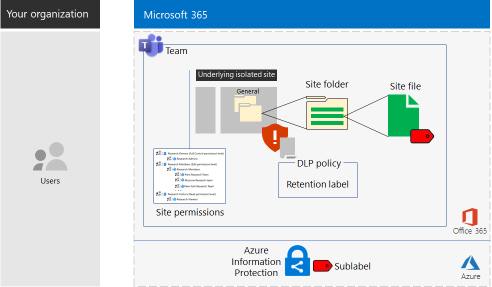

# Microsoft Teams and SharePoint Online sites for highly regulated data

*This scenario applies to both the E3 and E5 versions of Microsoft 365 Enterprise*

Microsoft 365 Enterprise includes a full suite of cloud-based services so that you can create, store, and secure your highly regulated data. This includes data that is:

- Subject to regional regulations.
- The most valuable data for your organization, such as trade secrets, financial or human resources information, and organization strategy.

A Microsoft 365 Enterprise cloud-based scenario that meets this business need requires that you:

- Store digital assets (documents, slide decks, spreadsheets, etc.) in a SharePoint Online team site or in the **Files** tab of a Microsoft Teams team.
- Lock down the site or team to prevent:
   - Access to only a specific set of user accounts through group membership, which includes those who can access the SharePoint Online team site and at what level of permission, and those who can administer it.
   - Members of the site from granting access to others.
   - Non-members of the site from requesting access to the site.
- Configure an Office 365 retention label for your SharePoint Online sites or teams as a default way to define retention policies on the documents in the site or team.
- Block users from sending files outside the organization.
- Encrypt the most sensitive digital assets of the site or team.
- Add permissions to the most sensitive digital assets so that if even if they get shared outside of the site, opening the asset still requires the valid credentials of a user account that has permission.

The following table maps the requirements of this scenario to a feature of Microsoft 365 Enterprise.

|||
|:-------|:-----|
| **Requirement** | **Microsoft 365 Enterprise feature** |
| Store digital assets | SharePoint Online team sites and teams in Office 365 |
| Lock down the site | Azure AD groups and SharePoint Online team site permissions |
| Label the digital assets of the site | Office 365 retention labels |
| Block users when sending files outside the organization | Data Loss Prevention (DLP) policies in Office 365 |
| Encrypt all of the digital assets of the site | Azure Information Protection sub-labels in Enterprise Mobility + Security (EMS) |
| Add permissions to the digital assets of the site | Azure Information Protection sub-labels in EMS |
|||

Here is the configuration for a SharePoint Online site.

This scenario requires that you have already deployed:

- The [Identity](identity-infrastructure.md) phase and steps 1 and 2 of the [Information protection](infoprotect-infrastructure.md) phase of the foundation infrastructure. 
- For highly regulated data in SharePoint Online team sites, [SharePoint Online](sharepoint-online-onedrive-workload.md).
- For highly regulated data in Microsoft Teams teams, [Microsoft Teams](teams-workload.md).

The following phases step you through designing, configuring, and driving adoption for SharePoint Online sites and teams for highly regulated data.

To see how the Contoso Corporation, a fictional but representative multi-national organization, designed a SharePoint Online site for its research teams, see this [example configuration](contoso-sharepoint-online-site-for-highly-confidential-assets.md).

A team for highly regulated data requires that you first create a SharePoint Online team site for highly regulated data. You then create a new team that uses the Office 365 group of the SharePoint Online team site. See Phase 2, Step 4 for more information.

Here is the configuration for a team.

## Identity and device access prerequisites

To protect access to the team or SharePoint Online site, ensure that you have configured [identity and device access policies](identity-access-policies.md) and the [recommended SharePoint Online access policies](sharepoint-file-access-policies.md).

## Phase 1: Design

To create a SharePoint Online site or team for highly regulated data, you must first identify its purpose. For example, the research and development department of a manufacturing organization needs a SharePoint Online site to store current design specifications for existing products and a place to collaborate on new products. Only members of the Research & Development department and selected executives will be allowed to access the site.

That purpose will drive the determination of essential configuration items such as:

- The set of SharePoint Online permission sets and SharePoint groups
- The set of access groups, the Azure AD security groups and their members to add to the SharePoint groups
- The Office 365 retention label to assign to the site and the set of DLP policies for the label
- The settings of an Azure Information Protection sub-label that users apply to highly sensitive digital assets stored in the site

Once determined, you use these settings to configure the site in Phase 2. 

### Step 1: An isolated SharePoint Online site

The locked-down version of a SharePoint Online team site is known as an isolated site. Unlike the default settings of private team sites, isolated sites are configured to prevent:

- Access to those who are not members of specified groups.
- The requesting of access.
- The unauthorized granting of access by current members of specified groups.
- Administration of the site by access group members.

The security of SharePoint Online team sites that contain highly regulated assets do not change unless done by a SharePoint administrator for the site.

See [Design an isolated SharePoint Online team site](https://docs.microsoft.com/office365/enterprise/design-an-isolated-sharepoint-online-team-site) for the details to determine the set of permission levels, SharePoint groups, access groups, and group members.

### Step 2: Office 365 retention labels and DLP policies

When applied to a SharePoint Online team site, Office 365 retention labels provide a default method of classifying all digital assets stored on the site.
 
For SharePoint Online sites for highly regulated data, you need to determine which Office 365 retention label to use.

For the design considerations of Office 365 labels, see [Office 365 classification and labels](https://docs.microsoft.com/office365/securitycompliance/secure-sharepoint-online-sites-and-files#office-365-retention-labels).

To protect sensitive information and prevent its accidental or intentional disclosure, you use DLP policies. For more information, see this [overview](https://docs.microsoft.com/office365/securitycompliance/data-loss-prevention-policies).

For SharePoint Online sites for highly regulated data, you must configure a DLP policy for the Office 365 retention label assigned to the site to block users when they attempt to share digital assets with external users. 

### Step 3: Your Azure Information Protection sub-label

To provide encryption and a set of permissions to your most sensitive digital assets, users must apply an Azure Information Protection label using the Azure Information Protection client. To use Azure Information Protection labels for SharePoint Online sites for highly regulated data, you must configure an Azure Information Protection sub-label in a scoped policy. 

A sub-label exists under an existing label. For example, you can create a Research & Development sub-label under the Highly Confidential label. A scoped policy is one that applies only to a subset of users. For SharePoint Online sites for highly regulated data, the scope is the set of users that are members of the access groups for the site.

The settings of the applied sub-label travel with the asset. Even if it is downloaded and shared outside the site, only authenticated user accounts that have permissions can open it.

### Design results

You have determined the following:

- The set of SharePoint groups and permission levels
- The set of access groups and their members for each permission level
- The appropriate Office 365 retention label and the DLP policy that is associated with the label
- The settings of the Azure Information Protection sub-label that include encryption and permissions

## Phase 2: Configure

In this phase, you take the settings determined in Phase 1 and implement them to create a SharePoint Online site for highly regulated data.

### Step 1: Create and configure an isolated SharePoint Online team site

Use the instructions in [Deploy an isolated SharePoint Online team site](https://docs.microsoft.com/office365/enterprise/deploy-an-isolated-sharepoint-online-team-site) to:

- Create and populate the access groups for each SharePoint permission level used on the site.
- Create and configure the isolated team site.

### Step 2: Configure the site for an Office 365 retention label

Use the instructions in [Protect SharePoint Online files with Office 365 labels and DLP](https://docs.microsoft.com/office365/enterprise/protect-sharepoint-online-files-with-office-365-labels-and-dlp) to:

- Identify or create the Office 365 retention label and apply it to your isolated SharePoint Online site.
- Create and configure the DLP policy that blocks users when they attempt to share a digital asset on your SharePoint Online site outside the organization.

### Step 3: Create an Azure Information Protection sub-label for the site

Use the instructions in [Protect SharePoint Online files with Azure Information Protection](https://docs.microsoft.com/office365/enterprise/protect-sharepoint-online-files-with-azure-information-protection) to: 

- Create and configure an Azure Information Protection sub-label in a scoped policy.
- Deploy the Azure Information Protection client to user computers.

### Step 4 (optional): Create a team for the highly regulated data

If you want a team for highly regulated data, you first create a SharePoint Online site for highly regulated data. When you create the initial private SharePoint Online team site, you specify an Office 365 group name.

After the SharePoint Online site for highly regulated data is fully configured, use these steps to convert it into a team for highly regulated data:

1. Sign in to Office 365.
2. From the **Microsoft Office Home** tab, click **Teams**.
3. From the **Microsoft Teams** tab, in the **Join or create a team** pane, click **Create team**.
4. In the **Create your team** pane, click **Create a team from an existing Office 365 group**.
5. In the list of Office 365 groups, select the name of the Office 365 group corresponding to the SharePoint Online site for highly regulated data, and then click **Choose team**.

The **Files** tab of the new team lists the contents of the **General** folder of the **Documents** area of the corresponding SharePoint Online site. To see the rest of the resources of the SharePoint Online site for the team, click the ellipsis, and then click **Open in SharePoint**.

### Configuration results

You have configured the following:

- A SharePoint Online isolated site
- An Office 365 retention label assigned to the SharePoint Online isolated site
- A DLP policy for the Office 365 retention label
- An Azure Information Protection sub-label of a scoped policy that users can apply to the most sensitive digital assets stored in the site that encrypts the asset and enforces permissions
- If needed, a team for highly regulated data based on the SharePoint Online site

## Phase 3: Drive user adoption

A SharePoint Online site or team for highly regulated data can only protect that data if it is consistently used for storage and access of sensitive digital assets. This is the hardest phase because it relies on users changing their ways. 

For example, executives that are used to storing sensitive files on USB drives or on personal cloud-based storage solutions will now have to store them exclusively in a SharePoint Online site or team for highly regulated data.

### Step 1: Train your users

After completing your configuration, train the set of users who are members of the site access groups:

- On the importance of using the new site or team to protect valuable assets and the consequences of a highly regulated data leak, such as legal ramifications, regulatory fines, ransomware, or loss of competitive advantage.
- How to access the site and its assets.
- How to create new files on the site and upload new files stored locally.
- How the DLP policy blocks them from sharing files externally.
- How to use the Azure Information Protection client to label the most sensitive digital assets with the configured sub-label.
- How the Azure Information Protection sub-label protects an asset even when it is leaked off the site or team.

This training should include hands-on exercises so that the users can experience these operations and their results.

### Step 2: Conduct periodic reviews of usage and files

In the weeks after training, the SharePoint administrator for the SharePoint Online site or team can:

- Analyze usage for the site or team and compare it with usage expectations.
- Verify that highly sensitive files have been properly labeled with the Azure Information Protection sub-label.

Retrain your users as needed.

### User adoption results

Sensitive digital assets are stored exclusively on SharePoint Online sites or teams for highly regulated data and that the most sensitive assets have the configured Azure Information Protection sub-label applied.

## How the Contoso Corporation deployed Microsoft 365 Enterprise

The Contoso Corporation is a fictional but representative global manufacturing conglomerate with its headquarters in Paris, France. See how Contoso designed, configured, and then drove the adoption of a [secure SharePoint Online site](contoso-sharepoint-online-site-for-highly-confidential-assets.md) for their research teams in Paris, Moscow, New York, Beijing, and Bangalore. 

## See also

[Deployment guide](deploy-microsoft-365-enterprise.md)

[Test lab guides](m365-enterprise-test-lab-guides.md)

[Secure SharePoint Online sites in a dev/test environment](https://docs.microsoft.com/office365/enterprise/secure-sharepoint-online-sites-in-a-dev-test-environment)
