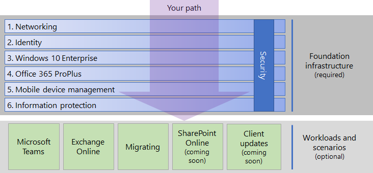

# Enterprise Business Continuity Management (EBCM) with cloud services

As part of your organizations digital transformation, you need to revisit and update your disaster recovery and business continuity plans to account for the business process that depend on Microsoft 365 Cloud services. Microsoft 365 Cloud services, like Exchange Online, SharePoint Online and OneDrive for Business are designed and operated to be highly resilient. Even with this resilience, incidents do occur. When they do, your organization should be prepared and have a well defined business continuity strategy. 

If you haven't updated your plans yet this series of topics helps you to prepare to fail from a known state, to a known state. This means developing a continuity strategy that integrates mitigations and contingency measures.  Defining procedures for operating your business under normal conditions is only partial preparedness. This document highlights key considerations that improve your continuity readiness in the event of a disruption in Microsoft cloud services, third-party provider services, or even your own infrastructure.  

- Microsofts role as a trusted partner.
- What your organization is reponsible for .

ing the considerations that are introduced into your EBCM planning by having cloud service dependencies.

As a trusted partner, Microsft builds cloud services like Exchange Online, SharePoint Online and OneDrive for Business to be highly resilient.   

like Exchange Online, SharePoint Online, and OneDrive for Business among others.

## heading 2

stuff stuff text 

KEEPING SAMPLE OF EXTERNAL LINK [FastTrack for Microsoft 365](https://fasttrack.microsoft.com/microsoft365).

KEEPING SAMPLE OF INTERNAL LINK Deploy the [foundation infrastructure](deploy-foundation-infrastructure.md) 

  KEEPING SAMPLE OF BOLD **If you are a smaller or newer organization**

KEEPING SAMPLE OF BULLETED LIST BELOW
- Deploy key productivity [workloads and scenarios](deploy-workloads.md) on top of your infrastructure. These unlock creativity and teamwork in your organization.

KEEPING SAMPLE OF GRAPHIC INSERT

### Heading 3

KEEPING SAMPLE OF NESTED BULLET LIST

- Construction
  - [Search for data security solution unearths collaborative capabilities of Microsoft 365 at general contracting company](https://aka.ms/Transbluecasestudy)
  - [EMCOR Group transitions to the cloud, constructs intelligent workplace with Microsoft 365](https://aka.ms/EMCOR)
- Consulting
  - [ERM contributes to a more sustainable future with Microsoft 365](https://aka.ms/ERM_CS)
- Energy services
  - [Schlumberger refines global teamwork with Microsoft 365](https://aka.ms/Schlumberger_)
- Engineering
   - [Cadence increases the pace of business with mobile collaboration tools](https://customers.microsoft.com/story/cadence-partner-professional-services-microsoft-365)
- Financial services
  - [TD Bank empowers employees with assistive technology in Office 365 and Windows 10](https://aka.ms/tdbankgroup)
  - [Family tax preparation startup chooses all-in-one solution to help grow business](https://aka.ms/SOSCaseStudy)
- Gaming
  - [Gaming company improves productivity and communications with Microsoft 365 and Surface devices](https://aka.ms/PlaynGO)
  - [Razer plays to win, gains advantage in global gaming industry with Microsoft 365](https://aka.ms/Razer_)
- Health services
  - [Lilly envisions a workplace where internal and external collaboration help enable innovation and accelerate time-to-market for new medicines](https://aka.ms/Eli_CLS)
  - [Healthcare technology innovator accelerates diabetes prevention in the cloud ](https://aka.ms/Soleracasestudy)
  - [Adventist Health System is enhancing healthcare delivery using Microsoft 365](https://aka.ms/adventisthealth)
  - [Abrona accelerates GDPR compliance and increases productivity with Microsoft 365](https://aka.ms/Abrona)
  - [Centra embraces transformation, improves patient care with Microsoft 365 intelligent business tools](https://aka.ms/Centra_Health)
  - [Advocate Aurora Health helps patients live well using Microsoft care coordination solution to enhance collaboration](https://aka.ms/Advocate_)
- Importing
  - [Sales, marketing, and import company increases data security and cuts operating costs with Microsoft 365](https://aka.ms/MvmtGroupNordic)
- Manufacturing
  - [Steel company eliminates hardware costs, streamlines IT, and gains mobile productivity in the cloud](https://aka.ms/Steeledalecasestudy)
  - [Embroidery equipment supplier empowers its business with cloud-based services, spreads word to other small businesses](https://aka.ms/PriorityLLCCaseStudy)
  - [Father and son business shows the world what employees with disabilities can achieve](https://aka.ms/JCSCaseStudy)
  - [Coconut company gains improved mobility, better metrics, and increased productivity by modernizing collaboration tools](https://aka.ms/SilvermillCS)
  - [Thriving Japanese innovator finds future-proof flexibility and enhanced security with Microsoft 365 Business](https://aka.ms/DreamFactoryCaseStudy)
- Non-profit
  - [Move to the cloud saves nonprofit $500,000 while improving security, mobility, and collaboration ](https://aka.ms/MOWCaseStudy)
- Professional services
  - [Boutique business and real estate law firm supports expansion with comprehensive cloud-based platform ](https://aka.ms/Lieserskaffcasestudy)
  - [Sports technology company helps athletes reach their peak through biofeedback and analytics ](https://aka.ms/KMOTIONCasestudy)
  - [Digital transformation and the cloud empower business association to serve its members better ](https://aka.ms/AIMCS)
- Transportation
  - [Qantas empowers employees to do their best work with Microsoft 365, enhancing customer experience](https://aka.ms/Qantas_CS)
  - [Amtrak keeps its mobile enterprise running ahead of schedule with Microsoft 365](https://aka.ms/Amtrak_)
  - [Amtrak is all aboard with workplace modernization, saving labor costs and improving portfolio transparency using Microsoft 365](https://aka.ms/Amtrak_CS)
  

KEEPING SAMPLE OF A NOTE
> [!Note]
> This web page is only available in English.

