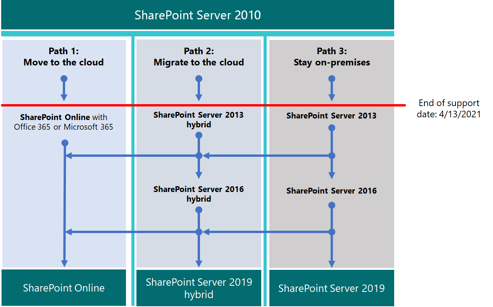
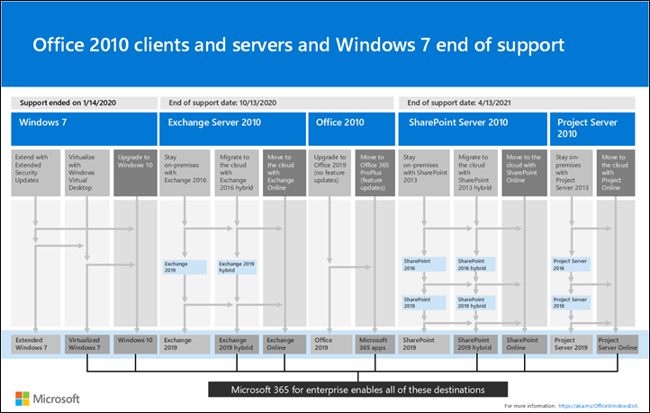

# Upgrading from SharePoint 2010

*This article applies to both Microsoft 365 Enterprise and Office 365 Enterprise.*

Microsoft SharePoint 2010 and SharePoint Server 2010 will reach end of support on **April 13, 2021**. This article provides resources to help you migrate your existing SharePoint Server 2010 data to SharePoint Online in Microsoft 365 or upgrade your on-premises SharePoint Server 2010 environment.

## What is *end of support*?

Most Microsoft products have a support lifecycle, during which they get new features, bug fixes, security fixes, and so on. After the end-of-support date, the product doesn't stop working, but Microsoft no longer provides:

- Technical support for problems that may occur.

- Bug fixes for issues that may impact the stability and usability of the server.

- Security fixes for vulnerabilities that may make the server vulnerable to security breaches.

- Time zone updates.

That means there will be no further updates, patches, or fixes for the product (including security patches/fixes). Microsoft Support will have fully shifted its support efforts to more recent versions.

As the end of support of SharePoint Server 2010 approaches, delete data you no longer need before you upgrade the product and migrate your important data.

> [!NOTE]
> A software lifecycle typically lasts for ten years from the initial release. [Microsoft solution providers](https://go.microsoft.com/fwlink/?linkid=841249) can can help you upgrade to the next version of the software or migrate to Microsoft 365 migration (or both). Make sure you're aware of end-of-support dates for critical underlying technologies as well, particularly for the version of Microsoft SQL Server you're using with SharePoint. For more information, see [Fixed Lifecycle Policy](https://support.microsoft.com/help/14085).

## Plan ahead

Check the dates that support ends on the [Product Lifecycle site](https://support.microsoft.com/lifecycle/search?alpha=SharePoint%20Server%202010). Plan your upgrades or migrations with these dates in mind. Remember that your product *won't stop working* at the date listed. But because your installation will no longer be patched after that date, you'll want to plan a smooth transition to the next version of the product.

This matrix helps plot a course among migration options:

|End of support product|Good |Best|
|---|---|---|
|SharePoint Server 2010|SharePoint Server 2013 (on-premises)|SharePoint Online|
||SharePoint Server 2013 hybrid with SharePoint Online|SharePoint Server 2016 (on-premises)|
|||SharePoint Cloud Hybrid Search|

If you choose an option on the low end of the scale (good), you'll need to start planning for another upgrade soon after your migration from SharePoint Server 2010.

Here are the three paths you can take to avoid the end of support for SharePoint Server 2010.

> [!NOTE]
> End of support for SharePoint Server 2010 and SharePoint Foundation 2010 is currently scheduled for April 13, 2021. But make sure to check the [Product Lifecycle site](https://support.microsoft.com/lifecycle) for the most-current dates.

## What's next?

SharePoint Server 2013 and SharePoint Foundation 2013 can be installed on-premises on your own servers. Or you can use SharePoint Online, which is an online service that's part of Microsoft 365. You can choose to:

- Migrate to SharePoint Online.

- Upgrade SharePoint Server or SharePoint Foundation on-premises.

- Do both of the above.

- Implement a [SharePoint hybrid](/sharepoint/hybrid/hybrid) solution.

Consider the hidden costs of maintaining a server farm, including maintaining or migrating customizations and upgrading hardware. If you've accounted for these factors, it will be easier to upgrade on-premises. If you run your farm on legacy SharePoint Servers without heavy customization, you could benefit from a planned migration to SharePoint Online. For an on-premises SharePoint Server environment, you can also consider moving some data in SharePoint Online to reduce hardware management overhead.

> [!NOTE]
> SharePoint administrators can create a Microsoft 365 Subscription, set up new SharePoint Online sites, and then cut away from SharePoint Server 2010 cleanly, taking only essential documents to the fresh sites. Then, any remaining data can be drained from the SharePoint Server 2010 site into on-premises archives.

|SharePoint Online|SharePoint Server on-premises|
|---|---|
|High cost in time (plan/execution/verification)|High cost in time (plan/execution/verification)|
|Lower cost in funds (no hardware purchases)|Higher cost in funds (hardware purchases)|
|One-time cost in migration|One-time cost repeated per future migration|
|Low total cost of ownership/maintenance|High total cost of ownership/maintenance|

A one-time move to Microsoft 365 will have a higher cost while you organize data and decide what to take to the cloud and what to leave behind. But after your data is migrated, future upgrades will be automatic, as you'll no longer need to manage hardware and software updates. And the up time of your farm will be backed by a [Microsoft service level agreement (SLA)](/office365/servicedescriptions/office-365-platform-service-description/service-level-agreement).

### Migrate to SharePoint Online

Make sure SharePoint Online offers all the features you need. See [SharePoint service description](/office365/servicedescriptions/sharepoint-online-service-description/sharepoint-online-service-description).

You can't migrate directly from SharePoint Server 2010 (or SharePoint Foundation 2010) to SharePoint Online. So much of the migration work is manual. But this stage gives you the opportunity to prune data and sites that are no longer needed before the move. You can archive other data into storage. 

Remember that SharePoint Server 2010 and SharePoint Foundation 2010 won't stop working at end of support. So administrators can have a period when SharePoint is still running if their customers forget to move some of their data.

If you upgrade to SharePoint Server 2013 or SharePoint Server 2016 and decide to put data into SharePoint Online, you might use the [SharePoint Migration API](https://support.office.com/article/Upload-on-premises-content-to-SharePoint-Online-using-PowerShell-cmdlets-555049c6-15ef-45a6-9a1f-a1ef673b867c?ui=en-US&amp;rs=en-US&amp;ad=US) to migrate information into OneDrive for Business.

|SharePoint Online advantage|SharePoint Online disadvantage|
|---|---|
|Microsoft supplies SPO hardware and all hardware administration.|Available features may differ between SharePoint Server on-premises and SPO.|
|You're the SharePoint admin or global admin of your subscription and can assign administrators to SPO sites.|Some actions available to a farm administrator in SharePoint Server on-premises don't exist (or aren't necessary) in the SharePoint Administrator role in Microsoft 365. But SharePoint Administration, Site Collection Administration, and Site Ownership are local to your org.|
|Microsoft applies patches, fixes, and updates to underlying hardware and software, including SQL servers on which SharePoint Online runs.|Because there's no access to the underlying file system in the service, customization is limited.|
|Microsoft publishes [service level agreements](/office365/servicedescriptions/office-365-platform-service-description/service-level-agreement) and moves quickly to resolve service-level incidents.|Backup and restore and other recovery options are automated by the service in SharePoint Online. Backups are overwritten if not used.|
|Security testing and server performance tuning are carried out continuously in the service by Microsoft.|Changes to the user interface and other SharePoint features are installed by the service and may need to be toggled on or off.|
|Microsoft 365 meets many industry standards: [Microsoft compliance offerings](/compliance/regulatory/offering-home).|[FastTrack](https://go.microsoft.com/fwlink/?linkid=518597) assistance for migration is limited.    Much of the upgrade will be manual or via the SPO Migration API described in the [SharePoint Online and OneDrive Migration Content Roadmap](/sharepointmigration/upload-on-premises-content-to-sharepoint-online-using-powershell-cmdlets).|
|Microsoft Support engineers and datacenter employees don't have unrestricted admin access to your subscription.|There can be additional costs if hardware infrastructure needs to be upgraded to support the newer version of SharePoint or if a secondary farm is required for upgrade.|
|Solution providers can help with the one-time job of migrating your data to SharePoint Online.|Not all changes to SharePoint Online are within your control. After migration, design differences in menus, libraries, and other features may temporarily affect usability.|
|Online products are updated automatically across the service. Features may deprecate, but there's no true end of support lifecycle.|There's an end-of-support lifecycle for SharePoint Server or SharePoint Foundation as well as underlying SQL servers.|

If you've decided to create a new Microsoft 365 site and will manually migrate data to it as is needed, check your [Microsoft 365 options](https://www.microsoft.com/microsoft-365/).

### Upgrade SharePoint Server on-premises

As of SharePoint Server 2019, upgrades must go  *serially*. There's no way to upgrade from SharePoint Server 2010 to SharePoint Server 2016 or to SharePoint 2019 directly. Serial upgrade path:

- SharePoint Server 2010 \> SharePoint Server 2013 \> SharePoint Server 2016

It will take time and planning to follow the entire path from SharePoint 2010 to SharePoint Server 2016. Upgrades involve costs for hardware (SQL servers must also be upgraded), software, and administration. Also, customizations may need to be upgraded or even abandoned. Be sure that you document critical customizations before you upgrade your SharePoint Server farm.

> [!NOTE]
> It's possible to maintain your end-of-support SharePoint 2010 farm, install a SharePoint Server 2016 farm on new hardware (so the separate farms run side-by-side), and then plan and execute a manual migration of content (for downloading and re-uploading content, for example). But there are potential pitfalls to these manual moves, such as documents coming from 2010 having a current last-modified account with the alias of the account that does the manual move. And some work must be done ahead of time, such as recreating sites, subsites, permissions, and list structures. Be sure to clean your environment prior to upgrade. Consider what data you can move into storage or no longer need. This can reduce the impact of migration. Be certain your existing farm is functional before you upgrade, and (certainly) before you decommission!

Remember to review the *supported and unsupported upgrade paths*:

- [SharePoint Server 2010](/previous-versions/office/sharepoint-2007-products-and-technologies/cc262747(v=office.12))

- [SharePoint Server 2013](/SharePoint/upgrade-and-update/review-supported-editions-and-products-for-upgrading-to-sharepoint-2013)

If you have *customizations*, it's critical that you plan for each step in the migration path:

- [SharePoint Server 2010](/previous-versions/office/sharepoint-server-2010/cc263203(v=office.14))

- [SharePoint Server 2013](/SharePoint/upgrade-and-update/create-a-communication-plan-for-the-upgrade-to-sharepoint-2013)

|On-premises advantage|On-premises disadvantage|
|---|---|
|Full control of all aspects of your SharePoint Farm (and its SQL), from the server hardware up.|All breaks and fixes are the responsibility of your company. But you can engage paid Microsoft Support if your product isn't past end of support.|
|Full feature set of SharePoint Server on-premises with the option to connect your on-premises farm to a SharePoint Online subscription via hybrid.|Upgrade, patches, security fixes, hardware upgrades, and all maintenance of SharePoint Server and its SQL farm are managed on-premises.|
|Full access for greater customization options than with SharePoint Online.|[Microsoft compliance offerings](/compliance/regulatory/offering-home) must be manually configured on-premises.|
|Security testing and server performance tuning are carried out on your premises under your control.|Microsoft 365 may make features available to SharePoint Online that don't interoperate with SharePoint Server on-premise.|
|Solution providers can help migrate data to the next version of SharePoint Server (and beyond).|Your SharePoint Server sites will not automatically use [SSL/TLS](/SharePoint/security-for-sharepoint-server/enable-tls-1-1-and-tls-1-2-support-in-sharepoint-server-2016) certificates as is seen in SharePoint Online.|
|Full control of naming conventions and backup and restore and other recovery options in SharePoint Server on-premises.|SharePoint Server on-premises is sensitive to product lifecycles.|

### Upgrade resources

Begin by comparing hardware and software requirements. If your current environment doesn't meet basic requirements, you may have to upgrade the hardware in the farm or the SQL servers first. 

You may decide to move some of your sites to the "evergreen" hardware of SharePoint Online. Once you've made your assessment, follow supported upgrade paths and methods.

- *Hardware/software requirements for:*

    [SharePoint Server 2010](/previous-versions/office/sharepoint-server-2010/cc262485(v=office.14)) | [SharePoint Server 2013](/sharepoint/install/hardware-software-requirements-2013) | [SharePoint Server 2016](/SharePoint/install/hardware-and-software-requirements)

- *Software boundaries and limits for:*

    [SharePoint Server 2010](/previous-versions/office/sharepoint-server-2010/cc262787(v=office.14)) | [SharePoint Server 2013](/SharePoint/install/software-boundaries-and-limits) | [SharePoint Server 2016](/sharepoint/install/software-boundaries-limits-2019)

- *The upgrade process overview for:*

    [SharePoint Server 2010](/previous-versions/office/sharepoint-server-2010/cc303420(v=office.14)) | [SharePoint Server 2013](/SharePoint/upgrade-and-update/upgrade-to-sharepoint-server-2016) | [SharePoint Server 2016](/SharePoint/upgrade-and-update/upgrade-to-sharepoint-server-2016)

### Create a hybrid solution with SharePoint Online and SharePoint Server on-premises

A hybrid setup provides the best of both on-premises and online for some migration needs. You can connect SharePoint Server 2013, 2016, or 2019 farms to SharePoint Online to create a SharePoint hybrid: [Learn about SharePoint hybrid solutions](https://support.office.com/article/4c89a95a-a58c-4fc1-974a-389d4f195383.aspx).

If a hybrid SharePoint Server farm is your migration goal, figure what sites and users to move online and which need to remain on-premises. Ranking your SharePoint Server farm content as high, medium, or low impact to your company can help with this decision. You may only need to share user accounts for login and the SharePoint Server search index with SharePoint Online. But this factor may not be clear until you look at how your sites are used. If your company later decides to migrate all your content to SharePoint Online, you can move all remaining accounts and data online and decommission your on-premises farm. Management/administration of the SharePoint farm will be done through Microsoft 365 consoles from that point on.

Be sure to familiarize yourself with the existing types of hybrids and how to configure the connection between your on-premises SharePoint farm and your Microsoft 365 subscription.

|Option|Description|
|---|---|
|[Microsoft compliance offerings](/compliance/regulatory/offering-home).|[FastTrack](https://www.microsoft.com/fasttrack/microsoft-365) assistance for migration is limited.   Much of the upgrade will be manual or via the SPO Migration API described in the [SharePoint Online and OneDrive Migration Content Roadmap](/sharepointmigration/upload-on-premises-content-to-sharepoint-online-using-powershell-cmdlets).|
|Microsoft Support engineers and datacenter employees don't have unrestricted admin access to your subscription.|There may be additional costs if hardware infrastructure needs to be upgraded to support the newer version of SharePoint, or if a secondary farm is required.|
|Partners can assist with the one-time job of migrating your data to SharePoint Online.||
|Online products are updated automatically across the service. Features may deprecate, but there's no true end of support.||

If you've decided to create a new Microsoft 365 site and manually migrate data to it as is needed, check your [Microsoft 365 options](https://www.microsoft.com/microsoft-365/).

### Upgrade SharePoint Server on-premises

There's no way to skip versions in SharePoint Upgrades. That means upgrades go serially:

- SharePoint 2007 \> SharePoint Server 2010 \> SharePoint Server 2013 \> SharePoint Server 2016

To take the entire path from SharePoint 2007 to SharePoint Server 2016 will mean a significant investment of time and will involve hardware (SQL servers must also be upgraded), software, and administration costs. Customizations will need to be upgraded or abandoned, according to the criticality of the feature.

> [!NOTE]
> It's possible to maintain your end-of-life SharePoint 2007 farm, install a SharePoint Server 2016 farm on new hardware (so the separate farms run side-by-side), and then plan and execute a manual migration of content (for downloading and re-uploading content, for example). But there are some drawbacks to these manual moves, such as moves of documents replacing the last modified account with the alias of the account that does the manual move. And much work must be done ahead of time, such as recreating sites, subsites, permissions, and list structures. In any case, consider what data you can move into storage or no longer need to reduce the impact of migration.

Make sure to clean your environment prior to upgrade. Be certain your existing farm is functional before you upgrade, and certainly before you decommission!

Remember to review the *supported and unsupported upgrade paths*:

- [SharePoint Server 2007](/previous-versions/office/sharepoint-2007-products-and-technologies/cc262747(v=office.12))

- [SharePoint Server 2010](/previous-versions/office/sharepoint-2007-products-and-technologies/cc262747(v=office.12))

- [SharePoint Server 2013](/SharePoint/upgrade-and-update/review-supported-editions-and-products-for-upgrading-to-sharepoint-2013)

If you have *customizations*, it's critical to plan your upgrade for each step in the migration path:

- [SharePoint 2007](/previous-versions/office/sharepoint-2007-products-and-technologies/cc263203(v=office.12))

- [SharePoint Server 2010](/previous-versions/office/sharepoint-server-2010/cc263203(v=office.14))

- [SharePoint Server 2013](/SharePoint/upgrade-and-update/create-a-communication-plan-for-the-upgrade-to-sharepoint-2013)

|On-premises pro|On-premises con|
|---|---|
|Full control of all aspects of your SharePoint Farm, from the server hardware up.|All breaks and fixes are the responsibility of your company. (But you can engage paid Microsoft Support if your product isn't past end of support.)|
|Full feature set of SharePoint Server on-premises with the option to connect your on-premises farm to a SharePoint Online subscription via hybrid.|Upgrade, patches, security fixes, and all maintenance of SharePoint Server managed on-premises.|
|Full access for greater customization.|[Microsoft compliance offerings](/compliance/regulatory/offering-home) must be manually configured on-premises.|
|Security testing and server performance tuning is carried out on your premises under your control.|Microsoft 365 may make features available to SharePoint Online that don't interoperate with SharePoint Server on-premises.|
|Partners can help migrate data to the next version of SharePoint Server (and beyond).|Your SharePoint Server sites will not automatically use [SSL/TLS](/SharePoint/security-for-sharepoint-server/enable-tls-1-1-and-tls-1-2-support-in-sharepoint-server-2016) certificates as is seen in SharePoint Online.|
|Full control of naming conventions and backup and restore and other recovery options in SharePoint Server on-premises.|SharePoint Server on-premises is sensitive to product lifecycles.|

### Upgrade resources

Begin by knowing that you meet hardware and software requirements, then follow supported upgrade methods.

- *Hardware/software requirements for*:

    [SharePoint Server 2010](/previous-versions/office/sharepoint-server-2010/cc262485(v=office.14)) | [SharePoint Server 2010](/previous-versions/office/sharepoint-server-2010/cc262485(v=office.14)) | [SharePoint Server 2013](/sharepoint/install/hardware-software-requirements-2013) | [SharePoint Server 2016](/SharePoint/install/hardware-and-software-requirements)

- *Software boundaries and limits for*:

    [SharePoint Server 2007](/previous-versions/office/sharepoint-2007-products-and-technologies/cc262787(v=office.12)) | [SharePoint Server 2010](/previous-versions/office/sharepoint-server-2010/cc262787(v=office.14)) | [SharePoint Server 2013](/SharePoint/install/software-boundaries-and-limits) | [SharePoint Server 2016](/sharepoint/install/software-boundaries-limits-2019)

- *The upgrade process overview for*:

    [SharePoint Server 2007](/previous-versions/office/sharepoint-2007-products-and-technologies/cc303420(v=office.12)) | [SharePoint Server 2010](/previous-versions/office/sharepoint-server-2010/cc303420(v=office.14)) | [SharePoint Server 2013](/SharePoint/upgrade-and-update/upgrade-to-sharepoint-server-2016) | [SharePoint Server 2016](/SharePoint/upgrade-and-update/upgrade-to-sharepoint-server-2016)

### Create a SharePoint hybrid solution between SharePoint Online and on-premises

If the answer to your migration needs is somewhere between the control offered by on-premises and the lower cost of ownership offered by SharePoint Online, you can connect SharePoint Server 2013 or 2016 farms to SharePoint Online through hybrids. [Learn about SharePoint hybrid solutions](https://support.office.com/article/4c89a95a-a58c-4fc1-974a-389d4f195383.aspx)

If you decide that a hybrid SharePoint Server farm will benefit your business, familiarize yourself with the existing types of hybrids and how to configure the connection between your on-premises SharePoint farm and your Microsoft 365 subscription.

You may want to create a Microsoft 365 dev/test environment, which you can set up with [Test Lab Guides](m365-enterprise-test-lab-guides.md). After you get a trial or purchased Microsoft 365 subscription, you can create the site collections, webs, and document libraries in SharePoint Online to which you can migrate data. You can migrate manually, by use of the Migration API, or, if you want to migrate My Site content to OneDrive for Business, through the hybrid wizard.

> [!NOTE]
> To use the hybrid option, your SharePoint Server 2010 farm must first be upgraded on-premises to SharePoint Server 2013 or 2016. SharePoint Foundation 2010 and SharePoint Foundation 2013 don't support hybrid connections with SharePoint Online.

## Summary of options for Office 2010 client and servers and Windows 7

For a visual summary of the upgrade, migrate, and move-to-the-cloud options for Office 2010 clients and servers and Windows 7, see the [end of support poster](../downloads/Office2010Windows7EndOfSupport.pdf).

This poster illustrates the various paths you can take to avoid Office 2010 client and server products and Windows 7 end of support, with preferred paths and option supports in Microsoft 365 Enterprise highlighted.

You can also [download](https://github.com/MicrosoftDocs/microsoft-365-docs/raw/public/microsoft-365/downloads/Office2010Windows7EndOfSupport.pdf) this poster and print it in letter, legal, or tabloid (11 x 17) format.

## Related articles

[Resources to help you upgrade from Office 2007 or 2010 servers and clients](upgrade-from-office-2010-servers-and-products.md)

[Overview of the upgrade process from SharePoint 2010 to SharePoint 2013](/SharePoint/upgrade-and-update/overview-of-the-upgrade-process-from-sharepoint-2010-to-sharepoint-2013)

[Best practices for upgrading from SharePoint 2010 to SharePoint 2013](/SharePoint/upgrade-and-update/best-practices-for-upgrading-from-sharepoint-2010-to-sharepoint-2013)

[Troubleshoot database upgrade issues in SharePoint 2013](/SharePoint/upgrade-and-update/troubleshoot-database-upgrade-issues-in-sharepoint-2013)

[Search for Microsoft solution providers to help with your upgrade](https://go.microsoft.com/fwlink/?linkid=841249)

[Updated Product Servicing Policy for SharePoint 2013](/SharePoint/product-servicing-policy/updated-product-servicing-policy-for-sharepoint-2013)

[Updated Product Servicing Policy for SharePoint Server 2016](/SharePoint/product-servicing-policy/updated-product-servicing-policy-for-sharepoint-server-2016)
