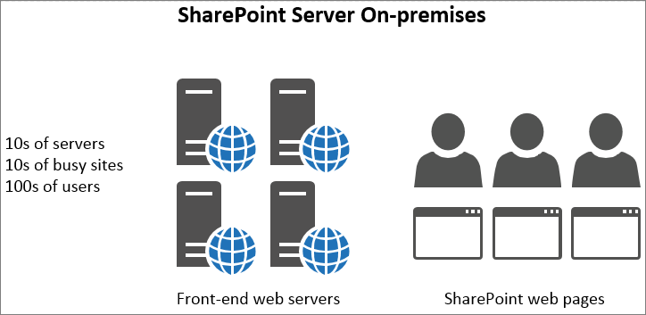
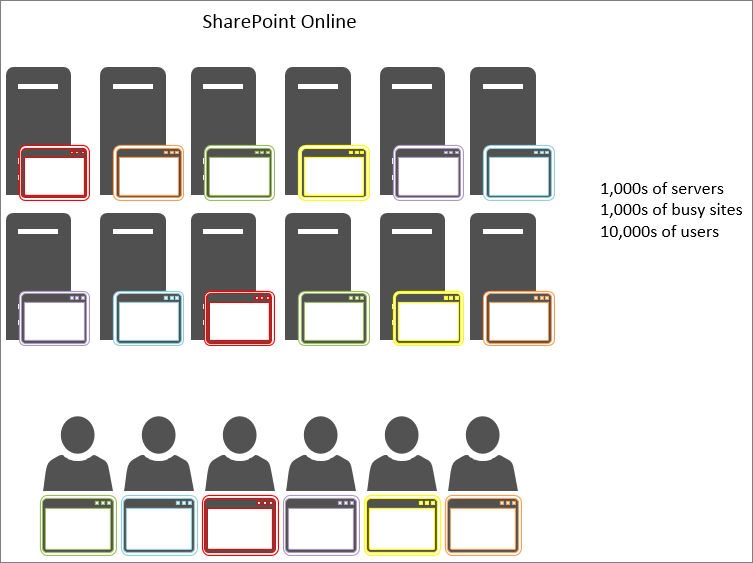

# Using the object cache with SharePoint

This article explains the difference between using the object cache in SharePoint Server 2013 on-premises and SharePoint in Microsoft 365.
  
There is significant negative impact of relying on the object cache in SharePoint deployment. Any dependency on object cache in SharePoint will reduce the reliability of your page.
  
## How the SharePoint in Microsoft 365 and SharePoint Server 2013 object cache works

When SharePoint Server 2013 is hosted on-premises, the customer has private front-end web servers that host the object cache. This means the cache is dedicated to one customer and is only limited by how much memory is available and allocated to the object cache. Because only one customer is served in the on-premises scenario, the front-end web servers typically have users making requests to the same sites over and over. This means that the cache gets full quickly and remains full of the list query results and SharePoint objects that your users are requesting regularly.
  

  
As a result, the second time a user visits a page, the page load time improves. After a minimum of four loads of the same page, the page is cached on all of the front-end web servers.
  
In contrast, in SharePoint in Microsoft 365, there are many more servers but also many more sites. Each user may connect to a different front-end web server that doesn't have the cache populated. Or, perhaps the cache does get populated for a server, but the next user to that front-end web server requests a page from a different site. Or, even if the next user requests the same page as on their previous visit, they are load-balanced to a different front-end web server that doesn't have that page in its cache. In this last case, caching doesn't help the users at all.
  
In the following figure, each dot represents a page that a user is requesting and where it cached. Different colors represent different customers making shared use of the SaaS infrastructure.
  

  
As you can see from the diagram, the chances of any given user hitting a server with the cached version of their page are slim. Also, due to the large throughput and fact that the servers are shared between many sites, the cache doesn't last long since there is only so much space for caching available.
  
For all of these reasons, relying on users getting cached objects is not an effective way to ensure a quality user experience and page load times in SharePoint.
  
## If we can't rely on the object cache to improve performance in SharePoint, what do we use instead?

Since you shouldn't rely on caching in SharePoint, you should evaluate alternative design approaches for SharePoint customizations that use the object cache. This means using approaches for performance issues, which do not rely on the object caching in order to produce good results for users. This is described in some of the other articles in this series and includes:
  
- [Navigation options for SharePoint](navigation-options-for-sharepoint-online.md)
    
- [Minification and bundling in SharePoint](minification-and-bundling-in-sharepoint-online.md)
    
- [Use the Office 365 Content Delivery Network (CDN) with SharePoint](use-microsoft-365-cdn-with-spo.md)
    
- [Delay loading images and JavaScript in SharePoint](delay-loading-images-and-javascript-in-sharepoint-online.md)
    