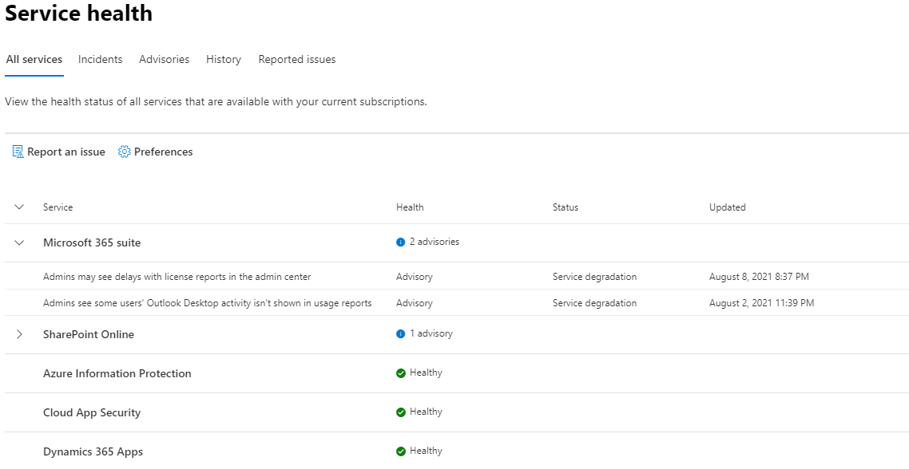

# How to check Microsoft 365 service health

You can view the health of your Microsoft services, including Office on the web, Viva Engage, Microsoft Dynamics CRM, and mobile device management cloud services, on the **Service health** page in the [Microsoft 365 admin center](https://go.microsoft.com/fwlink/p/?linkid=2024339). If you are experiencing problems with a cloud service, you can check the service health to determine whether this is a known issue with a resolution in progress before you call support or spend time troubleshooting.

If you are unable to sign in to the admin center, you can use the [service status page](https://status.office365.com) to check for known issues preventing you from logging into your tenant.  Also sign up to follow us at [@MSFT365status](https://twitter.com/MSFT365Status) on Twitter to see information on certain events.

## How to check service health

1. Go to the Microsoft 365 admin center at [https://admin.microsoft.com](https://go.microsoft.com/fwlink/p/?linkid=2024339), and sign in with an admin account.

    > [!NOTE]
    > People who are assigned the global admin or service support admin role can view service health. To allow Exchange, SharePoint, and Skype for Business admins to view service health, they must also be assigned the Service admin role. For more information about roles that can view service health, see [About admin roles](../admin/add-users/about-admin-roles.md?preserve-view=true&view=o365-worldwide#commonly-used-microsoft-365-admin-center-roles).

2. To view service health, in the left-hand navigation of the admin center, go to **Health** > **Service health**, or select the **Service health** card on the **Home dashboard**. The dashboard card indicates whether there is an active service issue and links to the detailed **Service health** page.

3. On the **Service health** page, the health state of each cloud service is shown in a table format.

   

The **All services** tab (the default view) shows all services, their current health state, and any active incidents or advisories. An icon and status in the **Health** column indicate the state of each service.

If there is an active incident or advisory for a service they will be listed directly under the service name in a nested table. You can collapse the nested table to hide the incidents or advisories in this view by clicking on the chevron icon to the left of the service name.

To filter your view to only show all the active incidents, select the **Incidents** tab at the top of the page. Selecting the **Advisories** tab will only show all the active advisories posted.

The **History** tab shows all incidents and advisories that have been resolved within the last seven or 30 days.

If you're experiencing an issue with a Microsoft 365 service and you don't see it listed on the **Service health** page, tell us about it by selecting **Report an issue**, and completing the short form. We'll look at related data and reports from other organizations to see how widespread the issue is, and if it originated with our service. If it did, we'll add it as a new incident or advisory on the **Service health** page, where you can track its resolution. The **Reported Issues** page will show all issues your tenant has reported from this form and the status.

To customize your view of which services show up on the dashboard, select **Preferences** > **Custom view**,  and clear the checkboxes for the services you want to filter out of your Service health dashboard view. Make sure that the checkbox is selected for each service that you want to monitor.

To sign up for email notifications of new incidents that affect your tenant and status changes for an active incident, select **Preferences** > **Email**, click **Send me service heath notifications in email**, and then specify:

- Up to two email addresses.
- Whether you want notifications for incidents or advisories
- The services for which you want notification

You can also subscribe to email notifications for individual events instead of every event for a service. To do so, select the active issue you want to receive email notification updates for, select **Manage notifications for this issue**, and then specify:

- Up to two email addresses.

> [!NOTE]
> Each admin can have their Preferences set and the above limit of two email address is per admin account.

> [!TIP]
> You can also use the [Microsoft 365 Admin app](https://go.microsoft.com/fwlink/p/?linkid=627216) on your mobile device to view Service health, which is a great way to stay current with push notifications.

### View details of posted service health

On the **All services** view, select the issue title to see the issue detail page, which shows more information about the issue, including a feed of all the messages posted while we work on a solution.

The advisory or incident summary provides the following information:

- **Title** - A summary of the problem.
- **ID** - A numeric identifier for the problem.
- **Service** - The name of the affected service.
- **Last updated** - The last time that the service health message was updated.
- **Estimated Start time** - The estimated time when the issue started.
- **Status** - How this problem affects the service.
- **User Impact** - A brief description of the impact this issue has on the end user.
- **All Updates** - We post frequent messages to let you know the progress that we're making in applying a solution.

### Translate service health details

We use machine translation to automatically display messages in your preferred language. Read [Language translation for Service health dashboard](lang-service-health.md) for more information on how to set your language.

### Definitions

Most of the time, services will appear as healthy with no further information. When a service is having a problem, the issue is identified as either an advisory or an incident and shows a current status.

> [!TIP]
> Planned maintenance events aren't shown in service health. You can track planned maintenance events by staying up to date with the **Message center**. Filter to messages categorized as Plan for change to find out when the change is going to happen, its effect, and how to prepare for it. See [Message center in Microsoft 365](https://support.office.com/article/38fb3333-bfcc-4340-a37b-deda509c2093) for more details.

### Incidents and advisories

| Icon | Description |
|:-----|:-----|
||If a service has an advisory shown, we are aware of a problem that is affecting some users, but the service is still available. In an advisory, there is often a workaround to the problem and the problem may be intermittent or is limited in scope and user impact.    |
||If a service has an active incident shown, it's a critical issue and the service or a major function of the service is unavailable. For example, users may be unable to send and receive email or unable to sign-in. Incidents will have noticeable impact to users. When there is an incident in progress, we will provide updates regarding the investigation, mitigation efforts, and confirmation of resolution in the Service health dashboard.    |

### Status definitions

| Status | Definition |
|:-----|:-----|
|**Investigating** | We're aware of a potential issue and are gathering more information about what's going on and the scope of impact. |
|**Service degradation** | We've confirmed that there is an issue that may affect use of a service or feature. You might see this status if a service is performing more slowly than usual, there are intermittent interruptions, or if a feature isn't working, for example. |
|**Service interruption** | You'll see this status if we determine that an issue affects the ability for users to access the service. In this case, the issue is significant and can be reproduced consistently. |
|**Restoring service** | The cause of the issue has been identified, we know what corrective action to take, and are in the process of bringing the service back to a healthy state. |
|**Extended recovery** | This status indicates that corrective action is in progress to restore service to most users but will take some time to reach all the affected systems. You might also see this status if we've made a temporary fix to reduce impact while we wait to apply a permanent fix. |
|**Investigation suspended** | If our detailed investigation of a potential issue results in a request for additional information from customers to allow us to investigate further, you'll see this status. If we need you to act, we'll let you know what data or logs we need. |
|**Service restored** | We've confirmed that corrective action has resolved the underlying problem and the service has been restored to a healthy state. To find out what went wrong, view the issue details. |
|**False positive** | After a detailed investigation, we've confirmed the service is healthy and operating as designed. No impact to the service was observed or the cause of the incident originated outside of the service. Incidents and advisories with this status appear in the history view until they expire (after the period of time stated in the final post for that event). |
|**Post-incident report published** | We've published a Post Incident Report for a specific issue that includes root cause information and next steps to ensure a similar issue doesn't reoccur. |

### Message Post Types

| Type | Definition |
|:-----|:-----|
|**Quick Update** | Short and frequent incremental updates for broadly impacting incidents, available to all customers. |
|**Additional Details** | These additional posts will provide richer technical and resolution details to offer deeper visibility into the handling of incidents. This is available for tenants that meet the same requirements outlined for [Exchange Online monitoring](/microsoft-365/enterprise/microsoft-365-exchange-monitoring#requirements), |

### History

Service health lets you look at your current health status and view the history of any service advisories and incidents that have affected your tenant in the past 30 days. To view the past health of all services, select **History** view.

For more information about our commitment to uptime, see [Transparent operations from Microsoft 365](/office365/servicedescriptions/office-365-platform-service-description/service-health-and-continuity).

## Related topics

- [Activity Reports in the Microsoft 365 admin center](https://support.office.com/article/0d6dfb17-8582-4172-a9a9-aed798150263)
- [Message center Preferences](../admin/manage/message-center.md?preserve-view=true&view=o365-worldwide#preferences)
- [How to check Windows release health on admin center](/windows/deployment/update/check-release-health)
