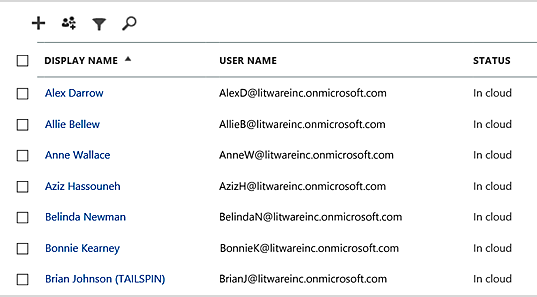
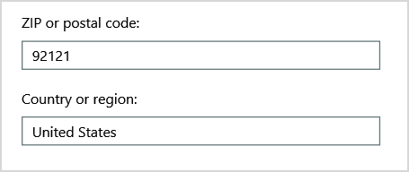
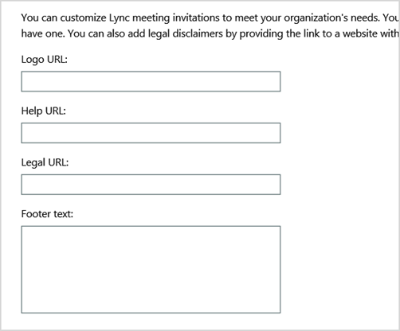
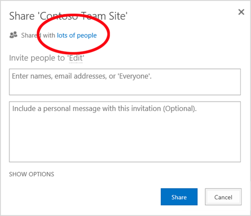
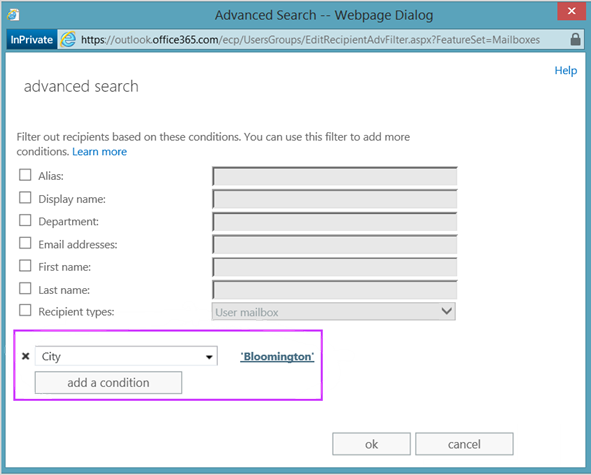
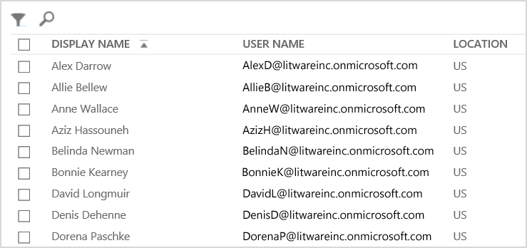
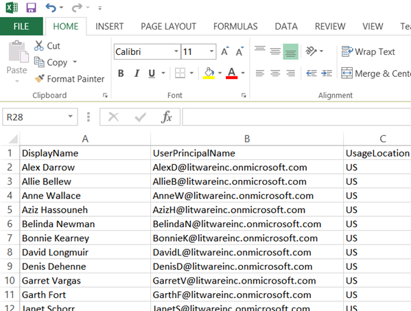
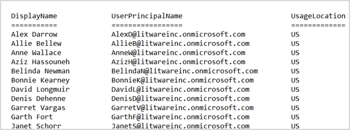

# Why you need to use PowerShell for Microsoft 365

*This article applies to both Microsoft 365 Enterprise and Office 365 Enterprise.*

With the Microsoft 365 admin center, you can manage your Microsoft 365 user accounts and licenses. You can also manage your Microsoft 365 services, such as Exchange Online, Teams, and SharePoint Online. If you instead use PowerShell to manage these services, you can and take advantage of the command-line and scripting language environment for speed, automation, and additional capabilities.
  
This article shows how to use PowerShell to manage Microsoft 365 to:
  
- Reveal additional information that you can't see in the Microsoft 365 admin center
    
- Configure features and settings only possible with PowerShell
    
- Do bulk operations
    
- Filter data
    
- Print or save data
    
- Manage across services
    
Keep in mind that PowerShell for Microsoft 365 is a set of modules for Windows PowerShell, which is a command-line environment for Windows-based services and platforms. This environment creates a command-shell language that can be extended with additional modules. It provides a way to execute simple or complex commands or scripts. For example, after you install the PowerShell for Microsoft 365 modules and connect to your Microsoft 365 subscription, you can run the following command to list all the user mailboxes for Microsoft Exchange Online:
  
```powershell
Get-Mailbox
```

You could also get the list of mailboxes by using the Microsoft 365 admin center but counting the items in all the lists for all the sites for all of your web apps isn't easy.
  
PowerShell for Microsoft 365 is designed to help you manage Microsoft 365, not to replace the Microsoft 365 admin center. Admins need to be able to use PowerShell for Microsoft 365 because there are some configuration procedures that can only be done through PowerShell for Microsoft 365 commands. For these cases, you need to know how to:
  
- Install the PowerShell for Microsoft 365 modules (done only one time for each administrator computer).
    
- Connect to your Microsoft 365 subscription (one time for each PowerShell session).
    
- Gather the information needed to run the required PowerShell for Microsoft 365 commands.
    
- Run PowerShell for Microsoft 365 commands.
    
After you learn these basic skills, you don't have to list your mailbox users by using the **Get-Mailbox** command. You also don't have to understand how to create a new command like the command cited previously to count all the items in all the lists for all the sites for all of your web apps. Microsoft and the community of administrators can help you with such tasks as needed.
  
## PowerShell for Microsoft 365 can reveal information that you can't see with the Microsoft 365 admin center

The Microsoft 365 admin center displays many useful information. But it doesn't display all the possible information that Microsoft 365 stores about users, licenses, mailboxes, and sites. Here's an example for *users and groups* in the Microsoft 365 admin center:
  

  
This view provides the information that you need in many cases. However, there are times when you need more. For example, Microsoft 365 licensing (and the Microsoft 365 features available to a user) depends in part on the user's geographic location. The policies and features that you can extend to a user who lives in the United States might not be the same as those that you can extend to a user in India or Belgium. Follow these steps in the Microsoft 365 admin center to determine a user's geographic location:
  
1. Double-click the user's **Display Name**.
    
2. In the user properties display pane, select **details**.
    
3. In the details display, select **additional details**.
    
4. Scroll until you find the heading **Country or region**:
    
     
  
5. Write the user's display name and location on a piece of paper, or copy and paste it into Notepad.
    
You must repeat this procedure for each user. If you have many users, this process can be tedious. With PowerShell for Microsoft 365, you can display this information for all of your users by using the following command:
  
```powershell
Get-AzureADUser | Select DisplayName, UsageLocation
```


>[!Note]
>PowerShell Core doesn't support the Microsoft Azure Active Directory Module for Windows PowerShell module and cmdlets that have *Msol* in their name. You have to run these cmdlets from Windows PowerShell.
>

Here's an example of the results:
  
```powershell
DisplayName                               UsageLocation
-----------                               -------------
Bonnie Kearney                            GB
Fabrice Canel                             BR
Brian Johnson (TAILSPIN)                  US
Anne Wallace                              US
Alex Darrow                               US
David Longmuir                            BR
```

The interpretation of this PowerShell command is: Get all of the users in the current Microsoft 365 subscription (**Get-AzureADUser**), but only display the name and location for each user (**Select DisplayName, UsageLocation**).
  
Because PowerShell for Microsoft 365 supports a command-shell language, you can further manipulate the information obtained by the **Get-AzureADUser** command. For example, maybe you'd like to sort these users by their location, grouping all the Brazilian users together, all the United States users together, and so on. Here's the command:
  
```powershell
Get-AzureADUser | Select DisplayName, UsageLocation | Sort UsageLocation, DisplayName
```

Here's an example of the results:
  
```powershell
DisplayName                                 UsageLocation
-----------                                 -------------
David Longmuir                              BR
Fabrice Canel                               BR
Bonnie Kearney                              GB
Alex Darrow                                 US
Anne Wallace                                US
Brian Johnson (TAILSPIN)                    US
```

The interpretation of this PowerShell command is: Get all the users in the current Microsoft 365 subscription, but only display the name and location for each user and sort them first by their location and then their name (**Sort UsageLocation, DisplayName**).
  
You can also use additional filtering. For example, if you only want to see information about users based in Brazil, use this command:
  
```powershell
Get-AzureADUser | Where {$_.UsageLocation -eq "BR"} | Select DisplayName, UsageLocation 
```

Here's an example of the results:
  
```powershell
DisplayName                                           UsageLocation
-----------                                           -------------
David Longmuir                                        BR
Fabrice Canel                                         BR
```

The interpretation of this PowerShell command is: Get all the users in the current Microsoft 365 subscription whose location is Brazil (**Where {$\_.UsageLocation -eq "BR"}**) and then display the name and location for each user.
  
 **A note about large domains**
  
If you have a large domain with tens of thousands of users, trying some of the examples we show in this article could lead to throttling. Based on factors like computing power and available network bandwidth, you may be trying to do too much at one time. Large organizations might want to split some of these PowerShell operations into two commands.

For example, the following command returns all the user accounts and shows the name and location for each:
  
```powershell
Get-AzureADUser | Select DisplayName, UsageLocation
```

That works great for smaller domains. But in a large organization, you might want to split that operation into two commands: one command to store the user account information in a variable and another to display the needed information. Here's an example:
  
```powershell
$x = Get-AzureADUser
$x | Select DisplayName, UsageLocation
```

The interpretation of this set of PowerShell commands is:
1. Get all the users in the current Microsoft 365 subscription and store the information in a variable named $x (**$x = Get-AzureADUser**).
1.  Display the contents of the variable *$x*, but only include the name and location for each user (**$x | Select DisplayName, UsageLocation**).
  
## Microsoft 365 has features that you can only configure with PowerShell for Microsoft 365

The Microsoft 365 admin center is intended to provide access to common, useful administrative tasks that apply to most environments. In other words, the Microsoft 365 admin center was designed so that the typical administrator can carry out the most-common management tasks. But there are some tasks that can't be done in the admin center.
  
For example, the Skype for Business Online admin center provides a few options for creating custom meeting invitations:
  

  
With these settings, you can add a touch of personalization and professionalism to meeting invitations. But there's more to meeting-configuration settings than simply creating custom meeting invitations. For example, by default, meetings allow:
  
- Anonymous users to gain automatic entrance to each meeting.
    
- Attendees to record the meeting.
    
- All users from your organization to be designated as presenters when they join the meeting.
    
These settings aren't available from the Skype for Business Online admin center. You can control them from PowerShell for Microsoft 365. Here's a command that disables these three settings:
  
```powershell
Set-CsMeetingConfiguration -AdmitAnonymousUsersByDefault $False -AllowConferenceRecording $False -DesignateAsPresenter "None"
```

> [!NOTE]
> To run this command, you must install the [Skype for Business Online PowerShell Module ](https://www.microsoft.com/download/details.aspx?id=39366).
  
The interpretation of this PowerShell command is:
 
1. In the settings for new Skype for Business Online meetings (**Set-CsMeetingConfiguration**), disable allowing anonymous users to gain automatic entrance to meetings (**-AdmitAnonymousUsersByDefault $False**).
2.  Disable the ability for attendees to record meetings (**-AllowConferenceRecording $False**).
3. Don't designate all users from your organization as presenters (**-DesignateAsPresenter "None"**).
  
To restore these default settings (enable the options), run this command:
  
```powershell
Set-CsMeetingConfiguration -AdmitAnonymousUsersByDefault $True -AllowConferenceRecording $True -DesignateAsPresenter "Company"
```

There are other similar scenarios as well, which is why administrators should know how to run PowerShell for Microsoft 365 commands.
  
## PowerShell for Microsoft 365 is great for bulk operations

Visual interfaces like the Microsoft 365 admin center are most valuable when you have a single operation to do. For example, if you need to disable one user account, you can use the admin center to quickly locate and clear a checkbox. This may be easier than performing a similar operation in PowerShell.
  
But if you have to change many things or some selected things within a large set of other things, the Microsoft 365 admin center might not be the best tool. For example, say you have to change the prefix on thousands of phone numbers or remove the specific user *Ken Myer* from all your SharePoint Online sites. How would you do that in the Microsoft 365 admin center?
  
For the last example, say you have several hundred SharePoint Online sites, and you don't know which ones Ken Meyer is a member of. You would have to start at the Microsoft 365 admin center and then perform this procedure for each site:
  
1. Select the **URL** of the site.
    
2. In the **site collection properties** box, select the **Web Site Address** link to open the site.
    
3. On the site, select **Share**.
    
4. In the **Share** dialog box, select the link that shows all the users who have permissions to the site:
    
     
  
5. In the **Shared With** dialog box, select **Advanced**.
    
6. Scroll down the list of users, find and select Ken Myer (assuming he has permissions to the site), and then select **Remove User Permissions**.
    
This would take a *long* time for several hundred sites.
  
The alternative is to run the following command in PowerShell for Microsoft 365 to remove Ken Myer from all your sites:
  
```powershell
Get-SPOSite | ForEach {Remove-SPOUser -Site $_.Url -LoginName "kenmyer@litwareinc.com"}
```

> [!NOTE]
> This command requires that you install the [SharePoint Online PowerShell module](/powershell/sharepoint/sharepoint-online/connect-sharepoint-online?view=sharepoint-ps). 
  
The interpretation of this PowerShell command is: Get all of the SharePoint sites in the current Microsoft 365 subscription (**Get-SPOSite**) and for each site remove Ken Meyer from the list of users who can access it (**ForEach {Remove-SPOUser -Site $\_.Url -LoginName "kenmyer\@litwareinc.com"}**).
  
We tell Microsoft 365 to remove Ken Meyer from every site, including those that he doesn't have access to. So the results will show errors for those sites that he doesn't have access to. We can use an additional condition on this command to remove Ken Meyer only from the sites that have him on their login list. But the errors that are returned cause no harm to the sites themselves. This command might take a few minutes to run against hundreds of sites, rather than hours of working through the Microsoft 365 admin center.
  
Here's another bulk operation example. Use this command to add *Bonnie Kearney*, a new SharePoint administrator, to all sites in the organization:
  
```powershell
Get-SPOSite | ForEach {Add-SPOUser -Site $_.Url -LoginName "bkearney@litwareinc.com" -Group "Members"}
```

The interpretation of this PowerShell command is: Get all the SharePoint sites in the current Microsoft 365 subscription and for each site allow Bonnie Kearney access by adding her login name to the Members group of the site (**ForEach {Add-SPOUser -Site $\_.Url -LoginName "bkearney\@litwareinc.com" -Group "Members"}**).
  
## PowerShell for Microsoft 365 is great at filtering data

The Microsoft 365 admin center provides several ways to filter your data to easily locate a targeted subset of information. For example, Exchange makes it easy to filter on practically any property of a user mailbox. For example, here's the list of mailboxes for all the users who live in the city of Bloomington:
  

  
The Exchange Admin center also lets you combine filter criteria. For example, you can find the mailboxes for all the people who live in Bloomington and work in the Finance department.
  
But there are limitations to what you can do in the Exchange Admin center. For example, you couldn't as easily find the mailboxes of people who live in Bloomington *or* San Diego, or the mailboxes for all people who don't live in Bloomington.
  
You can use the following PowerShell for Microsoft 365 command to get a list of mailboxes for all the people who live in Bloomington or San Diego:
  
```powershell
Get-User | Where {$_.RecipientTypeDetails -eq "UserMailbox" -and ($_.City -eq "San Diego" -or $_.City -eq "Bloomington")} | Select DisplayName, City
```

Here's an example of the results:
  
```powershell
DisplayName                              City
-----------                              ----
Alex Darrow                              San Diego
Bonnie Kearney                           San Diego
Julian Isla                              Bloomington
Rob Young                                Bloomington
```

The interpretation of this PowerShell command is: Get all the users in the current Microsoft 365 subscription who have a mailbox in the city of San Diego or Bloomington (**Where {$\_.RecipientTypeDetails -eq "UserMailbox" -and ($\_.City -eq "San Diego" -or $\_.City -eq "Bloomington")}**), and then display the name and city for each (**Select DisplayName, City**).
  
And here's the command to list all the mailboxes for people who live anywhere except Bloomington:
  
```powershell
Get-User | Where {$_.RecipientTypeDetails -eq "UserMailbox" -and $_.City -ne "Bloomington"} | Select DisplayName, City
```

Here's an example of the results:
  
```powershell
DisplayName                               City
-----------                               ----
MOD Administrator                         Redmond
Alex Darrow                               San Diego
Allie Bellew                              Bellevue
Anne Wallace                              Louisville
Aziz Hassouneh                            Cairo
Belinda Newman                            Charlotte
Bonnie Kearney                            San Diego
David Longmuir                            Waukesha
Denis Dehenne                             Birmingham
Garret Vargas                             Seattle
Garth Fort                                Tulsa
Janet Schorr                              Bellevue
```

The interpretation of this PowerShell command is: Get all the users in the current Microsoft 365 subscription who have a mailbox not located in the city of Bloomington (**Where {$\_.RecipientTypeDetails -eq "UserMailbox" -and $\_.City -ne "Bloomington"}**), and then display the name and city for each.
  
### Use wildcards

You can also use wildcard characters in your PowerShell filters to match part of a name. For example, suppose you're looking for a user account. All you can remember is that the user's last name was *Anderson* or maybe *Henderson* or *Jorgenson*.
  
You could track down that user in the Microsoft 365 admin center by using the search tool and carrying out three different searches:
  
- One for  *Anderson* 
    
- One for  *Henderson* 
    
- One for  *Jorgenson* 
    
Because all three of these names end in "son", you can tell PowerShell to display all the users whose name ends in "son". Here's the command:
  
```powershell
Get-User -Filter '{LastName -like "*son"}'
```

The interpretation of this PowerShell command is: Get all the users in the current Microsoft 365 subscription, but use a filter that only lists the users whose last names end in "son" (**-Filter '{LastName -like "\*son"}'**). The \* stands for any set of characters, which are letters in the user's last name.
  
## PowerShell for Microsoft 365 makes it easy to print or save data

The Microsoft 365 admin center lets you view lists of data. Here's an example of the Skype for Business Online admin center displaying a list of users who have been enabled for Skype for Business Online:
  

  
To save that information to a file, you must paste it into a document or Microsoft Excel worksheet. Either case might require additional formatting. Additionally, the Microsoft 365 admin center doesn't provide a way to directly print the displayed list.
  
Fortunately, you can use PowerShell to not only display the list but to save it to a file that can be easily imported into Excel. Here's an example command to save Skype for Business Online user data to a comma-separated values (CSV) file, which can then be easily imported as a table in an Excel worksheet:
  
```powershell
Get-CsOnlineUser | Select DisplayName, UserPrincipalName, UsageLocation | Export-Csv -Path "C:\Logs\SfBUsers.csv" -NoTypeInformation
```

Here's an example of the results:
  

  
The interpretation of this PowerShell command is: Get all the Skype for Business Online users in the current Microsoft 365 subscription (**Get-CsOnlineUser**); obtain only the user name, UPN, and location (**Select DisplayName, UserPrincipalName, UsageLocation**); and then save that information in a CSV file named C:\\Logs\\SfBUsers.csv (**Export-Csv -Path "C:\\Logs\\SfBUsers.csv" -NoTypeInformation**).
  
You can also use options to save this list as an XML file or an HTML page. In fact, with additional PowerShell commands, you could save it directly as an Excel file, with any custom formatting you want.
  
You can also send the output of a PowerShell command that displays a list directly to the default printer in Windows. Here's an example command:
  
```powershell
Get-CsOnlineUser | Select DisplayName, UserPrincipalName, UsageLocation | Out-Printer
```

Here's what your printed document will look like:
  

  
The interpretation of this PowerShell command is: Get all the Skype for Business Online users in the current Microsoft 365 subscription; obtain only the user name, UPN, and location; and then send that information to the default Windows printer (**Out-Printer**).
  
The printed document has the same simple formatting as the display in the PowerShell command window. To get a hard copy, just add **| Out-Printer** to the end of the command.
  
## PowerShell for Microsoft 365 lets you manage across server products

The components that make up Microsoft 365 are designed to work together. For example, suppose you add a new user to Microsoft 365, and you specify such information as the user's department and phone number. That information will then be available if you access the user's information in any of the Microsoft 365 services: Skype for Business Online, Exchange, or SharePoint.
  
But that's for common information that spans the suite of products. Product-specific information, such as information about a user's Exchange mailbox, isn't typically available across the suite. For example, information about whether a user's mailbox is enabled or not is available only in the Exchange admin center.
  
Suppose you'd like to make a report that shows the following information for all your users:
  
- The user's display name
    
- Whether the user is licensed for Microsoft 365
    
- Whether the user's Exchange mailbox has been enabled
    
- Whether the user is enabled for Skype for Business Online
    
You can't easily produce such a report in the Microsoft 365 admin center. Instead, you would have to create a separate document to store the information, such as an Excel worksheet. Then, get all the user names and licensing information from the Microsoft 365 admin center, get mailbox information from the Exchange Admin center, get Skype for Business Online information from the Skype for Business Online Admin center, and then combine that information.
  
The alternative is to use a PowerShell script to compile the report for you.
  
The following example script is more complicated than the commands you've seen so far in this article. But, it shows the potential of using PowerShell to create information views that are difficult to get otherwise. Here's the script to compile and display the list you need:
  
```powershell
$x = Get-AzureADUser

foreach ($i in $x)
    {
      $y = Get-Mailbox -Identity $i.UserPrincipalName
      $i | Add-Member -MemberType NoteProperty -Name IsMailboxEnabled -Value $y.IsMailboxEnabled

      $y = Get-CsOnlineUser -Identity $i.UserPrincipalName
      $i | Add-Member -MemberType NoteProperty -Name EnabledForSfB -Value $y.Enabled
    }

$x | Select DisplayName, IsLicensed, IsMailboxEnabled, EnabledforSfB
```

Here's an example of the results:
  
```powershell
DisplayName             IsLicensed   IsMailboxEnabled   EnabledForSfB
-----------             ----------   ----------------   --------------
Bonnie Kearney          True         True               True
Fabrice Canel           True         True               True
Brian Johnson           False        True               False
Anne Wallace            True         True               True
Alex Darrow             True         True               True
David Longmuir          True         True               True
Katy Jordan             False        True               False
Molly Dempsey           False        True               False
```

The interpretation of this PowerShell script is:  

1. Get all the users in the current Microsoft 365 subscription and store the information in a variable that's named *$x* (**$x = Get-AzureADUser**).
1. Start a loop that runs over all the users in the variable $x (**foreach ($i in $x)**).  
1. Define a variable named *$y* and store the user's mailbox information in it (**$y = Get-Mailbox -Identity $i.UserPrincipalName**).
1. Add a new property to the user information that's named *IsMailBoxEnabled*. Set it to the value of the IsMailBoxEnabled property of the user's mailbox (**$i | Add-Member -MemberType NoteProperty -Name IsMailboxEnabled -Value $y.IsMailboxEnabled**).
1. Define a variable named *$y*, and store the user's Skype for Business Online information in it (**$y = Get-CsOnlineUser -Identity $i.UserPrincipalName**).
1. Add a new property to the user information that's named *EnabledForSfB*. Set it to the value of the Enabled property of the user's Skype for Business Online information (**$i | Add-Member -MemberType NoteProperty -Name EnabledForSfB -Value $y.Enabled**).
1. Display the list of users, but include only their name, whether they are licensed, and the two new properties that indicate whether their mailbox is enabled and whether they are enabled for Skype for Business Online (**$x | Select DisplayName, IsLicensed, IsMailboxEnabled, EnabledforSfB**).
  
## See also

[Get started with PowerShell for Microsoft 365](getting-started-with-microsoft-365-powershell.md)
  
[Manage Microsoft 365 user accounts, licenses, and groups with PowerShell](manage-user-accounts-and-licenses-with-microsoft-365-powershell.md)
  
[Use Windows PowerShell to create reports in Microsoft 365](use-windows-powershell-to-create-reports-in-microsoft-365.md)