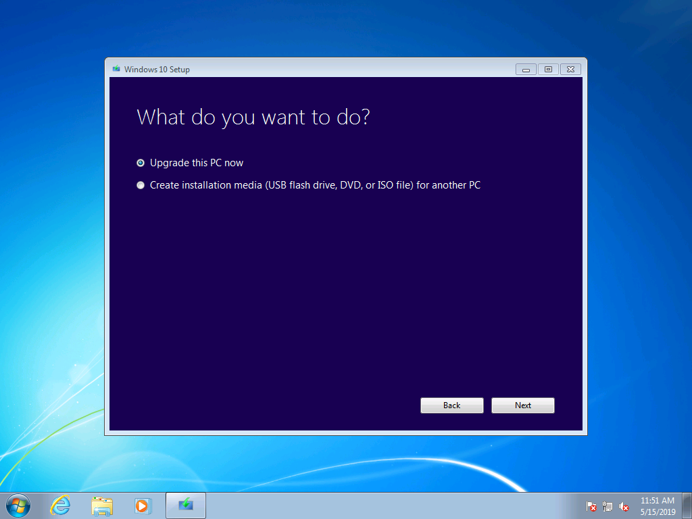
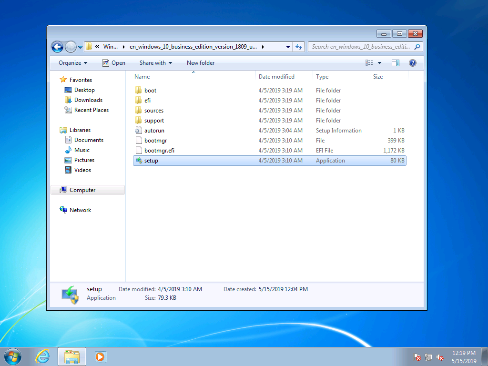
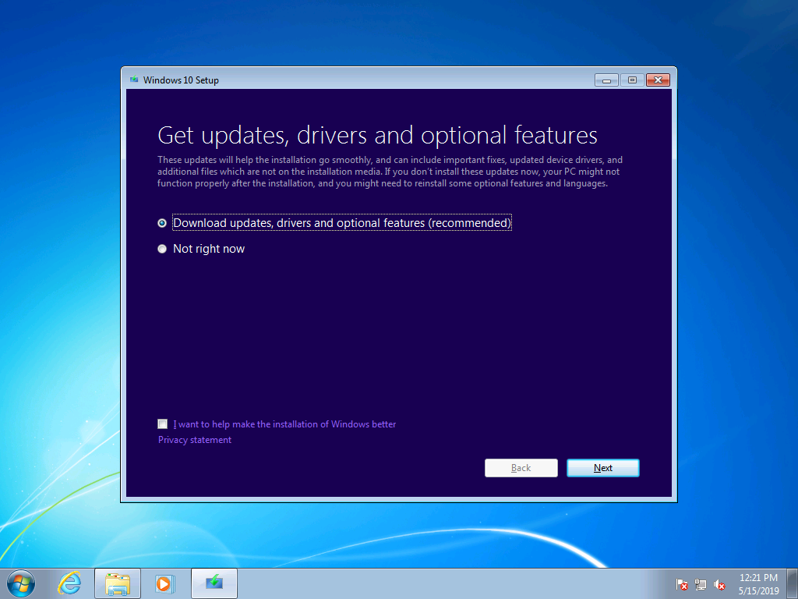
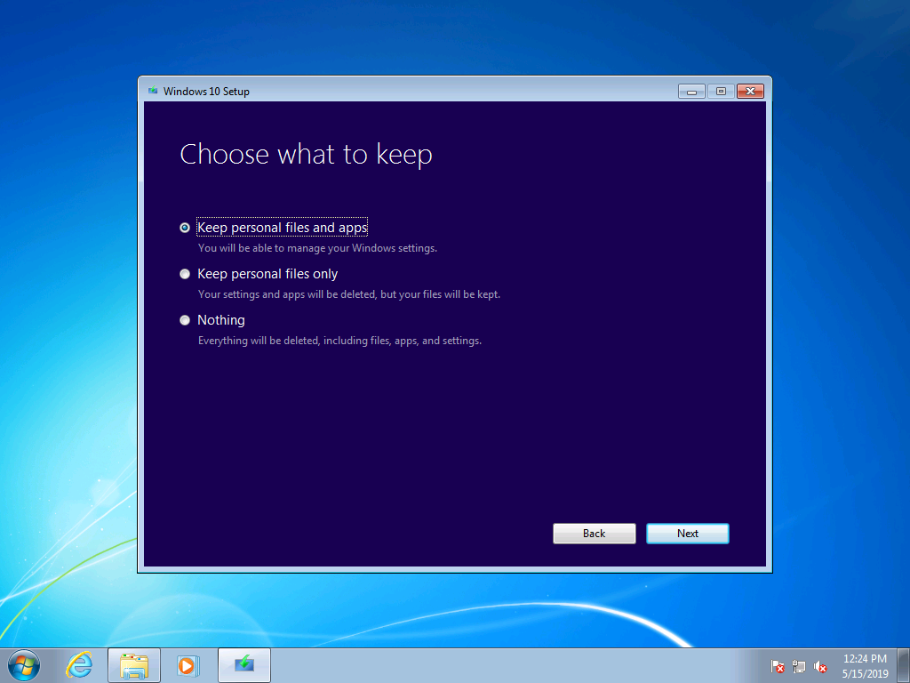
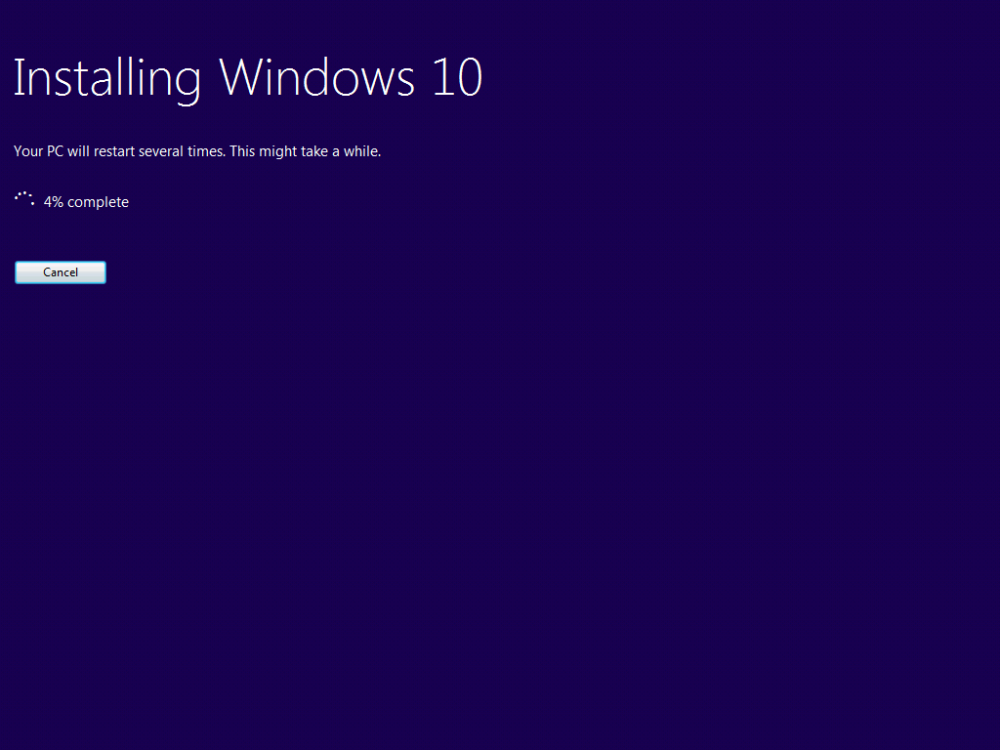
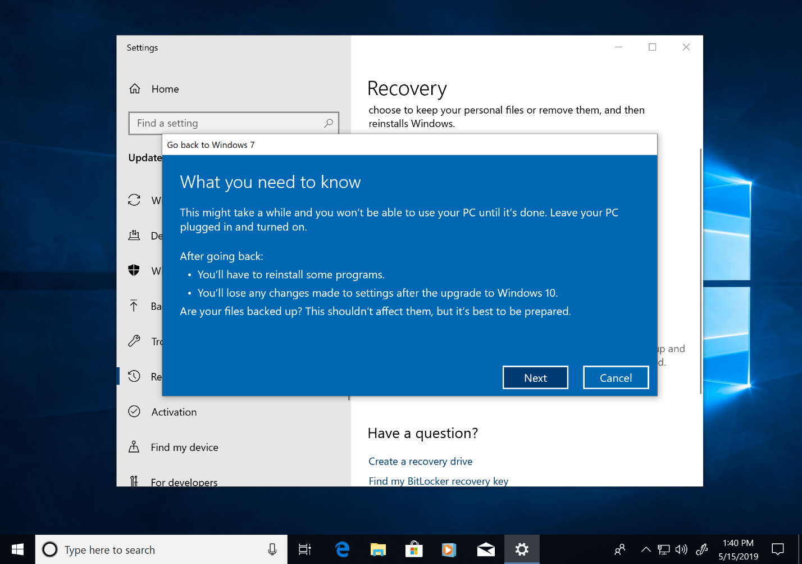

# Windows 7 to Windows 10 manual upgrade step-by-step guide

This article describes the process to manually upgrade a Windows 7 Enterprise PC to Windows 10 Enterprise. For other Windows 7 editions, such as Home and Professional, the process is very similar, but you also have the option to upgrade directly using the media creation tool. Upgrades for any edition of Windows 7 to Windows 10 will require a valid product key and matching or higher edition of Windows, for example Windows 7 Professional can upgrade to Windows 10 Pro, but cannot be upgraded to Windows 10 Home. Windows 7 Ultimate will need to be upgraded to Windows 10 Pro.

## Windows 10 upgrades using the media creation tool or ISO files

You can upgrade to Windows 10 directly using the [media creation tool](https://www.microsoft.com/software-download/windows10ISO) or use it to download Windows 10 as an ISO file. You’ll need to note whether your current system is 32 or 64-bit, your system’s default language and edition of Windows 7 (e.g. Home, Professional, or Enterprise). In Windows 7, this information is located in the Control Panel \> System and Security \> System. The media creation tool does not support Windows 10 Enterprise for upgrades, creating installation media or downloading ISO files. Windows 10 Enterprise is required if you are upgrading from Windows 7 Enterprise.

When upgrading from Windows 7 Enterprise to Windows 10 Enterprise, you’ll need to download the ISO file for your language and architecture (32-bit or 64-bit) from the [Volume Licensing Service Center](https://www.microsoft.com/licensing/servicecenter/default.aspx).

If you plan to perform the upgrade using an ISO file, you will need to extract the files within the ISO to either your local file system, to a removable drive, or you can burn the ISO file to a DVD. You can extract the installation files within the ISO using a Windows 8 or newer PC and save these files to removable USB storage or use an application such as [7zip](https://www.7-zip.org/) to extract the contents of your ISO file to a folder on your local drive within Windows 7.

Once you have the install media available in Windows 7, you can initiate the upgrade by running setup.exe as shown below.

**Important tip: For an in-place upgrade where applications and your data are migrated to Window 10, you’ll need to initiate the process from within a running Windows 7 session. Booting to install media from a DVD or USB drive will not give you the option to keep your apps and files, instead it will perform a clean install of Windows 10.**

Within Windows 10 Setup, you will be guided through the installation process and the first screen provides an option to download updates, drivers and optional features. This is recommended to help ensure success with the upgrade

Once updates have been applied, Windows 10 Setup will move to the next phase, Select Image. Here, you will need to select your edition of Windows. In this case, since the PC has Windows 7 Enterprise installed, you would select Windows 10 Enterprise.

In the next screen in Windows 10 Setup, you’re presented with applicable notices and license terms. Once you have read and understand the notices and terms, click “Accept” to continue or “Decline” to cancel.

Now Windows 10 Setup will look for additional updates.

Once complete, Windows 10 Setup is ready to install and by default is configured to install Windows 10 and keep your personal files and apps installed. This is the recommended option. By clicking, “Change what to keep,” you’ll find additional options. Otherwise, click “Install.”

If you select “Change what to keep”, you’ll be presented with these options:

“Keep personal files only” will not move your installed apps or settings from Windows 7 to Windows 10. Instead it will only move your files and user accounts to Windows. Apps will need to be reinstalled later with this option. Only use this option if you are confident you can reinstall and configure the apps you will need after Windows is installed, otherwise stick with the default “Keep personal files and apps” option.

“Nothing” will delete your files, apps and settings and perform a clean install of Windows. Use this option only if you have previously backed up the data you want to keep and you are able to reinstall your apps.

Now Windows 10 Setup will get updates again based on what you selected in the previous screen.

Now Windows 10 will install for several minutes and if you chose to keep your personal files and apps, everything will be in the same file locations and your apps will now be available in Windows 10.

## 

## Recovery in Windows 10

After Windows 10 is installed, the Recovery option in Windows 10 gives you up to 10 days to go back to Windows 7. This is useful if a device or app on your system does not function properly and you need to go back to your previous Windows 7 installation. After 10 days, by default Windows 10 will free up the space consumed by your Windows 7 recovery files on your hard drive and delete files from the previous installation. Although Windows 7 after this time is deleted and you won’t be able to revert Windows 7, your apps and personal files will remain in Windows 10.

To start the Go back to Windows 7 process, navigate to Settings \> Update & Security \> Recovery. Under Go back to Windows 7, select “Get started.”

Now, Windows 10 will ask why you are going back. If there is a technical reason, this is useful to fill out in order to help drive resolution and ensure others can benefit from your experience.

In many cases, your version of Windows 10 will have had updates issued, which may resolve technical issues. It is encouraged that you check for updates and if found and installed, then check if that fixes the problems you have experienced.

If the updates do not resolve issues and you do need to revert to your previous installation of Windows 7, there is a chance that some apps will need to be reinstalled – such as any app that installed during the time you were running Windows 10 – and some settings may be lost. Importantly, files and docs you’ve saved locally while using Windows 10 will remain and be available for you once you’re back in Windows 7. 

Before you get started, make sure you have a local or domain account and password ready from the previous Windows 7 installation.

From here you can initiate the process to go back to Windows 7. After a few minutes, your PC will boot back into Windows 7 with the same experience prior to upgrading to Windows 10.

## Moving to Windows 10 on a new PC

Another recommended option is to move to Windows 10 on a new PC. If this is your preference, you can transfer your files from your old computer using [OneDrive](https://support.office.com/article/b5e918be-0fd4-4095-98da-bceed57f8e0c?ocid=MoveToWindows10) backup, [Backup and Restore built into Windows](https://support.microsoft.com/help/4469209?ocid=MoveToWindows10), manually using an [external storage device](https://support.microsoft.com/help/4465814/windows-7-move-files-off-pc-with-an-external-storage-device?ocid=MoveToWindows10), or tools like [Laplink’s PCmover Express](https://www.microsoft.com/windows/transfer-your-data). With any of these options, you will still need to re-install any required applications not included with Windows 10. To learn more about your options for manually moving from an existing PC running Windows 7 to a new PC with Windows 10, see [Moving to a Windows 10 PC](https://support.microsoft.com/help/4229823?ocid=MoveToWindows10) in Windows Support.

## [Desktop Deployment Center](https://aka.ms/howtoshift)