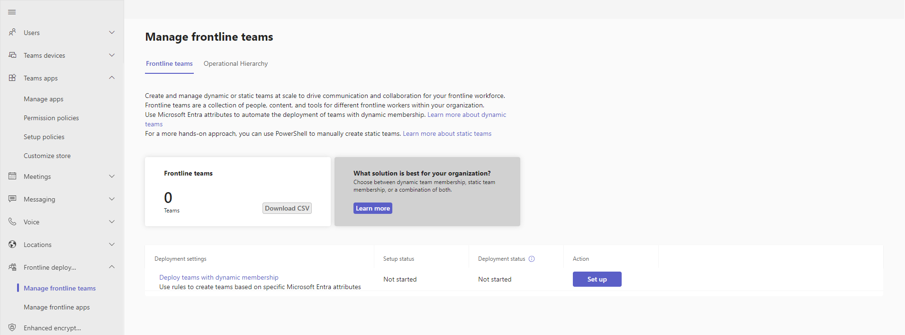
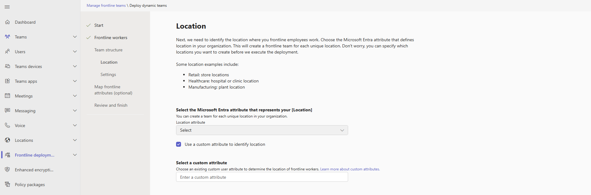
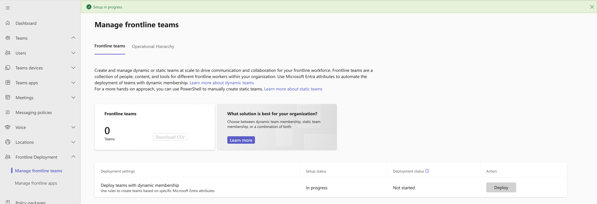
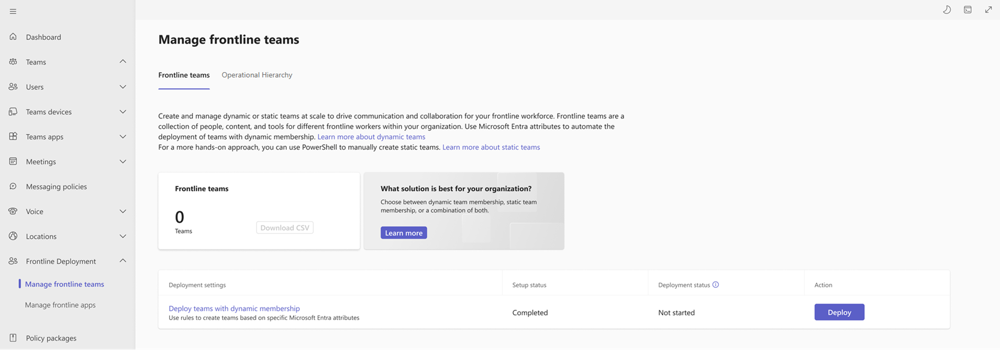
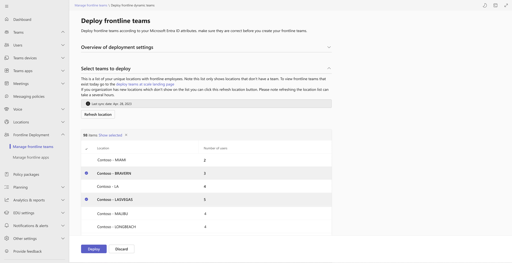
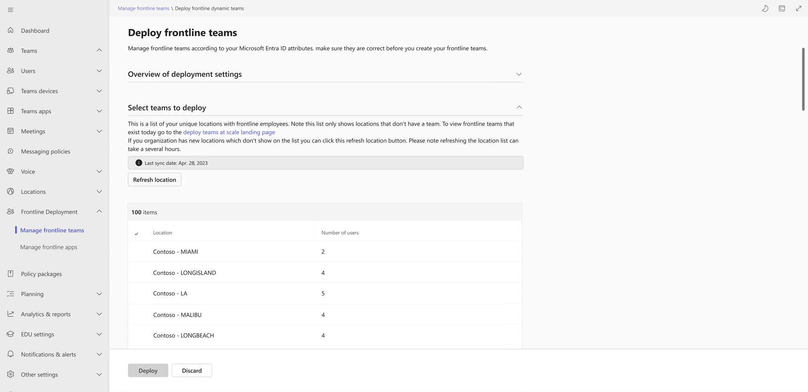

# Deploy frontline dynamic teams at scale

## Overview

>[!IMPORTANT]
>This feature will begin rolling out for public preview in July 2023.

Frontline teams are a collection of people, content, and tools within an organization for different frontline worker locations. Membership of frontline dynamic teams is determined and managed by a set of Azure Active Directory (Azure AD) attributes. [Learn more about Azure AD attributes](/azure/active-directory/external-identities/customers/how-to-define-custom-attributes).

In the setup process, you'll define the following with Azure AD attributes:

- Who your frontline workers are
- What locations they work at

You'll also determine team structure and team owners.

Then, you'll be able to choose which locations you want to create dynamic frontline teams for.

Team membership will be automatically managed over time through the power of dynamic teams. As frontline workers are onboarded, offboarded, or change locations, their membership in these teams will update accordingly.

## Prerequisites

- Users must have a Microsoft 365 F3, F1, E1, E3, or E5 license. If a user doesn't have one of these licenses, they'll need an Azure AD P1 add-on license to leverage dynamic teams. [Learn more about frontline licensing](flw-licensing-options.md).
- The admin running the deployment process needs Teams admin center permissions.
- Ensure you can define your frontline workers and their work locations through data available in Azure AD. If you don't have this data in Azure AD, you can sync it through a [human capital management (HCM) connector](/azure/active-directory/app-provisioning/plan-cloud-hr-provision) or [use the PowerShell solution](deploy-teams-at-scale.md) to create teams at scale.
- When evaluating the right solution, we recommend you do the following:
  1. Plan your frontline deployment
  1. Test the deploy tools (dynamic or static team creation)
  1. Deploy to a pilot location
  1. Deploy to a broader set of locations using a phased approach

     >[!NOTE]
     >The PowerShell solution creates static teams, which aren't managed automatically.

## Set up your frontline dynamic teams

1. Navigate to your [Teams admin center](https://admin.teams.microsoft.com).

2. Open the **Teams** section on the left rail.

3. Select **Manage frontline teams**.

4. Choose **Setup** in the table.

    

5. Review the prerequisite information.

6. Select the Azure AD attribute that defines your frontline workers. You can only choose one Azure AD attribute, but you can define multiple values by separating them with commas.

    

7. Select the Azure AD attribute that defines the location your frontline employees work in. You can only choose one location attribute.

    

8. Define your team structure by choosing a prefix. The prefix will be applied in the format: "prefix-location" for all of your teams.

    

9. Optionally, choose a team template. The team template you choose will define the channel structure for all of your frontline teams. [Learn more about Teams templates](/microsoftteams/get-started-with-teams-templates-in-the-admin-console).

10. Enter a user account object ID to be the team owner. This account will be the owner for all frontline teams. It's recommended to choose a shared account rather than an individual person.
    1. To get a user's object ID, navigate to your [Azure portal](https://portal.azure.com).
    1. Select **Azure Active Directory**.
    1. Select **Users**.
    1. Choose your user.
    1. Copy the user's object ID.

11. Review the settings and choose **Finish setup.**

    >[!NOTE]
    >The setup can take several hours to run. You can refresh the **Manage frontline teams** page to get the latest status of your setup.

    

## Deploy your frontline dynamic teams

1. After the setup is complete, go to your **Manage frontline teams** page and select the **Deploy** button.

    

2. From here you can review your settings and view the list of locations that don't yet have a frontline dynamic team created.

3. Select the locations you want to create teams for in the table.

    

4. Select **Deploy**. This process can take multiple hours depending on how many teams you're creating. After the deployment is complete, you'll see the Number of frontline teams tile update. In this tile you can download a CSV file with a list of your frontline teams. If any errors occurred, you can download the error CSV file on the last deployment health tile.

    

5. You can repeat this process for any frontline locations that don't have a team.

## Managing your frontline dynamic teams

You can manage your teams when changes happen in your organization.

### Create new teams for newly opened locations

1. First, navigate to your [Teams admin center](https://admin.teams.microsoft.com).

2. Open the **Teams** section on the left rail.

3. Select **Manage frontline teams**.

4. Choose **Deploy** in the table.

5. Select the **Refresh locations** button, and proceed when prompted by the dialog box. This process can take several hours depending on your number of new locations.

    

6. After your refresh completes, your setup status will show **Complete**. You can proceed to [deploy your new teams](#deploy-your-frontline-dynamic-teams). Deployment can take several hours depending on how many new teams you're deploying.

### Edit your frontline team settings

>[!IMPORTANT]
>The ability to edit your frontline team settings is coming soon.

1. First, navigate to your [Teams admin center](https://admin.teams.microsoft.com).
1. Open the **Teams** section on the left rail.
1. Select **Manage frontline teams**.
1. Choose **Deploy frontline teams** under the Deploy settings column.
1. Edit your settings on this page and select **Save**. Your settings may take several hours to update. Refer to the following table for the effects of updating your settings:

|Setting |Effect on existing frontline teams |Effect on new frontline teams |
|--------|-----------------------------------|------------------------------|
|Define your frontline Azure AD attribute. |All existing frontline teams will be members that have the new Azure AD attribute defined |All new frontline teams members will have the new Azure AD attribute defined |
|Choose the values applicable to your frontline Azure AD attribute. |All existing frontline team membership will reflect your updated values. |All new teams will be populated with members who have the updated Azure AD attributes you have defined. |
|Define your frontline locations. | Existing teams will continue to persist. If a team no longer is tied a location there will be no users in that team and users will be put in their respective location teams. |You can create new frontline teams based on the locations defined by your new Azure AD attribute. |
|Set your team name prefix. |All existing team names will be updated to reflect the prefix and location name if that has been changed. |All new teams will have the updated naming convention. |
|Select your team template. |No updates to the team structure will occur. |All new teams will use the updated team template. |
|Select your team owner. |The team owner will be updated for all existing teams. |All new teams will have the updated team owner. |
