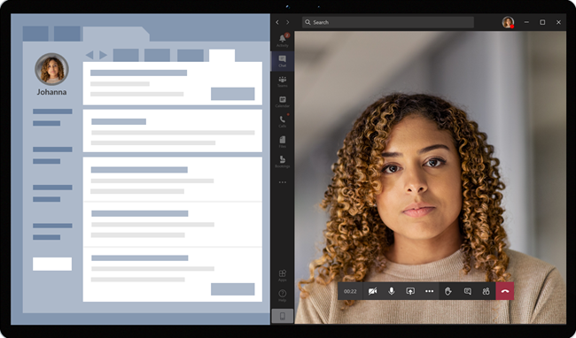

# Virtual appointments with Teams - Integration into Epic EHR

The Microsoft Teams Electronic Health Record (EHR) connector makes it easy for clinicians to launch a virtual patient appointment or consultation with another provider in Microsoft Teams directly from the Epic EHR system. Built on the Microsoft 365 cloud, Teams enables simple, secure collaboration and communication with chat, video, voice, and healthcare tools in a single hub that supports compliance with HIPAA, HITECH certification, and more.

The communication and collaboration platform of Teams makes it easy for clinicians to cut through the clutter of fragmented systems so they can focus on providing the best possible care. With the Teams EHR connector, you can:

- Launch Teams virtual appointments from your Epic EHR system with an integrated clinical workflow.
- Enable patients to join Teams virtual appointments from within the patient portal or through SMS.
- Support other scenarios including multi-participant, group visits, and interpreter services.
- Write metadata back to the EHR system about Teams virtual appointments to record when attendees connect, disconnect, and enable automatic auditing and record keeping.
- View consumption data reports and customizable Call Quality information for EHR-connected appointments.

This article describes how to set up and configure the Teams EHR connector to integrate with the Epic platform in your healthcare organization. It also gives you an overview of the Teams virtual appointments experience from the Epic EHR system.

## Before you begin

Before you get started, there’s a few things to do to prepare for the integration.

### Get familiar with the integration process

Review the following information to get an understanding of the overall integration process.

:::image type="content" source="media/ehr-connector-epic-flow.png" alt-text="Image summarizing the steps in the overall integration process.":::

||||||
|---------|---------|---------|---------|---------|
|**Action**: You [request access to the Teams app](#request-access-to-the-teams-app).   **Outcome**: We authorize your organization for testing.|**Action**: We create a public and private key certificate and upload them to Epic.   **Outcome**: Epic syncs the public key certificate.|**Action**: You complete configuration steps in the EHR connector configuration portal.   **Outcome**: You receive FDI records for Epic configuration.| **Action**: You work with your Epic technical specialist to configure FDI records in Epic.  **Outcome**: Configuration completed. Ready to test.|**Action**: You complete testing in your test environment.  **Outcome**: Full validation of flows and decision to move to production.|

### Request access to the Teams app

You'll need to request access to the Teams app.

1. Request to download the Teams app in the [Epic App Orchard marketplace](https://apporchard.epic.com/Gallery?id=6153). Doing this triggers a request from Epic to the Microsoft EHR connector team.
1. After you make your request, send an email to [TeamsForHealthcare@service.microsoft.com](mailto:teamsforhealthcare@service.microsoft.com) with your organization name, tenant ID, and the email address of your Epic technical contact.
1. The Microsoft EHR connector team will respond to your email with confirmation of enablement.

### Review the Epic-Microsoft Teams Telehealth Integration guide

Review the [Epic-Microsoft Teams Telehealth Integration Guide](https://galaxy.epic.com/Search/GetFile?Url=1!68!100!100100357) with your Epic technical specialist. Make sure that all prerequisites are met.

## Prerequisites

- An active subscription to Microsoft Cloud for Healthcare or a subscription to Microsoft Teams EHR connector standalone offer (only enforced when testing in a production EHR environment).
- Epic version November 2018 or later.
- Users have an appropriate Microsoft 365 or Office 365 license that includes Teams meetings.
- Teams is adopted and used in your healthcare organization.
- Your systems meet all [software and browser requirements](../../hardware-requirements-for-the-teams-app.md) for Teams.

> [!IMPORTANT]
> Make sure you complete the pre-integration steps and all prerequisites are met before you move forward with the integration.

The integration steps are performed by the following people in your organization:

- **Microsoft 365 global admin**: The main person who is responsible for the integration. The admin configures the connector, enables SMS (if needed), and adds the Epic customer analyst who will be approving the configuration.
- **Epic customer analyst**: A person in your organization who has login credentials to Epic. They approve the configuration settings entered by the admin and provide the configuration records to Epic.

The Microsoft 365 admin and Epic customer analyst can be the same person.

## Set up the Teams EHR connector

The connector setup requires that you:

- [Launch the EHR connector configuration portal](#launch-the-ehr-connector-configuration-portal)
- [Enter configuration information](#enter-configuration-information)
- [Enable SMS notifications (optional)](#enable-sms-notifications-optional)
- [Approve or view the configuration](#approve-or-view-the-configuration)
- [Review and finish the configuration](#review-and-finish-the-configuration)

### Launch the EHR connector configuration portal

To get started, your Microsoft 365 admin launches the [EHR connector configuration portal](https://ehrconnector.teams.microsoft.com) and signs in using their Microsoft 365 credentials.

Your Microsoft 365 admin can configure a single organization or multiple organizations to test the integration. Configure the test and production URL in the configuration portal. Make sure to test the integration from the Epic test environment before moving to production.

> [!NOTE]
> Your Microsoft 365 admin and Epic customer analyst must complete the integration steps in the configuration portal. For Epic configuration steps, contact the Epic technical specialist assigned to your organization.

### Enter configuration information

Next, to set up the integration, your Microsoft 365 admin does the following:

1. Adds a Fast Health Interoperability Resources (FHIR) base URL from your Epic technical specialist and specifies the environment. Configure as many FHIR base URLs as needed, depending on your organization’s needs and the environments you want to test.

    - The FHIR base URL is a static address that corresponds to your server FHIR API endpoint. An example URL is `https://lamnahealthcare.org/fihr/auth/connect-ocurprd-oauth/api/FHDST`.

    - You can set up the integration for test and production environments. For initial setup, we encourage you to configure the connector from a test environment before moving to production.

1. Adds the username of the Epic customer analyst who will be approving the configuration in a later step.

    :::image type="content" source="media/ehr-connector-epic-configure.png" alt-text="Screenshot of the Configuration page, showing the approver being added." lightbox="media/ehr-connector-epic-configure.png":::

### Enable SMS notifications (optional)

> [!NOTE]
> SMS notifications is currently only available in the United States. We're working on making this feature available in other regions in future releases of Teams and will update this article when available.

Complete this step if your organization wants Microsoft to manage SMS notifications for your patients. When you enable SMS notifications, your patients will receive confirmation and reminder messages for scheduled appointments.

To enable SMS notifications, your Microsoft 365 admin does the following:

1. On the SMS notifications page, select both consent checkboxes to:

    - Allow Microsoft to send SMS notifications to patients on behalf of your organization.
    - Acknowledge that you'll ensure attendees have consented to send and receive SMS messages.
    
    :::image type="content" source="media/ehr-connector-epic-sms-notifications.png" alt-text="Screenshot of the SMS notifications page, showing consent check boxes and the option to generate a phone number." lightbox="media/ehr-connector-epic-sms-notifications.png":::

1. Under **Your phone numbers**, select **Generate a new phone number** to generate a phone number for your organization. Doing this starts the process to request and generate a new phone number. This process might take up to 2 minutes to complete.

    After the phone number is generated, it's displayed on the screen. This number will be used to send SMS confirmations and reminders to your patients. The number has been provisioned but isn’t linked to the FHIR base URL yet. You do that in the next step.

    :::image type="content" source="media/ehr-connector-epic-phone-number.png" alt-text="Screenshot showing an example of the phone number that's generated." lightbox="media/ehr-connector-epic-phone-number.png":::

    Choose **Done**, and then select **Next**.

1. To link the phone number to a FHIR base URL, under **Phone number** in the **SMS configuration** section, select the number. Do this for each FHIR base URL for which you want to enable SMS notifications.

    :::image type="content" source="media/ehr-connector-epic-link-phone-number.png" alt-text="Screenshot showing how to link a phone number to a FHIR base URL." lightbox="media/ehr-connector-epic-link-phone-number.png":::

    If this is the first time you’re configuring the connector, you’ll see the FHIR base URL that was entered in the earlier step. The same phone number can be linked to multiple FHIR base URLs, which means that patients will receive SMS notifications from the same phone number for different organizations and/or departments.

1. Select **SMS setup** next to each FHIR base URL to set up the types of SMS notifications to send to your patients.

    :::image type="content" source="media/ehr-connector-epic-sms-setup.png" alt-text="Screenshot showing SMS setup settings." lightbox="media/ehr-connector-epic-sms-setup.png":::

    - **Confirmation SMS**: Notifications are sent to patients when an appointment is scheduled, updated, or canceled in the EHR system.
    - **Reminder SMS**: Notifications are sent to patients according to the time interval you specify and the scheduled time of the appointment.

    Choose **Save**.

1. Select **Upload certificate** to upload a public key certificate. You must upload a Base64 encoded (public key only) .cer certificate for each environment.

    A public key certificate is required to receive appointment information for sending SMS notifications. The certificate is needed to verify that the incoming information is from a valid source.

    When the connector is used to send SMS reminders, the patient’s phone number is sent by Epic in a HL7v2 payload when appointments are created in Epic. These numbers are stored for each appointment in your organization’s geography and are retained until the appointment takes place. To learn more about how to configure HL7v2 messages, see the [Epic-Microsoft Teams Telehealth Integration Guide](https://galaxy.epic.com/Search/GetFile?Url=1!68!100!100100357).

    Choose **Next**.

> [!NOTE]
> At any time, your Microsoft 365 admin can update any of the SMS settings. Keep in mind that changing settings might result in a stoppage of SMS service. For more information about how to view SMS reports, see [Teams EHR connector admin reports](ehr-admin-reports.md).

### Approve or view the configuration

The Epic customer analyst in your organization who was added as approver launches the [EHR connector configuration portal](https://ehrconnector.teams.microsoft.com) and signs in using their Microsoft 365 credentials. After successful validation, the approver is asked to sign in using their Epic credentials to validate the Epic organization.

> [!Note]
> If the Microsoft 365 admin and Epic customer analyst are the same person, you'll still need to sign in to Epic to validate your access. The Epic sign-in is used only to validate your FHIR base URL. Microsoft won't store credentials or access EHR data with this sign-in.

:::image type="content" source="media/ehr-connector-epic-login-approve.png" alt-text="Screenshot of the Approve or View Configuration page, showing the Login and approve option." lightbox="media/ehr-connector-epic-login-approve.png":::

After successful sign-in to Epic, the Epic customer analyst **must** approve the configuration. If the configuration isn't correct, your Microsoft 365 admin can sign in to the configuration portal and change the settings.

:::image type="content" source="media/ehr-connector-epic-approve.png" alt-text="Screenshot of the Approve or View Configuration page, showing the Approve option." lightbox="media/ehr-connector-epic-approve.png":::

### Review and finish the configuration

When the configuration information is approved by the Epic administrator, you'll be presented with integration records for patient and provider launch. The integration records include:

- Patient and provider records
- Direct SMS record
- SMS configuration record
- Device test configuration record

The context token for device test can be found in the patient integration record. The Epic customer analyst must provide these records to Epic to complete the virtual appointments configuration in Epic. For more information, see the [Epic-Microsoft Teams Telehealth Integration Guide](https://galaxy.epic.com/Search/GetFile?Url=1!68!100!100100357).

> [!Note]  
> At any time the Microsoft 365 or Epic customer analyst can sign in to the configuration portal to view integration records and change organization configuration, as needed.

:::image type="content" source="media/ehr-connector-epic-finish.png" alt-text="Screenshot of the Review and Finish page, showing integration information." lightbox="media/ehr-connector-epic-finish.png":::

> [!Note]
> The Epic customer analyst must complete the approval process for each FHIR base URL that's configured by the Microsoft 365 admin.

## Launch Teams virtual appointments

After completing the EHR connector steps and Epic configuration, your organization is ready to support video appointments with Teams.

### Virtual appointments prerequisites

- Your systems must meet all [software and browser requirements](../../hardware-requirements-for-the-teams-app.md) for Teams.

- You completed the integration setup between the Epic organization and your Microsoft 365 organization.

### Provider experience

Healthcare providers from your organization can join appointments using Teams from their Epic provider apps (Hyperspace, Haiku, Canto). The **Begin virtual visit** button is embedded in the provider flow.

  

Key features of the provider experience:

- Providers can join appointments using supported browsers or the Teams app.

- Providers must do a one-time sign-in with their Microsoft 365 account when joining an appointment for the first time.

- After the one-time sign-in, the provider is taken directly to the virtual appointment in  Teams. (The provider must be signed in to Teams).

- Providers can see real-time updates of participants connecting and disconnecting for a given appointment. Providers can see when the patient is connected to an appointment.

> [!NOTE]
> Any information entered in the meeting chat that’s necessary for medical records continuity or retention purposes should be downloaded, copied, and notated by the healthcare provider. The chat doesn’t constitute a legal medical record or a designated record set. Messages from the chat are stored based on settings created by the Microsoft Teams admin.

### Patient experience

The connector supports patients joining appointments through a link in the SMS text message, MyChart web, and mobile. At the time of the appointment, patients can start the appointment from MyChart using the **Begin virtual visit** button or by tapping the link in the SMS text message.

  

Key features of the patient experience:

- Patients can join appointments from [modern web browsers on desktop and mobile without having to install the Teams app](../browser-join.md).
- Patients can test their device hardware and connection before joining an appointment.

    :::image type="content" source="media/ehr-admin-epic-device-test.png" alt-text="Images of a mobile device, showing device test capabilities." lightbox="media/ehr-admin-epic-device-test.png":::
  
    Device test capabilities:

  - Patients can test their speaker, microphone, camera, and connection.
  - Patients can complete a test call to fully validate their configuration.
  - Results of the device test can be sent back to the EHR system.

- Patients can join appointments with a single click and no other account or sign-in is required.

- Patients aren't required to create a Microsoft account or sign in to launch an appointment.

- Patients are placed in a lobby until the provider joins and admits them.

- Patients can test their video and microphone in the lobby before they join the appointment.

> [!Note]
> Epic, MyChart, Haiku, and Canto are trademarks of Epic Systems Corporation.

## Get insight into virtual appointments usage

The [Virtual Visits usage report](../../teams-analytics-and-reports/virtual-visits-usage-report.md) in the Microsoft Teams admin center gives admins an overview of Teams virtual appointments activity in your organization. The report shows detailed analytics for virtual appointments including Teams EHR-integrated meetings conducted from your EHR system.

You can view key metrics such as lobby wait time and appointment duration. Use this information to gain insight into usage trends to help you optimize virtual appointments to deliver better business outcomes.

### Privacy and location of data

Teams integration into EHR systems optimizes the amount of data that's used and stored during integration and virtual appointment flows. The solution follows the overall Teams privacy and data management principles and guidelines outlined in Teams Privacy.

The Teams EHR connector doesn't store or transfer any identifiable personal data or any health records of patients or healthcare providers from the EHR system. The only data that is stored by the EHR connector is the EHR user’s unique ID, which is used during Teams meeting setup.

The EHR user’s unique ID is stored in one of the three geographic regions described in [Where your Microsoft 365 customer data is stored](/microsoft-365/enterprise/o365-data-locations). All chat, recordings, and other data shared in Teams by meeting participants are stored according to existing storage policies. To learn more about the location of data in Teams, see [Location of data in Teams](../../location-of-data-in-teams.md).

## Related articles

- [Teams Virtual Visits usage report](../../teams-analytics-and-reports/virtual-visits-usage-report.md)
- [Teams EHR connector admin reports](ehr-admin-reports.md)
- [Get started with Teams for healthcare organizations](teams-in-hc.md)
