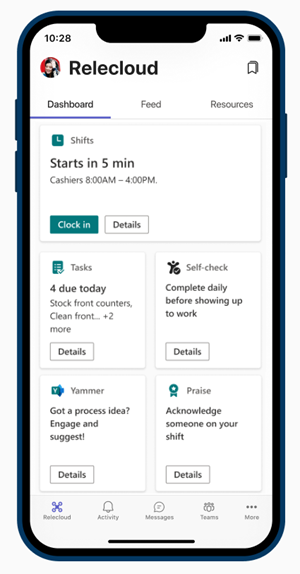
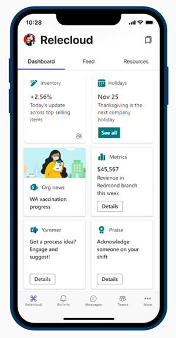

# Corporate communications with frontline workers

Keep your frontline team connected with your broader organization by using Yammer and Viva Connections.

## Connect information from across the organization with Viva Connections

Engage and inform workers with Viva Connections. Viva Connections creates a hub in Teams where your frontline team can view a tailored news feed from your organization and a personalized dashboard with resources they need. When employees use Viva Connections, they’re able to get important information faster, meaning that managers don’t have to spend valuable time relaying updates. Surface key information, personalized news, tasks, announcements, and other resources on the Viva Connections Dashboard. For example, a retailer could share new product and promotion announcements with their store associates, or a fundraising coordinator for a nonprofit could share quarterly goals with volunteers.

| View for a retail worker  |View for a retail manager                  | 
| :------------------- | :------------------- |
|   |  | 

Learn more about [Viva Connections](/sharepoint/viva-connections-overview) and help your employees and associates get started with [Viva Connections in Microsoft Teams](https://support.microsoft.com/office/your-intranet-is-now-in-microsoft-teams-8b4e7f76-f305-49a9-b6d2-09378476f95b).

With Microsoft Teams, Viva Connections, and SharePoint, you can enable these scenarios:

- Onboard new employees [Learn how](/sharepoint/onboard-employees).
- Connect leadership teams with frontline workers [Learn how](/sharepoint/leadership-connection).
- Distribute news to your organization [Learn how](/sharepoint/distribute-corporate-news-to-your-organization).

[Learn more about how to drive communication in your organization](/sharepoint/corporate-communications-overview).

## Connect across your organization with Yammer and Teams

Engage with communities in Yammer. Communities in Yammer serve the needs of knowledge-sharing, employee experience, company-wide communications, and leadership engagement by providing a central place for your conversations, files, events, and updates. Associates can raise issues, provide feedback, and ask and answer questions in Yammer Communities. Hold live events and town halls to keep everyone in your organization in the loop.

You can create yammer communities for individual locations, identity or interest groups, or work groups such as nurses and financial advisors.

Learn how to [add a Yammer page to a Teams channel](https://support.microsoft.com/office/add-a-yammer-page-to-a-teams-channel-ca06ec83-f22d-4b76-83a5-c83aa2a33528) and [join and create a community in Yammer](https://support.microsoft.com/office/join-and-create-a-community-in-yammer-56aaf591-1fbc-4160-ba26-0c4723c23fd6).

More information about Yammer:

- For admins: [Manage Yammer](/yammer)
- For users: [Use Yammer](https://support.microsoft.com/office/what-is-yammer-1b0f3b3e-89ee-4b66-aac5-30def12f287c)

## Connect over email with Exchange Online and Outlook

Email is a core communication tool for most workplaces. [Set up email with Exchange Online](flw-setup-microsoft-365.md#set-up-email-with-exchange-online) and create mailboxes for your frontline workers and managers so you can send broadcast communications over email. Users must have an F3 license to have an email mailbox.
