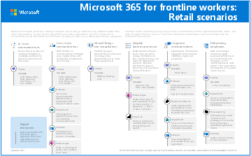

# Microsoft 365 for frontline workers - scenario posters

Use these scenario overviews to start envisioning what your organization can do with Microsoft 365 for frontline workers. You can download these posters in PDF or Visio format and customize them for your organization.

To learn more about how Microsoft 365 can help your frontline workers, see [Choose your scenarios for Microsoft 365 for frontline workers](flw-choose-scenarios.md). To learn more about planning and implementing scenarios, see [Technical planning guide for deploying frontline solutions (white paper)](flw-technical-planning-guide-deployment.md).

## Scenarios for frontline workers

| Item | Description |
|:-----|:-----|
|   [PDF](https://go.microsoft.com/fwlink/?linkid=2206713) \| [Visio](https://go.microsoft.com/fwlink/?linkid=2206386)   Updated September 2022   |This poster provides an overview of the scenarios you can implement for your frontline workforce to increase communications, enhance wellbeing and engagement, train and onboard your workers, and manage your workforce and operations.|

## Scenarios for healthcare organizations

Use the following poster to start envisioning what your organization can do with Microsoft 365 for frontline workers.

| Item | Description |
|:-----|:-----|
|   [PDF](https://go.microsoft.com/fwlink/?linkid=2206475) \| [Visio](https://go.microsoft.com/fwlink/?linkid=2206474)   Updated September 2022   |This poster provides an overview of the scenarios you can implement for your frontline workforce in a healthcare setting.|

## Scenarios for retail organizations

Use the following poster to start envisioning what your organization can do with Microsoft 365 for frontline workers.

| Item | Description |
|:-----|:-----|
|   [PDF](https://go.microsoft.com/fwlink/?linkid=2206476) \| [Visio](https://go.microsoft.com/fwlink/?linkid=2206271)   Updated September 2022   |This poster provides an overview of the scenarios you can implement for your frontline workforce in a retail setting.|

## See also

[Microsoft 365 productivity illustrations](/microsoft-365/solutions/productivity-illustrations.md)