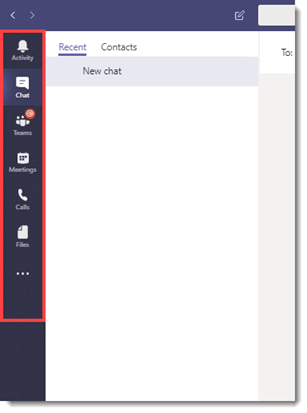

# How to provision Teams at scale for Frontline Workers

Do you need to rapidly onboard a large number of users to Microsoft Teams and configure a streamlined experience for them? You can quickly provision identities, provision teams, and assign all relevant policies to control the end user experience by walking through the following instructions.

In this walkthrough, you'll learn how to:

- Create a large number of users.
- Create a large number of teams and set up the appropriate channels.
- Assign licensing at scale.
- Create appropriate Teams messaging policies, app setup policies, and app permission policies.
- Apply those policies to users at scale.
- Assign a large number of users to a designated team.

> [!NOTE]
> If you've reviewed this information and feel like you need some help or have some questions, you can [**click here**](https://forms.office.com/Pages/ResponsePage.aspx?id=v4j5cvGGr0GRqy180BHbRyMDv-1voW9MqL7zkQ11DzBUREZaU1E0WEk5T0NYS0NDSkFMSDROUUdYMC4u) to reach out for White Glove Support.

## Prerequisites

Download the assets from [this location](https://aka.ms/flwteamsscale).

> [!IMPORTANT]
> The scripts in the link provided above are provided as-is by Microsoft, and must be modified for your individual needs.

## Technical requirements

- Your tenant must have the appropriate number of licenses available that include Microsoft Teams. If you do not already have these licenses, check out [Teams Exploratory](teams-exploratory.md) for a free trial subscription.
- The user taking these steps must have these roles assigned: Global Admin, User Admin, and Teams Service Admin, in Azure AD.
- User must have the rights to install and configure software on their local machine.

## Step-by-step process overview

1. **Set up your environment**
    1. Download from the GitHub repository containing the sample PowerShell scripts and documentation
    1. Configure the local environment
    1. Set up credentials
    1. Configure PowerShell Modules and environmental variables
1. **Create and set up teams**
    1. Create teams
    1. Steps to create teams
    1. Create channels for teams
1. **Create Teams policies**
    1. Create Teams message policies
    1. Create Teams app setup policies
    1. Create Teams app permission policies
1. **Users and security groups**
    1. Create users and security groups
    1. Assign licensing to users via group-based licensing
1. **Assign users and policies**
    1. Assign users to teams
    1. Assign Teams policies to users
    1. Optional: Convert group membership type
1. **Test and validate**
    1. Sign in to Teams with a test user
    1. Check for errors
    1. Error handling
1. **Further reading**

## Set up your environment

The following steps will allow you to set up your environment:

### Download from the GitHub repository containing sample PowerShell scripts and documentation

Before you can proceed, you'll need to download the scripts at [this location](https://aka.ms/flwteamsscale).

### Configure the local environment

Setting the local environment variables allows the scripts referenced here to be run using relative paths. The rootPath is the root of where you cloned this repository, and the tenantName is in the form **yourTenant.onmicrosoft.com** (https should not be included).

1. Open a PowerShell session and navigate to the scripts folder inside the cloned git repo.
1. Run the script .\SetConfig.ps1 -tenantName [your tenant name] -rootPath "full path to the root of the git repo".

For example: .\SetConfig.ps1 -tenantName contoso.onmicrosoft.com -rootPath "C:\data\source\FLWTeamsScale"

### Set up credentials

> [!IMPORTANT]
> How credentials are managed in these scripts may not be appropriate for your use, and they're easily changed to meet your requirements. Always follow your company's standards and practices for securing service accounts and managed identities.

The scripts use credentials that are stored as XML files in $ENV:LOCALAPPDATA\keys, that is, the AppData\Local folder. The helper function **Set-Creds** in the module **BulkAddFunctions.psm1** needs to be called to set the credentials used to run these scripts. This technique removes the need for you to authenticate to all various service endpoints while maintaining the credentials in a local store. From within each script, the appropriate credentials are read with the helper function **Get-Creds** and those credentials are used to connect to the various services.

When you call **Set-Creds**, you're prompted to provide an XML file name that will be written to $ENV:LOCALAPPDATA\keys. You might have different credentials for different services. For example, you might have different credentials for MicrosoftTeams, AzureAD, and MSonline, in which case you can run **Set-Creds** more than once, saving each credential file with its own meaningful name.

Examples:
Set-Creds msol-cred.xml
Set-Creds azuread-cred.xml
Set-Creds teams-cred.xml

Run the script **SetCreds.ps1** to save your credentials. You will be prompted with "Performing the operation "Export-Clixml"..." and enter 'Y' to approve.

> [!NOTE]
> The account used for the credentials cannot require Multi-Factor Auth (MFA).

Here's an example of how the various scripts use the saved credentials to authenticate:

```azurepowershell
# Connect to MicrosoftTeams
$teams_cred = Get-Creds teams-cred.xml
Connect-MicrosoftTeams -Credential $teams_cred
```

### Configure PowerShell modules and environmental variables

You'll need to install and connect to several PowerShell modules, including Azure AD, MSAL, MSCloudUtils, and MicrosoftTeams.

1. Find the **ConfigurePowerShellModules.ps1** in the scripts folder in the repository.
1. From PowerShell, run the **ConfigurePowerShellModules.ps1** script.

## Create and set up teams

In order to communicate and collaborate with your frontline workers, you will first need to establish a series of teams and add standard channels to those teams, which we'll walk through next.

### Create teams

Teams are a collection of people, content, and tools within your organization. For most frontline worker-centric organizations, it is best practice to anchor a team around a physical location. For example, a team for each of the following:

- Store
- Distribution center
- Manufacturing plant
- Hospital
- Grocery store

*Best practice discussion*: When designing your teams, it's important to keep in mind [Teams limits and specifications](limits-specifications-teams.md). For smaller organizations, an org-wide team can be used to streamline communication and complement a physical location structure. For others, a structured physical location Team naming convention helps assist Corporate Communications with Cross Posting to multiple teams simultaneously with ease. For example, you can search and cross-post to all Teams with US in the name to target all US locations. More information on cross-posting can be found [here](https://support.office.com/article/cross-post-a-channel-conversation-in-teams-9c1252a3-67ef-498e-a7c1-dd7147b3d295).

#### Steps to create teams

1. Find the **TeamsInformation.csv** file in the data folder in the repository.
1. Update the information in the **TeamsInformation.csv** file with your organization's specific information. Keep in mind our best practices above.
1. Find the **CreateTeams.ps1** script.
1. From PowerShell, run the **CreateTeams.ps1** script.

### Create channels for teams

Channels are dedicated sections within a team to keep conversations organized by specific topic, project, discipline, and more. Every team automatically gets a General channel, but from there you can customize your structure according to the needs of your business. For example, your additional channel structure could include:

- **Manufacturing** - Safety, Line 1, Line 2, Corporate Communications, Training
- **Grocery** - Bakery, Produce, Meat, Corporate Communications, Training
- **Healthcare** - Nurses, Doctors, Critical Care Unit 1, Critical Care Unit 2
- **Hospitality** - Front Desk, Maintenance, Housekeeping, Valet and Baggage, Corporate Communications, Training
- **Retail** - Front of Store, Back of Store, Corporate Communications, Training

> [!NOTE]
> Channels should not be thought of as a security boundary. They are a means of organizing your workers for the purposes of collaboration.

*Best practice discussion*: When designing your channel structure, it's important to keep things simple, especially when you're looking to onboard a lot of users. Resist the urge to create channels for every situation, role, or topic in order to minimize the need for training. Pick 3-5 channels at most to get started. Additional channels can easily be created as the need arises. In fact, it's okay to just use the General channel alone for now!

#### Steps to create channels for teams

1. Find the **TeamsChannels.csv** file in the scripts folder in the repository.
1. Update the **TeamsChannels.csv** file with your organization's specific information. Keep in mind our best practices above.
1. Find the **CreateTeamsChannels.ps1** script in the scripts folder in the repository.
1. From PowerShell, run the **CreateTeamsChannels.ps1** script.

## Create Teams policies

As an admin, you can use teams policies in Microsoft Teams to control what users in your organization see and can. For example, you can control which applications are pinned to the left rail on your desktop or web browser, or the bottom bar on mobile devices, in order to simplify the end user experience when onboarding a large amount of users. Some of these policies can be created with PowerShell, and others have to be manually created in the Teams admin center.

*Best practice discussion*: For each of the following policies, we're choosing to actually create two policies: one for frontline workers and one for frontline managers. You can choose to create as many or as few as you like. For most customers, two is a good place to start, even if you give the same settings to each group initially. As your experience with Teams grows, you may choose to differentiate their experience further and having the two separate policies already created can make that simpler.

### Create Teams messaging policies

Messaging policies are used to control which chat and channel messaging features are available to users in Microsoft Teams.

*Best practice discussion*: While you can use the default Global policy that is created automatically, we have opted to create a custom policy using the steps below to provide a more locked down, simple, and differentiated experience for frontline managers and frontline workers.

#### Steps to create Teams messaging policies

1. Find the **TeamsMessagingPolicies.csv** file in the scripts folder in the repository.
1. Update the **TeamsMessagingPolicies.csv** file with your organization's specific information. Additional information on some of the various options can be found [here](./messaging-policies-in-teams.md#messaging-policy-settings).
1. Find the **CreateTeamsMessagePolicies.ps1** script in the scripts folder in the repository.
1. From PowerShell, run the **CreateTeamsMessagePolicies.ps1** script.

### Create Teams app setup policies

As an admin, you can use app setup policies to do the following:

- Customize Teams to highlight the apps that are most important for your users. You choose the apps to pin and set the order in which they appear. Pinning apps lets you showcase apps that users in your organization need, including those built by third parties or by developers in your organization.
- Control whether users can pin apps to Teams.

Apps are pinned to the app bar. This is the bar on the side of the Teams desktop client and at the bottom of the Teams mobile clients (iOS and Android).

|Teams desktop client  | &nbsp; |Teams mobile client  |
|---------|---------|---------|
|         |         | |

*Best practice discussion*: You manage app setup policies in the Microsoft Teams admin center. They aren't able to be created with PowerShell. You can use the global (Org-wide default) policy or create custom policies and assign them to users. Users in your organization will automatically be assigned to the global policy unless you create and assign a custom policy. For our purposes, we are creating two new policies for frontline workers and frontline managers, in order to provide them a simpler and more streamlined experience to ease onboarding a large number of users simultaneously. You can choose to customize the experience as your business needs.

#### Create the frontline manager app setup policy

The following settings can be customized to meet your business needs. We have chosen some recommended options based on best practices and to improve the ease of onboarding new users at scale. For more information, click [here](teams-app-setup-policies.md).

1. In the left navigation of the Microsoft Teams admin center, go to **Teams apps** > **Setup policies**.
2. Click **Add**.  
3. Enter a name and description for the policy. For example, Frontline manager app setup policy.
    :::image type="content" source="media/flw-flm-app-setup-policy.png" alt-text="Screenshot of example name and description for frontline manager app setup policy.":::

4. Turn off **Upload custom apps**.
5. Turn off **Allow user pinning**.
    :::image type="content" source="media/flw-allow-user-pinning.png" alt-text="Screenshot of Allow user pinning setting.":::

6. If it's not already listed, add the **Shifts** app. For more information about Shifts, click [here](expand-teams-across-your-org/shifts/manage-the-shifts-app-for-your-organization-in-teams.md).
    :::image type="content" source="media/flw-add-pinned-apps.png" alt-text="Screenshot of the Add pinned apps screen, showing the Add button for the Shifts app":::

7. Remove Calling, if it appears. Removing this feature will not disable it for the user, but will prevent it from appearing on the app bar to simplify the end user experience.
8. Arrange the apps in the following order to dictate their order in the Teams app bar, and then click **Save**.

    - Activity
    - Chat
    - Teams
    - Calendar
    - Shifts

    :::image type="content" source="media/flw-manager-pinned-apps.png" alt-text="Screenshot of apps for frontline managers listed in order.":::

#### Create the frontline worker app setup policy

The following settings can be customized to meet your business needs. We have chosen some recommended options based on best practices and to improve the ease of onboarding new users at scale. For more information, click [here](teams-app-setup-policies.md).

1. In the left navigation of the Microsoft Teams admin center, go to **Teams apps** > **Setup policies**.
2. Click **Add**.
3. Enter a name and description for the policy. For example, Frontline worker app setup policy.
    :::image type="content" source="media/flw-flw-app-setup-policy.png" alt-text="Screenshot of example name and description for frontline worker app setup policy.":::

4. Turn off **Upload custom apps**.
5. Turn off **Allow user pinning**.
    :::image type="content" source="media/flw-allow-user-pinning.png" alt-text="Screenshot of Allow user pinning setting.":::

6. If it's not already listed, add the **Shifts** app. For more information about Shifts, click [here](expand-teams-across-your-org/shifts/manage-the-shifts-app-for-your-organization-in-teams.md).

    :::image type="content" source="media/flw-add-pinned-apps.png" alt-text="Screenshot of the Add pinned apps screen, showing the Add button for the Shifts app":::

7. Remove Meetings and Calling, if they appear. Removing these features will not disable them for the user, but will prevent them from appearing on the app bar to simplify the end user experience.
8. Arrange the apps in the following order to dictate their order in the Teams app bar, and then click **Save**.
    - Activity
    - Chat
    - Teams
    - Shifts

    :::image type="content" source="media/flw-worker-pinned-apps.png" alt-text="Screenshot of apps for frontline workers listed in order.":::

### Create Teams app permission policies

As an admin, you can use app permission policies to control what apps are available to Microsoft Teams users in your organization. You can allow or block all apps, or specific apps published by Microsoft, third-parties, and your organization. When you block an app, users who have the policy are unable to install it from the Teams app store. You must be a global admin or Teams service admin to manage these policies.

*Best practice discussion*: You manage app setup policies in the Microsoft Teams admin center. They aren't able to be created with PowerShell. You can use the global (Org-wide default) policy or create custom policies and assign them to users. Users in your organization will automatically get the global policy unless you create and assign a custom policy. For our purposes, we are creating two new policies for frontline workers and frontline managers in order to provide a secure and more streamlined experience to ease onboarding a large number of users simultaneously. You can of course choose to customize the experience as your business needs.

#### Create the frontline manager app permission policy

The following settings can be customized to meet your business needs. These are some recommended options based on best practices that can improve the ease of onboarding new users at scale. For more information, click [here](teams-app-permission-policies.md).

1. In the left navigation of the Microsoft Teams admin center, go to **Teams apps** > **Permission policies**.
2. Click **Add**.

    :::image type="content" source="media/flw-add-app-permission-policy.png" alt-text="Screenshot of Add app permission policy page.":::

3. Enter a name and description for the policy. For example, Frontline manager app permission policy.
4. Under **Microsoft apps**, select **Allow all apps**.
5. Under **Third-party apps**, select **Allow all apps**.
6. Under **Custom apps**, select **Allow all apps**.
7. Click **Save**.

#### Create the frontline worker app permission policy

The following settings can be customized to meet your business needs. These are some recommended options based on best practices that can improve the ease of onboarding new users at scale. For more information, click [here](teams-app-permission-policies.md).

1. In the left navigation of the Microsoft Teams admin center, go to **Teams apps** > **Permission policies**.
2. Click **Add**.

    :::image type="content" source="media/flw-add-app-permission-policy.png" alt-text="Screenshot of Add app permission policy page.":::

3. Enter a name and description for the policy. For example, Frontline worker app permission policy.
4. Under **Microsoft apps**, select **Allow all apps**.
5. Under **Third-party apps**, select **Block all apps**.
6. Under **Custom apps**, select **Allow all apps**.
7. Click **Save**.

## Users and security groups

### Create users and security groups

To work with a large amount of users in Teams you first need to have the users created in Azure AD. There are many ways to provision a large number of users, but we're going to highlight the following:

- If these users already exist in one of the following HR systems, use the following links to set up user provisioning:
  - SAP Success Factors - [Tutorial: Configure SAP SuccessFactors to Active Directory user provisioning](/azure/active-directory/saas-apps/sap-successfactors-inbound-provisioning-tutorial).
  - Workday - [Tutorial: Configure Workday for automatic user provisioning](/azure/active-directory/saas-apps/workday-inbound-tutorial).
- If you have your user information in other systems, proceed with the following steps.

In order to manage these users at scale more effectively, you need to create two security groups for frontline workers and frontline managers, and provision those users into the security groups directly, following these steps:

1. Find the **Users.csv** file in the scripts folder in the repository.
1. Update the **Users.csv** file with your organization's specific information.
    1. By default, the script we've provided will create a user with a temporary password that must be changed at first sign in. If you don't want to use the default password, edit the **CreateUsers.ps1** script to meet your requirements.
    1. Make sure to update the SecurityGroup field to reflect the appropriate name created earlier.
1. Find the **SecurityGroups.csv** file in the scripts folder in the repository.
1. Update the **SecurityGroups.csv** file with your organization's specific security group information.
    1. Make sure to update the **MessagePolicy**, **AppPermissionPolicy**, and **AppSetupPolicy** fields to map to the appropriate policies you created earlier.
    1. Make sure to update the **LicensePlan** field to reflect the licensing that you intend to give each of these users. For more information on product names and service plan identifiers, review the documentation [here](/azure/active-directory/users-groups-roles/licensing-service-plan-reference).
1. From PowerShell, run the script **CreateUsers.ps1** from assets.

### Assign licensing to users via group-based licensing

Microsoft paid cloud services, such as Microsoft 365, Office 365, Enterprise Mobility + Security, Dynamics 365, and other similar products, require licenses. These licenses are assigned to each user who needs access to these services. To manage licenses, administrators use one of the management portals (Office or Azure) and PowerShell cmdlets. Azure Active Directory (Azure AD) is the underlying infrastructure that supports identity management for all Microsoft cloud services. Azure AD stores information about license assignment states for users.

In order to enable licensing at scale, Azure AD now includes group-based licensing, and for this reason we created the security groups earlier in this article. You can assign one or more product licenses to a group. Azure AD ensures that the licenses are assigned to all members of the group. Any new members who join the group are assigned the appropriate licenses. Licenses are removed from members who leave the group. This licensing management eliminates the need for automating license management via PowerShell to reflect changes in the organization and departmental structure on a per-user basis.

## Assign users and policies

### Assign users to teams

Now that you've created the users and created the teams, it's time to put all the users in the appropriate teams.

1. Find the **Users.csv** file in the data folder in the repository and make sure you have accurate mapping to Teams in this file.
1. From PowerShell, run the script **AssignUserstoTeams.ps1** from the scripts folder in the repository.

### Assign Teams policies to users

Now that you've created the users and the policies to modify their experience in Teams, it's time to assign those policies to the correct users.

1. Find the **SecurityGroups.csv** file in the data folder in the repository and make sure you have accurate mapping of the policies to the groups.
1. From PowerShell, run the script **AssignPoliciestoUsers.ps1** from the scripts folder in the repository.

### Optional: Convert group membership type

> [!NOTE]
> This step is for people who have Azure AD P1 or above.

When licensed for Azure AD P1 or above, you have the option of using Dynamic Group Membership instead of using assigned membership. The scripts that created the Teams also created Office Groups of the membership type Assigned, which means its members must be explicitly added.

Using Dynamic membership, rules are written to determine if someone is a member of the team or not.

> [!NOTE]
> When you run this script, the current membership of the group will be removed (except for its owners), and new members will be added when the membership synch job runs.

1. Find the **migrateGroups.csv** file in the data folder in the repository.
1. Update the CSV file **migrateGroups.csv** with the groups that will be migrated, along with the rule for dynamic membership.
1. Find the **ConvertGroupMembershipType.ps1** file in the scripts folder in the repository.
1. From PowerShell, run the script **ConvertGroupMembershipType.ps1**

## Test and validate

### Sign in to Teams with a test user

Now that you've completed all the steps, it's time to verify the work you've completed.

1. The created user will have an initial password that is in the CreateUsers.ps1 and they are required to change it at their first sign in.
1. Verify the look and feel of Teams is what you expected. If not, review the **Create Teams policies** and the **Assign Teams policies to Users** sections.
1. Verify the user is in the correct team. If not, review the **Create and set up users** and **Assign users to teams** sections.

> [!NOTE]
> If frontline employee provisioning is managed through your Identity and Access Management team, you will need to follow their process for providing the employee their credentials.

### Check for errors

As you ran the earlier scripts, errors or exceptions were written to a .csv file located in the logs folder in your copy of the repository. This file can be used to investigate any issues that may have occurred.

An example of an exception could be if you tried to create a team that already existed in your tenant.

1. Find the **Logs** folder and review any .csv file it may contain. If there are no exceptions, you may not find an exception file here.

### Error handling

Minimal error handling has been implemented in these sample scripts. There are try/catch blocks and, if triggered, we store the error into a variable in the catch block. Additional error handling must be implemented according to your preferences.

## Further reading

- [New Team Channel (PowerShell)](/powershell/module/teams/new-teamchannel)
- [New Teams Messaging Policy (PowerShell)](/powershell/module/skype/new-csteamsmessagingpolicy)
- [Assign policies to your users in Microsoft Teams](policy-assignment-overview.md)
- [Assign licenses and user accounts with Office 365 PowerShell](/office365/enterprise/powershell/assign-licenses-to-user-accounts-with-office-365-powershell)
