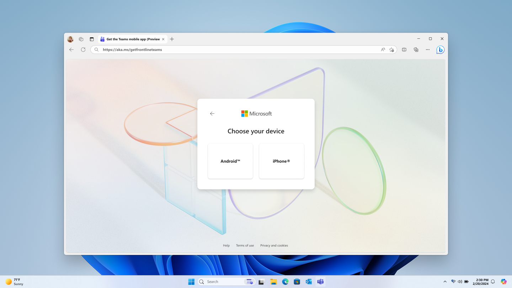
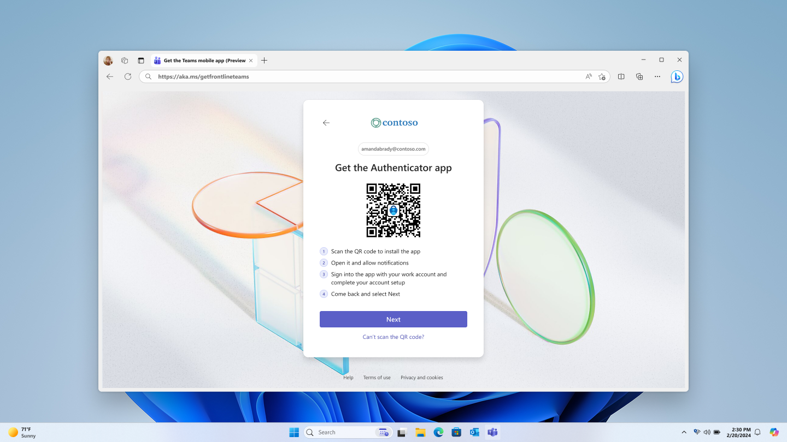
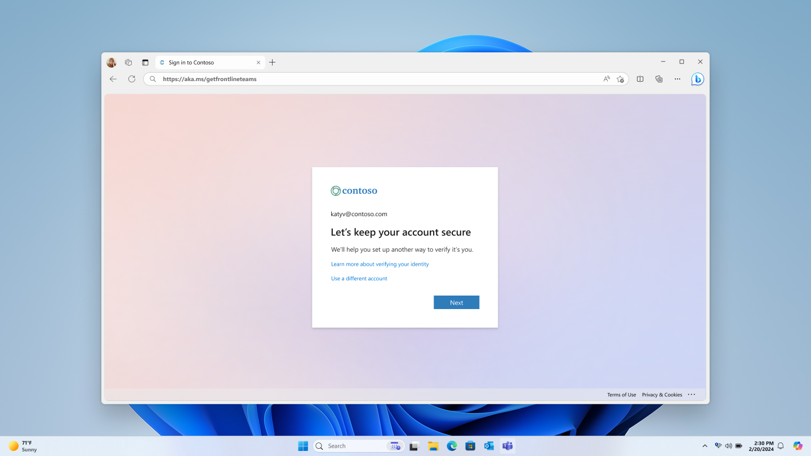
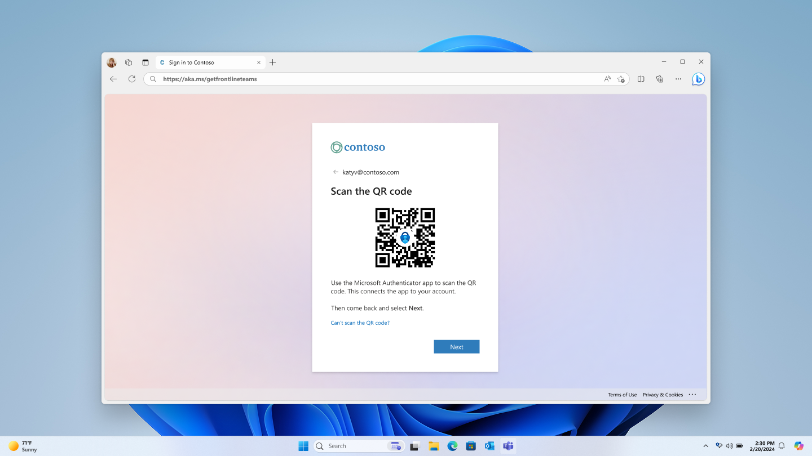
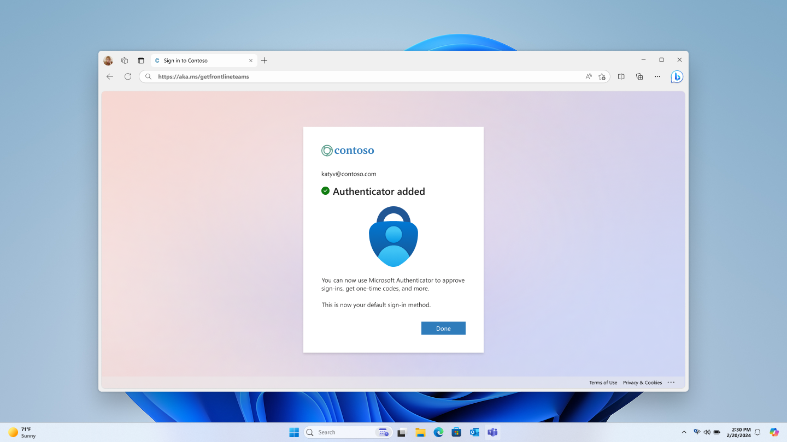
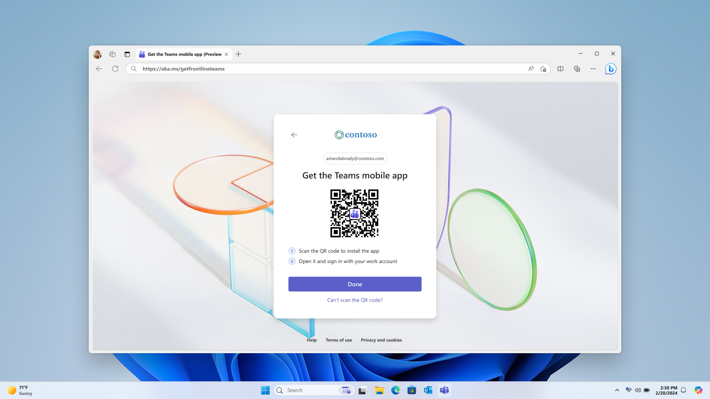

---
# Required metadata
# For more information, see https://learn.microsoft.com/en-us/help/platform/learn-editor-add-metadata
# For valid values of ms.service, ms.prod, and ms.topic, see https://learn.microsoft.com/en-us/help/platform/metadata-taxonomies

title: Setup-frontline-teams-on-personal-devices
description: Setup-frontline-teams-on-personal-devices
author:      aaglick # GitHub alias
ms.author:   aaglick # Microsoft alias
ms.service: microsoft-365-frontline
ms.topic: article
ms.date:     10/31/2025
manager: viseshag
---

# Set up frontline Teams on personal devices

> [!NOTE]
> This feature is currently in public preview. For updates, refer to the [Microsoft 365 roadmap](https://www.microsoft.com/microsoft-365/roadmap?id=523213). 

> [!NOTE]
> Use a new test user account to evaluate this feature and validate your organization’s first-time setup experience.

## Overview

The frontline Teams onboarding experience helps frontline workers set up Teams on their personal devices. This onboarding experience is available on the web and is intended for use on a desktop kiosk or shared PC at your work site. The steps in the experience update dynamically based on the security policies defined in your organization. If your policies change over time, the experience adapts automatically.

## Scenarios supported

- You want to set up Microsoft Teams on a personal device. Supported devices include Android and iOS.

- MFA is required to access Teams on a personal device. The experiences optimizes for setting up Authenticator push notifications as the primary MFA method.

- App protection or configuration policies are enforced to access Teams on a personal device.

## Before you begin

Make sure you have:

- Your work username and password

- Access to a desktop kiosk or shared PC

- Your mobile phone

## Step 1: start onboarding

> [!NOTE]
> For best results, use a private browsing session and close it after each setup.

On the desktop kiosk or back-office PC, open a web browser and navigate to [aka.ms/getfrontlineteams](https://aka.ms/getfrontlineteams).

Choose the device type that you're onboarding. 

Sign in with your work credentials.

Reset your default password if prompted.

## Step 2: download required apps

You could need to download extra apps such as Microsoft Authenticator and/or Company Portal based on your organization’s security policies. These scenarios are supported by the setup experience:

#### Multifactor authentication (MFA)

1. You don't require MFA to access Teams.  

   1. You'll skip the MFA setup step. 
      
1. You'll require MFA to access Teams and you already have an MFA method setup. 

1. You'll skip the MFA setup step. 

   You require MFA to access Teams and the web experience is being accessed from a device that doesn't require MFA.

      
   
   1. Download Microsoft Teams using the QR code. 
   
1. You'll open the Microsoft Authenticator app and allow notifications.
   
1. You'll sign in with your work account and complete setup.
   
1. You'll come back and select next on the screen. 
   
1. You require MFA to access Teams and the web experience is being access on a device that requires MFA. 

   1. Follow the on-screen steps to set up MFA with the Microsoft Authenticator app in the setup experience.
   
      
      
      
      
      
      
      
      
      
      
      
      
      
      
#### App protection policies and/or app configuration policies

If your organization uses app protection policies, app configuration policies, and/or conditional access policies with Microsoft Teams, you might need the Company Portal app on your device.

- If you have an iOS device, you won't see this step. 

- If you have an Android device, you see a screen to download Company Portal.  

   
  
#### Download Microsoft Teams

Next, you'll see a screen to download Microsoft Teams.

- Download Microsoft Teams using the QR code. 

- Sign in and click **Done** when finished.

- Sign out when prompted

- Close the browser

  
  
  
  
## Troubleshooting

- If the QR code doesn’t work, manually search for each app in your devices app store.

## FAQ

Q: Can this experience help me enroll my device in Intune?

A: No. This feature doesn't guide you through the device enrollment process. Follow the steps on your mobile phone.

Q: Can I go backward in the setup experience?

A: You should always move forward in the setup experience. Navigating backward can cause errors.
