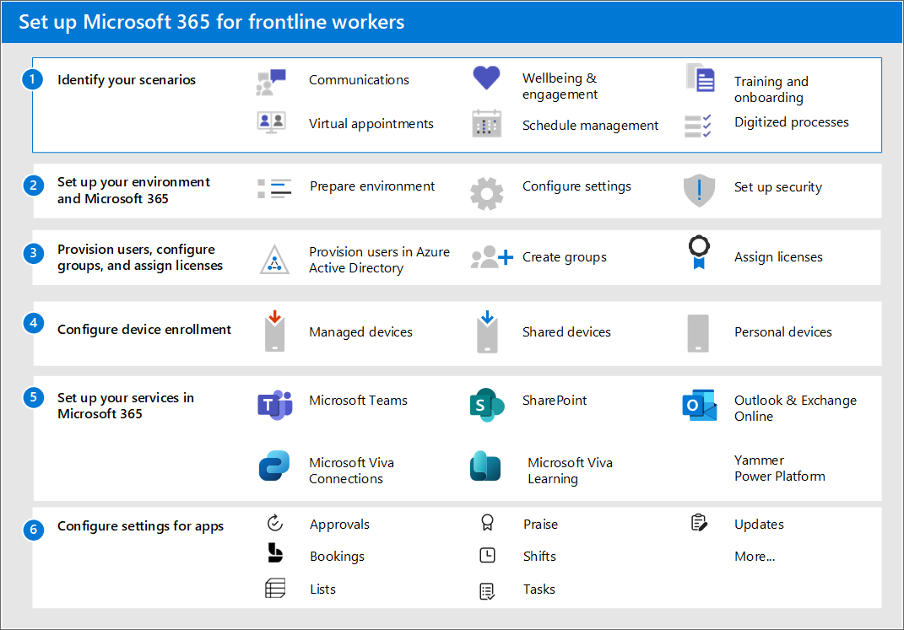

# Set up Microsoft 365 for frontline workers

To set up Microsoft 365 for frontline workers, follow this overall process:

1. **[Identify your scenarios](#step-1-identify-your-scenarios)**: Which scenarios do you want to implement for your frontline workers? After you have determined which scenarios you want, use the table below to identify the required apps and services for each scenario that you want to implement.
1. **[Set up your environment and core Microsoft 365](#step-2-set-up-your-environment-and-core-microsoft-365)**: Follow the Setup Guides in the Microsoft 365 admin center to set up Microsoft 365. Keep reading to learn how to access these guides.
1. **[Provision users, configure groups, and assign licenses](#step-3-provision-users-configure-groups-and-assign-licenses)**: Learn how to provision users and create groups in Azure AD, then assign frontline licenses to your users.
1. **[Configure device enrollment](#step-4-configure-device-enrollment)**: Set up shared and personal devices to work with Microsoft 365 and Microsoft Teams and to allow your frontline workers to communicate more securely within your organization.
1. **[Set up any other services needed for your scenario](#step-5-set-up-other-services)**: Set up services including Exchange, Outlook, SharePoint, and Microsoft Viva.
1. **[Configure security](#step-6-configure-security)**: Learn how to create security policies to keep your organization secure.
1. **[Configure apps](#step-7-configure-apps-for-your-scenario)**: After everything is set up and configured in the admin center, you can follow the guidance for your scenarios to further configure the apps you need for each scenario.

## Step 1: Identify your scenarios

The following table lists the scenarios for your frontline workers. You can read a summary of each scenario in [choose your scenarios](flw-choose-scenarios.md), and find out exactly what you need to configure by following the links to each scenario and to each app or service that's required.

| Scenario | Required services |
|  ------- | -------  |
| [Team communication and collaboration](flw-team-collaboration.md) | [Microsoft Teams](#set-up-microsoft-teams)  [Email with Exchange Online](#set-up-email-with-exchange-online) |
| [Corporate communications](flw-corp-comms.md) | [Microsoft Teams](#set-up-microsoft-teams)  [SharePoint](#set-up-sites-with-sharepoint-in-microsoft-365)  [Viva Connections](#set-up-viva-connections)  [Viva Engage](#set-up-your-organizations-social-network-with-viva-engage) |
| [Virtual Appointments](virtual-appointments.md) | [Microsoft Teams](#set-up-microsoft-teams) |
| [Engage your employees and focus on employee wellbeing](flw-wellbeing-engagement.md)| [Microsoft Teams](#set-up-microsoft-teams)  [SharePoint](#set-up-sites-with-sharepoint-in-microsoft-365)  [Viva Connections](#set-up-viva-connections)  [Viva Engage](#set-up-your-organizations-social-network-with-viva-engage) |
| [Schedule your team with Shifts](shifts-for-teams-landing-page.md) | [Microsoft Teams](#set-up-microsoft-teams) |
| [Onboard new employees](/sharepoint/onboard-employees)| [Microsoft Teams](#set-up-microsoft-teams)  [SharePoint](#set-up-sites-with-sharepoint-in-microsoft-365)  [Viva Connections](#set-up-viva-connections)  [Viva Learning](#set-up-viva-learning)|
| [Ongoing training](flw-onboarding-training.md) | [Microsoft Teams](#set-up-microsoft-teams)  [Viva Learning](#set-up-viva-learning) |
| [Simplify business processes](simplify-business-processes.md) | [Microsoft Teams](#set-up-microsoft-teams)  [Power Apps, Power Automate, and Power BI](#set-up-power-apps-power-automate-and-power-bi) |

Some services are only included with F3 licenses, such as email and the Power Platform. Check out [Understand frontline worker user types and licensing](flw-licensing-options.md) to determine the type of licenses you'll need for your users.

## Step 2: Set up your environment and core Microsoft 365

The Microsoft 365 admin center has a set of [Setup guides](/microsoft-365/enterprise/setup-guides-for-microsoft-365) that walk you through the steps to set up the products, security features, and collaboration tools in Microsoft 365. The setup guides are accessible from the [Setup guidance page](https://aka.ms/setupguidance) in the Microsoft 365 admin center.

1. Use the [Prepare your environment](https://aka.ms/prepareyourenvironment) guide to prepare your organization's environment for Microsoft 365 and Office 365 services.
1. Use the [Microsoft 365 setup](https://aka.ms/microsoft365setupguide) guide to set up productivity tools, security policies, and device management capabilities. You can also use this advisor to set up and configure your organization's devices.

## Step 3: Provision users, configure groups, and assign licenses

Now that you have Microsoft 365 set up, you can start to add users, organize them into groups, and assign licenses. Much of this information is also in the [downloadable technical planning guide](https://go.microsoft.com/fwlink/?linkid=2211637).

### Provision users

Now that you have Microsoft 365 set up, you can start to add users, organize them into groups, and assign licenses. Before you provision frontline users, you should create new administrator accounts or review and update your existing [administrator accounts in Azure AD](/azure/active-directory/roles/permissions-reference). [Learn more about what Azure AD admin roles you might need for Microsoft 365](/microsoft-365/admin/add-users/about-admin-roles).

In this step, you'll create user identities for your frontline workers in Azure AD. You can import users in three ways:

- **Integrate Azure AD with an existing Active Directory instance:** [Azure AD Connect](/azure/active-directory/hybrid/how-to-connect-install-prerequisites) replicates Active Directory user accounts to Azure AD, allowing a user to have a single identity capable of accessing both local and cloud-based resources.
- **Integrate Azure AD with a third-party identity solution:** Azure AD supports integration with some third-party providers through federation.
    - [Learn how to use Okta for Hybrid Microsoft AAD Join](https://www.okta.com/resources/whitepaper/using-okta-for-hybrid-microsoft-aad-join/).
    - [Learn how to configure PingFederate with Azure AD Connect](/azure/active-directory/hybrid/how-to-connect-install-custom#configuring-federation-with-pingfederate).
- **Import users from your organization's HR systems:** [Azure AD user provisioning service](/azure/active-directory/app-provisioning/plan-auto-user-provisioning) automates the creation, maintenance, and removal of user identities based on rules set by your organization.
    - **On-premises HR systems:** You can use [Microsoft Identity Manager](/microsoft-identity-manager/microsoft-identity-manager-2016) to provision users from your on-premises HR systems to Active Directory or directly to Azure AD.
    - **Cloud-based HR systems:** Learn how to connect [SAP SuccessFactors](/azure/active-directory/saas-apps/sap-successfactors-inbound-provisioning-tutorial) and [Workday](/azure/active-directory/saas-apps/workday-inbound-tutorial#planning-your-deployment) to Azure AD.

Use this table to validate your HR-driven user provisioning.

|Test scenario |Expected results |
|--------------|-----------------|
|New employee is created in the cloud HR app |The user account is provisioned in Azure AD and can access assigned cloud resources.   If Azure AD Connect sync is configured, the user account also gets created in Active Directory.   The user can sign into Active Directory domain apps and perform their desired actions.|
|User is terminated in the cloud HR app |The user account is disabled in Azure AD, and, if applicable, Active Directory.  The user can’t sign into cloud or on-premises applications and resources assigned to them. |
|Supervisor is updated in the cloud HR app |User remains active with the new mapping. |
|HR rehires an employee into a new role. |The results depend on how the cloud HR app is configured to generate employee IDs.  If the old employee ID is reused for a rehire, the connector enables the existing Active Directory account for the user.  If the rehire gets a new employee ID, the connector creates a new Active Directory account for the user. |
|HR converts the employee to a contract worker or vice-versa |A new Active Directory account is created for the new persona and the old account is disabled on the effective date of the conversion. |

[Learn more about Azure AD deployment](/azure/active-directory/fundamentals/active-directory-deployment-checklist-p2).

### Configure Azure AD groups

Configuring groups in Azure  AD allows you to create and manage policies and license assignments at scale.

- **Assign a unique attribute to frontline workers:** The ability to identify all frontline workers is useful when applying groups to the frontline workforce or for validating that integrations between Azure AD and HR systems are functioning properly. Organizations frequently use the Job ID attribute for this purpose. Depending on your organization's structure, you may also need [custom security attributes](/azure/active-directory/fundamentals/custom-security-attributes-overview) or [directory extension attributes](/azure/active-directory/develop/active-directory-schema-extensions).
- **Create Azure AD groups and assign frontline users:** With Azure AD groups, you can grant access and permissions to a group of users instead of for each individual user. Groups are used to manage users that all need the same access and permissions to resources, such as potentially restricted apps and services. Instead of adding special permissions to individual users, you create a group that applies the special permissions to every member of that group.

The table below includes recommendations for applying groups in frontline implementations. For more information on group types, membership types, and assignment, see the [Azure AD documentation for groups and membership](/azure/active-directory/fundamentals/concept-learn-about-groups?context=%2Fazure%2Factive-directory%2Fenterprise-users%2Fcontext%2Fugr-context) and [managing groups](/azure/active-directory/fundamentals/how-to-manage-groups). For more information on security group limits and other Azure AD service limits, see [Azure Active Directory Service limits and restrictions](/azure/active-directory/enterprise-users/directory-service-limits-restrictions).

|Use case |Group type |
|---------|-----------|
|Assign licenses, policies, and permissions automatically. If a member’s attributes change, the system looks at dynamic group rules for the directory to see if the member meets the rule requirements (is added), or no longer meets the rule requirements (is removed). |Security group (limit 5,000 groups)   dynamic user |
|Manage access for users without automatic assignment to groups. |Security groups or distribution list (no limit applies) |
|Create an email alias to distribute groups messages to groups of users without automatic user management. |Distribution list or assigned Microsoft 365 group |
|Create an email alias or team in Microsoft Teams and manage membership automatically. |Microsoft 365 groups, dynamic user |
|Use [My Staff](/azure/active-directory/roles/my-staff-configure) to delegate permissions to frontline managers to view employee profiles, change phone numbers, and reset passwords. |[Administrative Unit](/azure/active-directory/roles/administrative-units) |

[Learn more about the different types of groups you can create in the Microsoft 365 admin center](/microsoft-365/admin/create-groups/compare-groups).

### Assign frontline licenses

You can add licenses to individual users or to groups of users in Azure AD. Group assignment is the most scalable way to assign licenses to your frontline workers. You can assign one or more product licenses to a group.

[Learn more about group-based licensing](/azure/active-directory/fundamentals/active-directory-licensing-whatis-azure-portal) and [assigning licenses to groups](/azure/active-directory/enterprise-users/licensing-groups-assign).

You may need to [unassign licenses](/microsoft-365/admin/manage/remove-licenses-from-users) if you're changing some users from E to F licenses. [Learn more about how to switch specific users from E to F licenses](switch-from-enterprise-to-frontline.md#switch-users-to-a-microsoft-365-f-plan).

## Step 4: Configure device enrollment

Registering devices in Azure AD creates a unique identity that can be used to secure and manage devices. [Learn more about Azure AD device identity](/azure/active-directory/devices/).

### Shared device enrollment with Intune

**Android:** Automatically enroll Android devices into shared device mode with [Microsoft Intune](/mem/intune/enrollment/android-kiosk-enroll). [Learn more about enrolling shared devices in Intune](https://techcommunity.microsoft.com/t5/intune-customer-success/enroll-android-enterprise-dedicated-devices-into-azure-ad-shared/ba-p/1820093).

**iOS:** Not currently available.

### BYOD device enrollment with Intune

Use Microsoft Intune to keep your frontline workers' devices secure and protected. Learn more about how to enroll different types of BYOD devices in Intune:

- [Windows](/mem/intune/enrollment/windows-enrollment-methods#user-self-enrollment-in-intune)
- [Android](/mem/intune/enrollment/android-work-profile-enroll)
- [iOS](/mem/intune/enrollment/ios-enroll#user-owned-iosipados-and-ipados-devices-byod)

### Configuring devices for shared device mode with third-party mobile device management

Zero-touch provisioning of shared device mode isn’t currently supported by third-party mobile device management(MDM) solutions. However, you can [manually configure shared device mode](/azure/active-directory/develop/tutorial-v2-shared-device-mode#set-up-an-android-device-in-shared-mode) for Android and iOS devices managed in third-party MDM solutions.

> [!NOTE]
> While these steps register the device in Azure AD, they don't connect Azure AD to the MDM solution. Conditional access won't be available for these devices.

[Learn more about configuration with VMware Workspace ONE](https://docs.vmware.com/en/VMware-Workspace-ONE-Access/21.08/ws1_access_connector_install/GUID-271C47F6-856C-40F0-97AB-A8AD95025F9C.html) and [SOTI](https://www.soti.net/mc/help/v15.0/en/console/configurations/advancedconfigurations/shareddevice/shareddevice.html).

If you choose to manually configure devices in shared device mode, you’ll need to take more steps to re-enroll Android devices in shared device mode when third-party MDM support is available by uninstalling and reinstalling Authenticator from the device.

To set up shared and personal devices to work with Microsoft 365 and Microsoft Teams and to allow your frontline workers to communicate more securely within your organization, see [Manage mobile devices for frontline workers](flw-devices.md).

## Step 5: Set up other services

Depending on your scenarios, you'll need to configure additional Microsoft 365 services, such as Exchange and Outlook for email or Microsoft Viva to expand your employee experience. Read on for information about each service.

### Set up email with Exchange Online

If you want your frontline managers and workers to have access to email, you need to set up email in Microsoft 365. Users must have an F3 license to get access to email. Follow the [Email setup guide](https://aka.ms/office365setup) to set it up.

Your users can also install the Outlook app to use for their email, so you'll want to make sure you share where to download the Outlook app with them.

#### Outlook

Using dynamic group backed shared mailboxes based on attributes such as Location, Department, and Role enables your organization to send targeted communications to dynamic groups that don’t require administrator intervention.

### Set up sites with SharePoint in Microsoft 365

[SharePoint](/sharepoint/sharepoint-online) lets you share documents and create sites. Use the [SharePoint setup guide](https://aka.ms/spoguidance) in the Microsoft 365 admin center to set it up.

### Set up Microsoft Teams

Follow the guidance in [Deploy Teams at scale for frontline workers](deploy-teams-at-scale.md).

### Set up employee experiences with Microsoft Viva

[Microsoft Viva](/viva/microsoft-viva-overview) helps connect employees with an integrated employee experience that brings together communications, knowledge, learning, resources, and insights into the flow of work. Microsoft Viva has several modules that can be used with Microsoft Teams to create employee experiences.

#### Set up Viva Connections

Use [Viva Connections](/viva/connections/viva-connections-overview) to create a dashboard that helps engage and inform your frontline workers. Viva Connections is a customizable app in Microsoft Teams that gives everyone a personalized destination to discover relevant news, conversations, and the tools they need to succeed.

Follow the [Build your employee experience setup guide](https://aka.ms/EmployeeExperienceDashboard) to set it up. Learn more about [setting up Viva Connections](/viva/connections/guide-to-setting-up-viva-connections).

#### Set up Viva Learning

[Viva Learning](/viva/learning/) is an app in Microsoft Teams that empowers employees to make learning a natural part of the day by bringing learning into the flow of work within the tools and platforms they already use. See [Set up Microsoft Viva Learning in the Teams admin center](/viva/learning/set-up-viva-learning) to learn how to set up Viva Learning.

#### Set up your organization's social network with Viva Engage

[Viva Engage](/viva/engage/overview) helps connect your workforce across your company. Learn how to [Set up Viva Engage](/viva/engage/setup) to set it up.

### Set up Power Apps, Power Automate, and Power BI

You can use all of these apps within Microsoft Teams. For more information about how to set them up, see:

- [Power Apps and Microsoft Teams integration](/powerapps/teams/overview)
- [Power Automate - use flows in Microsoft Teams](/power-automate/teams/overview)
- [Collaborate in Microsoft Teams with Power BI](/power-bi/collaborate-share/service-collaborate-microsoft-teams)
- [Power Virtual Agents app in Microsoft Teams](/power-virtual-agents/teams/fundamentals-what-is-power-virtual-agents-teams)
- [Power Apps](/microsoftteams/manage-power-platform-apps)

## Step 6: Configure security

After provisioning users, enrolling your devices, and configuring your applications, you’re now ready to create policies to secure your organization’s infrastructure resources.

- **Conditional access:** Plan an [Azure Active Directory conditional access deployment](/azure/active-directory/conditional-access/plan-conditional-access).
- **App protection policies:** [Learn about app management in Microsoft Intune](/mem/intune/apps/app-management).
- **Multi-factor authentication:** Require [multi-factor authentication for Intune device enrollment](/mem/intune/enrollment/multi-factor-authentication).

Once you’re done setting up security policies, it’s important for you to use a test user (non-admin) account to verify the policies work as expected, and to ensure that the end-user experience is right for your frontline workforce’s needs. Some capabilities like multi-factor authentication and app protection policies can add additional steps to device enrollment or sign-on flows, which may not be acceptable for some frontline scenarios.

## Step 7: Configure apps for your scenario

After everything is set up and configured in the admin center, you can follow the guidance for your scenarios to further configure the apps you need for each scenario.

Follow these best practices to set up Microsoft Teams for your frontline workforce.

**Policy packages** are a collection of predefined policies and policy settings that you can assign to users who have similar roles in your organization. Policy packages simplify, streamline, and help provide consistency when managing policies. Teams provides [predefined policy packages](/microsoftteams/policy-packages-flw) for frontline workers and managers. You can also create a custom policy package and assign them to your frontline workers at scale in the Teams admin center.

Use **team templates** in the Teams admin center or by using PowerShell. You can use prebuilt templates or [create your own](/microsoftteams/get-started-with-teams-templates-in-the-admin-console#create-your-own-team-templates). You can also apply template policies to control which templates are available to your users in Teams. Learn more about [how to get started with team templates in the Teams admin center](/microsoftteams/get-started-with-teams-templates-in-the-admin-console) and [how to set up and deploy teams](/microsoft-365/frontline/deploy-teams-at-scale?#set-up-and-deploy-your-teams). A prebuilt frontline template is accessible from the Teams admin center with the template ID "com.microsoft.teams.template.Frontline".

The table below shows Teams applications commonly utilized in frontline solutions. Shifts, Approvals, and Walkie Talkie are present in the Teams mobile client out of the box. You can control which applications are available to all users in the Teams admin center.

**Scenarios and apps**

| Scenario | Approvals | Virtual Appointments or Bookings | Lists | Praise | Shifts | Tasks | Updates |
| :---- | :----: | :----: | :----: | :----: | :----: | :----: | :----: |
| [Team communication and collaboration](flw-team-collaboration.md) | &#x2705; | &nbsp; | &#x2705; | &#x2705; | &nbsp; | &#x2705; | &#x2705; |
| [Corporate communications](flw-corp-comms.md) |  &nbsp; |  &nbsp; |  &nbsp; |  &nbsp; |  &nbsp; |  &nbsp; |  &nbsp; |
| [Virtual Appointments with Microsoft Teams](virtual-appointments.md) |  &nbsp; | &#x2705; |  &nbsp; |  &nbsp; | &#x2705; |  &nbsp;|  &nbsp; |
| Wellbeing & engagement |  &nbsp; |  &nbsp; |  &nbsp; | &#x2705; |  &nbsp; |  &nbsp; | &#x2705; |
| [Schedule your team with Shifts](shifts-for-teams-landing-page.md) |  &nbsp; | &nbsp; | &#x2705; |  &nbsp; | &#x2705; | &#x2705; | &#x2705; |
| [Training: Onboard new employees](/sharepoint/onboard-employees) |  &nbsp; |  &nbsp; | &#x2705; |  &nbsp; |  &nbsp; | &#x2705; | &#x2705; |
| Ongoing training |  &nbsp; |  &nbsp; | &#x2705; |  &nbsp; |  &nbsp; | &#x2705; | &#x2705; |
| [Simplify business processes](simplify-business-processes.md) | &#x2705; |  &nbsp; | &#x2705; |  &nbsp; |  &nbsp; | &#x2705; | &#x2705; |
| Manage sites, stores, and projects | &#x2705; |  &nbsp; | &#x2705; |  &nbsp; | &nbsp; | &#x2705; | &#x2705; |

[Learn more about Microsoft Teams apps](/microsoftteams/deploy-apps-microsoft-teams-landing-page#core-apps).
