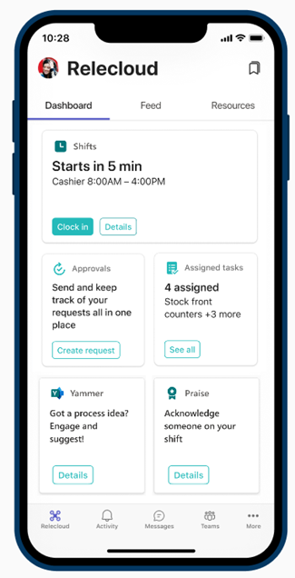

# Frontline team collaboration

Bring your frontline together to communicate, collaborate, and streamline operations with Microsoft Teams. Microsoft 365 and Teams can empower retail associates, healthcare workers, financial services providers, nonprofit organizers, manufacturing workers, and more to seamlessly communicate and collaborate.

> [!NOTE]
> These scenarios are also part of Microsoft Clouds for [Financial Services](/industry/financial-services), [Healthcare](/industry/healthcare), [Nonprofit](/industry/nonprofit), and [Retail](/industry/retail). You can do more with these scenarios when you also use other capabilities from the Microsoft Clouds, such as Microsoft Dynamics 365 and Azure.

## Day-to-day communications and collaboration in Teams

Microsoft Teams enables your on-the-ground staff to collaborate efficiently with included collaboration features and apps. Your frontline workforce can use Teams on either personal or shared devices depending on the needs of your organization.

Teams includes the following ways to communicate and share information:

|Task |Description |Manage this capability |End-user training |
|-----|------------|-----------------------|------------------|
|Chat, post messages, and communicate |Your frontline workers can seamlessly communicate within and across locations to with individual and channel chat messaging. Teams provides a great out-of-the-box collaboration experience for your organization, and most organizations find that the default settings work for them. |[Manage Chat, teams, channels, and apps](/microsoftteams/deploy-chat-teams-channels-microsoft-teams-landing-page). | [Start chats](https://support.microsoft.com/office/start-and-pin-chats-a864b052-5e4b-4ccf-b046-2e26f40e21b5) and [Work with posts and messages](https://support.microsoft.com/office/create-and-format-a-post-e66777da-636b-49eb-9408-b0d88b212885). Watch the [Tags in Microsoft Teams video](https://go.microsoft.com/fwlink/?linkid=2202727). |
|Call and meet with team members |Managers can set up individual meetings, or use channel meetings to manage daily meetings, both with the power of Teams audio, video, screen sharing, recording, and transcription features. You'll need to configure settings for meetings and conferencing, and enable a voice solution to use calling. |[Manage calling and meeting in Teams](/microsoftteams/deploy-meetings-microsoft-teams-landing-page) and [Plan your Teams voice solution](/microsoftteams/cloud-voice-landing-page) |[Make calls](https://support.microsoft.com/office/overview-of-teams-calls-425d6970-6e27-47b6-bc61-4c38fff51c4f) and [Join a meeting](https://support.microsoft.com/office/join-a-teams-meeting-078e9868-f1aa-4414-8bb9-ee88e9236ee4) |
|Store and share files and documents |Sharing files allows in-store staff to easily access information such as merchandising diagrams without having to leave the sales floor or get help from a manager. Every team automatically comes with a Files tab that you can use to store and share documents. This tab actually represents a folder within the default team site document library in SharePoint that is automatically created when the team is created. |[Overview of Teams and SharePoint integration](/sharepoint/teams-connected-sites) |[Upload and share files](https://support.microsoft.com/office/upload-and-share-files-57b669db-678e-424e-b0a0-15d19215cb12) |

### See examples of how different industries can use communication capabilities in Teams

These examples are for industries included in the Microsoft industry clouds, but you can use these capabilities for an organization in any sector.

#### Retail

Retail employees can use Teams to keep in touch and better serve customers. Different locations and departments can use chats and channels to share information about products and policies, such as which items are being promoted or going on sale. Employees in different departments or locations can use Teams meetings to get important updates without leaving their stations. Managers or merchandising specialists can use file sharing to send out diagrams for new displays or new product labels.

#### Healthcare

Healthcare workers in a hospital use Teams capabilities to coordinate care. Everyone in the office is part of a general chat, and each group of workers (doctors, nurses, receptionists, and other staff) has their own channel where they can ask questions and communicate. Staff in different departments use Teams meetings and calls to keep up to date without having to leave their stations. When multiple staff are attending to one patient, they share notes and care plans over Teams. Staff who work with instruments and machinery, such as medical instrument technicians, can share fact and care sheets about equipment.

#### Financial services

Bank employees can use Teams to communicate across branches and share information. Each branch can use a separate channel, as can different work groups such as tellers and advisors. Banks can hold Teams meetings for different branches to learn about new policies and products. They can also hold morning meetings with the whole region before the branches open. When the bank launches a new product, such as a credit card or account type, fact sheets can be shared in Teams so everyone has quick access to new information.

#### Manufacturing

Manufacturing workers can use Teams to communicate and coordinate production within and across locations. Plants can hold morning stand-up meetings without anyone having to leave their stations. Workers can use chat to get in touch with each other and foremen or supervisors so they don't need to search across large areas to find help. Your team can use file sharing to make sure everyone has on-the-go access to manuals, instruction sheets, inspection records, and any other information your workers need.

## Apps in Teams

Your team can use apps in Teams to coordinate and collaborate with each other on everyday tasks, such as the following:

- [Create, manage, and share schedules with Shifts](#create-manage-and-share-schedules-with-shifts)
- [Keep in touch with Walkie Talkie](#keep-in-touch-with-walkie-talkie)
- [Boost morale with Praise](#boost-morale-with-praise)
- [Track and monitor work with Tasks](#track-and-monitor-work-with-tasks)
- [Streamline approvals with Approvals](#streamline-approvals-with-approvals)
- [Check in on progress with Updates](#check-in-on-progress-with-updates)

Financial services organizations can also use the [Collaboration Manager for Loans](/industry/financial-services/collaboration-manager/overview) to seamlessly collaborate on the lending process.

> [!TIP]
> Examples are given for the financial services, healthcare, nonprofit, and retail industries, but you can use these apps for an organization in any sector.

[View videos and resources](collab-features-apps-toolkit.md) to share with your team to help them use collaboration apps and features in Teams.

### Create, manage, and share schedules with Shifts

Use Shifts to seamlessly manage and share schedules. Managers can create custom groups such as cashiers, nurses, or mortgage specialists, assign shifts to employees, add custom labeling and breaks, and add open shifts that employees can request to take. Employees can use Shifts to set their availability, view their schedules, swap shifts with coworkers, and clock in and out. Managers can also create open shifts that employees can request. For example, a volunteer coordinator at a nonprofit could create open shifts that volunteers can request to take.

Learn how to [Manage Shifts for your organization](/microsoftteams/expand-teams-across-your-org/shifts/manage-the-shifts-app-for-your-organization-in-teams?bc=/microsoft-365/frontline/breadcrumb/toc.json&toc=/microsoft-365/frontline/toc.json).

Learn how to [help your employees track time and attendance with Shifts](shifts-toolkit.md).

Share this [Shifts video training](https://support.microsoft.com/office/what-is-shifts-f8efe6e4-ddb3-4d23-b81b-bb812296b821) with your users.

[View videos and resources](shifts-toolkit.md) to share with your team to help them use features in Shifts.

### Keep in touch with Walkie Talkie

The Walkie Talkie app provides instant push-to-talk communication. By using Walkie Talkie, employees and managers can communicate from anywhere in the store. For example, if a customer on one side of the store asks an employee if an item is in stock on the other side of the store, the employee can use Walkie Talkie to contact someone who works near the item. Because Walkie Talkie doesn’t have limited range, employees can also easily consult with experts in other stores or corporate offices.

|Industry |Example |
|:--------|:-------|
|Retail | If a customer asks a store associate a question they don't know the answer to, the associate can use Walkie Talkie to call a manager or another expert without having to leave the customer. |
|Healthcare |A medical staff member who has a question about a patient's treatment can use Walkie Talkie to call another staff member who works with the patient. |
|Financial services |A bank employee discussing loan options with a customer can use Walkie Talkie to consult a loan expert to determine the best option for the customer. |
|Manufacturing |A technician can use Walkie Talkie to consult with an expert in another location while performing equipment maintenance or repair. |

Learn how to [manage Walkie Talkie for your organization](/microsoftteams/walkie-talkie?bc=/microsoft-365/frontline/breadcrumb/toc.json&toc=/microsoft-365/frontline/toc.json).

Share this [Walkie Talkie video training](https://support.microsoft.com/office/use-walkie-talkie-in-teams-884a008a-761e-4b62-99f8-15671d9a2f69) with your users.

Watch the [Walkie Talkie featurette video](https://go.microsoft.com/fwlink/?linkid=2202710).

### Boost morale with Praise

The Praise app allows management and frontline team members to congratulate each other and share appreciation by sending badges. Praise helps employees feel recognized for achievements such as making sales goals and going above and beyond to help customers.

|Industry |Example |
|:--------|:-------|
|Retail |A store manager can send the **Awesome** badge to an associate who meets their sales goals. |
|Healthcare |A healthcare worker can send the **Kind heart** badge to a peer who puts extra effort into patient care. |
|Financial services |A bank manager can send the **Achiever** badge to a relationship manager who helps to retain an important client. |
|Manufacturing |A supervisor can send the **Leadership** badge to a foreman whose team is performing well. |

Learn how to [manage the Praise app for your organization](/microsoftteams/manage-praise-app?bc=/microsoft-365/frontline/breadcrumb/toc.json&toc=/microsoft-365/frontline/toc.json).

Share this [Praise video training](https://support.microsoft.com/office/communication-and-praise-7d37ef80-542b-42e5-aa01-0fabbaa634b6) with your users.

### Track and monitor work with Tasks

Use Tasks in Teams to track to-do items for your whole frontline team. Store managers and employees can create, assign, and schedule tasks, categorize tasks, and update status at any time from any device running Teams. IT pros and admins can also publish tasks to specific teams for your organization. For example, you could publish a set of tasks for daily cleaning or steps to set up a new display.

|Industry |Example |
|:--------|:-------|
|Retail |A store manager could assign associates a task to set up a new seasonal display. |
|Healthcare |A team leader at a doctor's office could assign a nurse a task to attend a training session. |
|Financial services |A bank manager can assign mortgage specialists a task to review and get familiar with new rates or policies. |
|Manufacturing |A supervisor can assign a worker a task to inspect a new batch of products. |

Learn how to [manage the Tasks app for your organization](/microsoftteams/manage-tasks-app?bc=/microsoft-365/frontline/breadcrumb/toc.json&toc=/microsoft-365/frontline/toc.json).

Share this [Tasks video training](https://support.microsoft.com/office/use-the-tasks-app-in-teams-e32639f3-2e07-4b62-9a8c-fd706c12c070) with your users.

Watch the [Tasks featurette video](https://go.microsoft.com/fwlink/?linkid=2202616).

### Streamline approvals with Approvals

Use Approvals to streamline requests and processes with your team. Create, manage, and share approvals directly from your hub for teamwork. Start an approval flow from the same place you send a chat, in a channel conversation, or from the Approvals app itself. Just select an approval type, add details, attach files, and choose approvers. Once submitted, approvers are notified and can review and act on the request. You can allow the Approvals app for your organization and add it to Teams.

|Industry |Example |
|:--------|:-------|
|Retail |A sales associate could submit an approval request to offer a discount or special rate to a customer. |
|Healthcare |A nurse could submit an approval request to change an inpatient's medication. |
|Financial services |A lending specialist could submit an approval request to a supervisor to offer a special interest rate. |
|Manufacturing |A machine operator can submit a request for approval to adjust the settings on a piece of equipment. |

Learn how to [manage the Approvals app for your organization](/microsoftteams/approval-admin?bc=/microsoft-365/frontline/breadcrumb/toc.json&toc=/microsoft-365/frontline/toc.json).

Share this [Approvals video training](https://support.microsoft.com/office/what-is-approvals-a9a01c95-e0bf-4d20-9ada-f7be3fc283d3?wt.mc_id=otc_microsoft_teams) with your users.

Watch the [Approvals featurette video](https://go.microsoft.com/fwlink/?linkid=2202800).

### Check in on progress with Updates

The Updates in Microsoft Teams app provides a centralized place for members of your organization to create, review, and submit updates. By creating templates, you can use the Updates app to keep track of anything your organization needs. Updates is available for both desktop and mobile.

|Industry |Example |
|:--------|:-------|
|Retail |A manager could assign the out-of-the-box Store Opening template for the shift lead to complete every morning. |
|Healthcare |A team leader could create and assign a recurring daily template with a checklist for equipment preparation. |
|Financial services |A bank manager could create and assign a recurring daily template for tellers to confirm morning counts. |
|Manufacturing |A supervisor can create and assign a template to keep track of progress on production of a new batch of items. |

Learn how to [manage the Updates app for your organization](/microsoftteams/manage-updates-app?bc=/microsoft-365/frontline/breadcrumb/toc.json&toc=/microsoft-365/frontline/toc.json).

Share this [Updates video training](https://support.microsoft.com/office/get-started-in-updates-c03a079e-e660-42dc-817b-ca4cfd602e5a) with your users.

Watch the [Updates featurette video](https://go.microsoft.com/fwlink/?linkid=2202831).

## Set up your teams, channels, and apps

When you're ready to connect your retail associates in Teams, you can set up teams and channels for your store teams and managers with pre-built or custom templates. The easiest way is to start with a template. The **Organize a store** and **Retail for managers** [templates](/microsoftteams/get-started-with-retail-teams-templates?bc=/microsoft-365/frontline/breadcrumb/toc.json&toc=/microsoft-365/frontline/toc.json) are pre-made templates that include channels and apps designed for retail. You can also create a template based off of an existing team. Even when you start with a template, you can customize the team and channels, and add more apps to suit your team's needs.

- Use channels with tabs to share news, keep employees in touch across shifts, and build community.
- Use teams templates to set up teams with similar structures (such as channels and tabs) across stores or regions.

### Create a team based on a template

1. In Microsoft Teams, select **Join or create a team**.

2. Select **Create a team** and then scroll down to see available templates.

More information: [Create a team with templates](https://support.microsoft.com/office/create-a-team-with-team-templates-702a2977-e662-4038-bef5-bdf8ee47b17b)

### Manage apps

Refine what's in your team with apps. You can allow or block apps for your organization, or configure settings for apps, in the Microsoft Teams admin center. For more information about managing apps, see [Manage apps in the Microsoft Teams admin center](/microsoftteams/manage-apps).

Your users can add any apps that you have allowed to their teams. Share this training with your users to show them how: [Find and use apps](https://support.microsoft.com/office/find-and-use-apps-6e22a734-c002-4da0-ba63-681f155b142d).

## Communicate over email with Exchange Online and Outlook

Email is a core communication tool for most workplaces. [Set up email with Exchange Online](flw-setup-microsoft-365.md#set-up-email-with-exchange-online) to let your frontline managers and workers communicate with each other, with employees in other locations, or with headquarters. Users must have an F3 license to have an email mailbox.

You can also set up shared mailboxes to allow for incoming mail from customers (such as for customer service or scheduling requests) and have a group of workers who monitor and send email from a public email alias like info@contoso.com. For more information about shared mailboxes, see [About shared mailboxes](../admin/email/about-shared-mailboxes.md) and [Open and use a shared mailbox in Outlook](https://support.microsoft.com/office/open-and-use-a-shared-mailbox-in-outlook-d94a8e9e-21f1-4240-808b-de9c9c088afd).

## Use Viva Connections to create a personalized experience

> [!NOTE]
> Viva Connections isn't currently available for tablets.

Viva Connections is part of the [Microsoft Viva suite](/viva/microsoft-viva-overview) and enables you to create a personalized landing experience in Teams.

Use the Viva Connections Dashboard and add the Shifts, Tasks, and Approvals cards. Cards are connected to the Shifts, Tasks, and Approvals apps in Teams. Content in the cards is dynamic and personalized to the user.

Learn more about [how to get Viva Connections](/viva/connections/viva-connections-overview) and [how to create a Viva Connections Dashboard](/viva/connections/create-dashboard).

## Learn more about Teams capabilities for specific industries

- [Teams for Retail](teams-for-retail-landing-page.md)
- [Teams for Healthcare](teams-in-hc.md)
- [Collaboration Manager for Loans for Financial Services](/industry/financial-services/collaboration-manager/overview)
