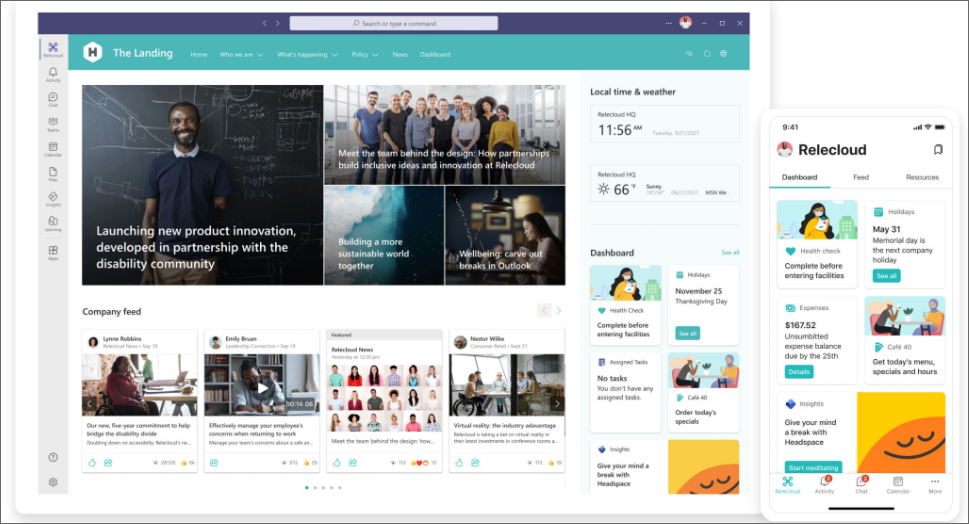
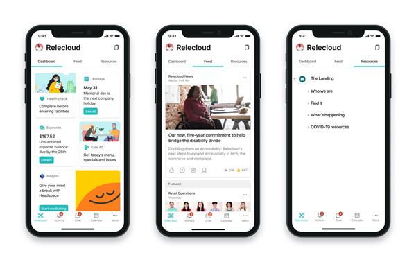

# Engage your frontline workers and focus on wellbeing

Nurture a sense of belonging among your frontline team by empowering to engage with your entire organization.

Survey's like Microsoft’s [Work Trend Index Pulse Report](https://www.microsoft.com/worklab/work-trend-index) show that many frontline workers:

- Wish more was being done to support their mental health
- Say leadership does not prioritize building culture
- Believe that work stress will either stay the same or worsen in the coming year

You can help your frontline team overcome these challenges and feel supported in your organization by using [Viva Connections](#connect-frontline-workers-to-your-broader-organization-with-viva-connections), [Yammer](#create-communities-with-yammer), [Praise](#boost-morale-with-praise), [SharePoint, and Microsoft Stream](#support-engagement-with-sharepoint-and-microsoft-stream).

## Connect frontline workers to your broader organization with Viva Connections

Viva Connections brings the power of SharePoint into Microsoft Teams, so your frontline workers can easily access everything they need on the go. Use the Viva Connections app for Microsoft Teams to:

- Connect frontline workers and create opportunities to communicate and engage
- Create a sense of belonging
- Provide tools that help foster well-being
- Recognize and celebrate frontline workers' success
- Make it easy for frontline workers to access important news and announcements
- Empower frontline workers around a common mission and goal

### Get started planning, building, and launching Viva Connections

First, you'll need to conduct a needs assessment to learn more about the shared challenges frontline workers face in your organization. Build a team of stakeholders (such as representatives from HR, operations, and process owners) who can accurately represent the needs of the frontline workforce. Take an inventory of the concerns of workers in different roles and capture opportunities to increase engagement. Work with stakeholders to create a plan that starts solving common issues and can be built-on over time.

Once you know what your frontline team's needs are, follow the [plan, build, and launch guide](/viva/connections/plan-viva-connections) to deploy Viva Connections.

1. **Make sure the right stakeholders are involved** when planning and design for frontline workers so that the needs of the workers are fully represented and understood.

|Goal |Potential stakeholders |
|:----|:----------------------|
|Increase engagement with communications |Internal communications team, HR team, operations team |
|Promote health and wellbeing |HR team, recruitment team, engagement teams, HR teams, health and safety teams |
|Create a supportive digital ecosystem |Operations team, technical and digital teams, owners of employee tools and systems |

2. **Develop goals and the metrics that can be used to measure success** before you deploy Viva Connections with frontline workers. Define goals with stakeholders early in the process to ensure your plan can be measured and improved once its implemented. Develop goals that are specific, measurable, assignable, realistic, and time related.

3. **Create communication channels** that allow frontline workers to share feedback about their experience with Viva Connections, ideas on how to improve the experience, and an opportunity to expand support for more processes and tasks. Consider using existing Yammer and Teams channels that are already focused on supporting frontline workers.

### Increase engagement with communications

Viva Connections is comprised of three main components that can be set up and customized in different ways to highlight tools and resources.

| |

|Component |Description |Capabilities |Learn more |
|:---------|:-----------|:------------|:----------|
|Dashboard |The Dashboard is your employee’s digital toolset and enables quick access to popular tasks. |Prioritize cards that help frontline workers accomplish popular tasks like clocking in and out, or viewing assigned tasks.   Cards can be targeted to distinct roles and regions. |
|Feed |The Feed aggregates content from Yammer, SharePoint news, and Stream to display a personalized news stream. |Content in the Feed gets automatically aggregated based on sites and Yammer communities that the user follows   Content can be prioritized to display more prominently in the Feed. |
|Resources |The Resources surface links to popular SharePoint portals and other content. |Resources are inherited from global navigation in SharePoint.   Link to popular SharePoint portals like HR benefits and training resources.   Modern SharePoint portals will display in Teams to provide the best possible viewing experience. |

There are several ways to use Viva Connections to communicate with your workforce. Viva Connections features a [Feed where news, content from Yammer, and videos are aggregated and displayed](/viva/connections/viva-connections-overview#viva-connections-feed) in a personalized view based on the sites and communities that the viewer follows. The [Dashboard](/viva/connections/create-dashboard) can also be used to highlight certain cards that link to important news sources.

As you prioritize and align the scenarios to support, consider how and where certain tools and resources should be located. [Learn more about the differences between desktop and mobile apps](/viva/connections/viva-connections-overview#viva-connections-mobile-and-desktop-experiences).

#### Empower your workers to share feedback

Creating channels for your frontline workers to share feedback helps these teams feel engaged and like their voices matter. In addition, getting feedback from these teams can provide insights into how your organization can improve processes. You can use a [web link card](/viva/connections/create-dashboard#add-a-web-link-card) in Viva Connections makes it easy to link to [Microsoft Forms](https://support.microsoft.com/office/create-a-form-with-microsoft-forms-4ffb64cc-7d5d-402f-b82e-b1d49418fd9d) that you can customize for your feedback needs. You can also [integrate third-party survey solutions](https://cloudpartners.transform.microsoft.com/resources/viva-app-integration).

> [!NOTE]
> Form creation requires an F3 or Enterprise license. Workers with F1 licenses can fill out forms, but they'll need to be created by someone with an F3 or Enterprise license. [Learn more about license types](flw-licensing-options.md) or [View the detailed license comparison table](https://go.microsoft.com/fwlink/?linkid=2139145).

### Promote health and wellbeing

Frontline workers need extra support when it comes to managing health and wellbeing. Not only are their jobs fast paced, but they can also be physically and emotionally demanding. Help frontline workers by using the Dashboard to help surface daily health checks, wellness reminders, access to health benefits, and other [third-party solutions that keep people feeling connected and productive](https://cloudpartners.transform.microsoft.com/resources/viva-app-integration).

- Use the [Web link card](/viva/connections/create-dashboard#add-a-web-link-card) to link to existing health and wellness resources.
- Use the [Teams app card](/viva/connections/create-dashboard#add-a-teams-app-card) to connect to health and wellness [apps in Microsoft Teams](https://support.microsoft.com/office/find-teams-apps-dca531fb-3885-428d-ba1a-f3c17032e07e).
- Use the [Card designer](/viva/connections/create-dashboard#design-your-own-card-with-a-quick-view) to create a custom card.

### Create a supportive digital ecosystem

Empowering frontline workers with the right technology makes their jobs easier and helps your organization quickly adapt to ever-changing work conditions. Use Viva Connections to create a digital ecosystem and curated employee experience.

Use [Adaptive card templates](/adaptive-cards/templating/), the [Card designer](/viva/connections/create-dashboard#design-your-own-card-with-a-quick-view), and [third-party integrations](https://cloudpartners.transform.microsoft.com/resources/viva-app-integration) to create custom cards and quick views that help workers access information and complete everyday tasks such as:

- Finding or securing parking spaces
- Accessing pay and benefits information
- Requesting new uniform pieces

## Create communities with Yammer

Yammer is an internal social network that gives members of your organization opportunities to connect with each other. You can create communities where members of your organization can post messages and communicate. Having a variety of communities that span both frontline and non-frontline teams helps your on-the-ground workforce connect to each other and the broader organization. Communities can be based on:

- Location
- Roles, such as cashiers or nurses
- Interests, such as outdoor activities or pop culture
- Identity groups
- And more

### Host live events

Members of your leadership or management team can host live events on Yammer where employees can engage and ask questions in real time over chat. Your communications and management teams can use live events to share announcements, host morale events, and more.

> [!NOTE]
> Only users with an E3 or E5 license can host live events, but users with F licenses can join them. [Learn more about who can host and join live events in Yammer](/yammer/manage-yammer-groups/yammer-live-events).

[Learn more about Yammer](https://support.microsoft.com/office/what-is-yammer-1b0f3b3e-89ee-4b66-aac5-30def12f287c).

## Boost morale with Praise

The Praise app in Microsoft Teams lets managers and employees congratulate each other and share appreciation by sending badges in Teams chat and channels. Praise helps employees feel recognized for achievements such as meeting goals and going above and beyond to help customers.

[Learn how to manage Praise for your organization](/microsoftteams/manage-praise-app).

## Support engagement with SharePoint and Microsoft Stream

One of the biggest struggles for frontline workers is feeling included in the broader organization. By recording important meetings in SharePoint and hosting videos in Microsoft Stream.

### Record Teams meetings and store them in SharePoint

If your organization already uses Microsoft Teams, you may have recorded some of your meetings so that team members can catch up on meetings that they missed. Recording meetings can also benefit your frontline team by making them feel included in the organization. Some ways you can use recorded meetings to help frontline teams include:

- Give them earlier access to announcements such as product releases and new policies.
- Help them understand your organization's broader business goals.
- Familiarize them with the leadership team that drives decisions that affect them.

[Learn how to record Teams meetings and store them in SharePoint](https://support.microsoft.com/office/record-a-meeting-in-teams-34dfbe7f-b07d-4a27-b4c6-de62f1348c24).

Once a meeting is recorded and saved in SharePoint, your corporate communications team can [add a card in Viva Connections](/viva/connections/create-dashboard#create-a-dashboard-and-add-cards) to make it easily accessible for your frontline team.

### Host live events and share content on Microsoft Stream

Microsoft Stream is your organization's own streaming video platform. With Stream, anyone in your organization can record and upload videos to share. Ways you can use Stream to engage your frontline workers include:

- Share announcements such as product releases and new policies so your frontline team isn't the last to know.
- Members of the leadership team can introduce themselves and discuss their goals so your frontline team understands who drives decisions and why.
- Frontline teams from different locations can create videos introducing themselves and showcasing their location so workers in different places can feel connected.

> [!NOTE]
> Only users with an Enterprise license can host events or publish to stream. Users with F licenses can join events and view videos.

[Learn more about Microsoft Stream](https://support.microsoft.com/office/explore-stream-87a7d1e2-ef0e-44c6-88dc-74b23266cfc0).

Your corporate communications team can make sure everyone has easy access to stream videos by [adding a card in Viva Connections](/viva/connections/create-dashboard#create-a-dashboard-and-add-cards).
