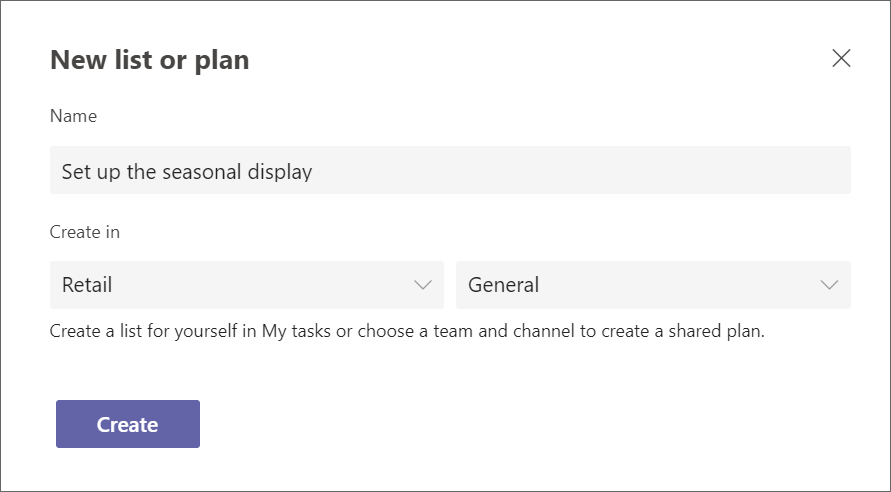
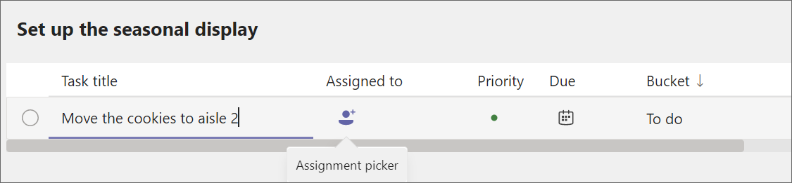
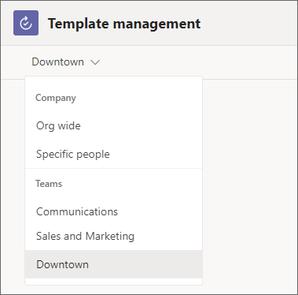
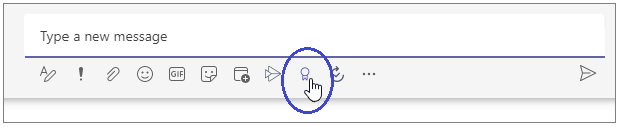

# Managers - Get your team started with Microsoft 365 for frontline workers

Microsoft 365 for frontline workers includes a variety of capabilities to help your team do their best. Here are a few things you can start doing right away to get your team working together:

|Path   |Description   |Teams apps you'll need |
|----------|-----------|-----------|
|[Enable quick communication](#enable-quick-communication) |Help your frontline team stay in touch. |Chats and Walkie Talkie |
|[Manage frontline schedules, time, and attendance](#manage-frontline-schedules-time-and-attendance) |Set up a schedule that you can manage in Teams. |Shifts |
|[Manage work items](#manage-work-items) |Use Teams and Microsoft 365 apps to assign and keep track of work items. |Tasks, Lists, Approvals, and Updates |
|[Foster connections and boost morale](#foster-connections-and-boost-morale-with-praise) |Send praise to your team members to help them feel appreciated. |Praise |

The apps that support these capabilities are included in Teams and most are ready to use right away. Some you’ll need to add to your team or set up before you’re ready to use it. Also, most of these apps are pinned by default, meaning that members of your frontline team will see them by default in the app bar, which is the bar at the bottom of the Teams mobile clients (iOS and Android) and on the side of the Teams desktop client. You can always add apps that aren’t pinned based on your needs. [Learn how to add apps in Teams](https://support.microsoft.com/office/add-an-app-to-microsoft-teams-b2217706-f7ed-4e64-8e96-c413afd02f77).

This article will help you get Teams for frontline workers, set up a team, and then configure the features and apps you need to get your team going with these capabilities.

## Get Teams for frontline workers

First, you'll need to [initiate the frontline trial experience](https://support.microsoft.com/office/learn-more-about-the-frontline-trial-in-microsoft-teams-73a429fc-f211-4360-8329-704bc102ba98) from within the Tasks app in Microsoft Teams. If you already have Microsoft 365 for frontline workers, you can skip this step and follow the rest of this article to learn how to get the most out of your licenses.

> [!NOTE]
> The Frontline Trial is based on the Microsoft 365 F3 license.

## Enable quick communication

Use the inbuilt communication tools in Microsoft Teams to enable your frontline workers to stay in touch. You don’t need to do any additional setup for the communication apps or to use them in your team. You’ll always see the Teams, Chats, and Activity icons when you open Teams, either on desktop or mobile, while Walkie Talkie is only available on mobile.

### Teams

You and your frontline workers can create teams to help specific groups stay in touch. For example, you could create a Cashiers team so all your cashiers can communicate with each other and share information. If there’s a policy change that only applies to cashiers, you can post it in the Cashiers team so it reaches the people who need to see it. [Learn how to create a team in Teams](https://support.microsoft.com/office/set-up-groups-and-teams-a79afa20-aa01-44a3-b33d-5eaa72f6404f).

### Chats

Teams chat allows members of your frontline workforce to communicate seamlessly without having to use their personal messaging apps. [Learn more about chats](https://support.microsoft.com/office/first-things-to-know-about-chats-88ed0a06-6b59-43a3-8cf7-40c01f2f92f2).

### Activity

You can @Mention a team member to call their attention to a conversation. @Mentions send users a notification, so they’ll see the message in Activity even if they miss it in the chat.

### Walkie Talkie

Walkie Talkie empowers your workers to have real-time conversations with workers at any location without leaving their station. For example, if an employee is helping a customer and needs assistance, they can use Walkie Talkie to contact an expert or manager without having to walk away from the customer.

Walkie Talkie is supported on Android devices with Google Mobile Services (GMS) and iOS devices.

## Manage frontline schedules, time, and attendance

You can use the Shifts app to create and manage schedules. With Shifts, employees can request time off, volunteer for open shifts, and request to swap shifts with coworkers. You can also use shifts to share schedules so it’s easy for everyone on your team to know when they’re working. Employees can use Shifts to clock in and out.
To create a schedule in Shifts:

1. Go into the app and select **Create a new schedule**.
2. Then select **Add group** to organize the schedule based on job type or location. You can have multiple groups on one schedule. For example, a healthcare organization could have a group for receptionists and a group for nurses.
3. Select the ellipses (**...**) and then **Rename** to name the group.
4. To create a shift for a team member, select their row and then select **More options > add shift**.

Watch [this video](https://support.microsoft.com/office/create-a-shifts-schedule-2b94ca38-36db-4a1c-8fee-f8f0fec9a984) to learn more about creating schedules in shifts.

If your organization is already using a workforce management system for scheduling, your IT team can integrate it with Teams to pull all of your schedules into shifts. Right now Shifts is able to integrate with Blue Yonder and Reflexis workforce management systems. [Learn more about connecting your workforce management system](shifts-connectors.md).

## Manage work items

You can use the Tasks, Lists, Approvals, and Updates apps to manage and keep track of work items. You can choose to use just one app, or use several of them based on your needs. Anyone can create and assign tasks to themselves and team members.

### Tasks

Tasks is powered by Planner, and lets you create and assign work items for your team. To create and assign a task in Tasks:

1. Open the Tasks app.
2. Select **+ New list or plan** to create a task list for your team.
3. Give your plan a name. Under **Create in**, choose the team and channel you want the task plan to apply to. Then select **Create**.

    

4. To create a new task, give it a name. Then assign it to a member of the team that you created the plan in. You can also choose a due date.

    

5. Once you've created and assigned the task, it will appear in the Tasks app for members of the team. If you don't assign the task to a specific person, it will still show up for the team.

Tasks is powered by Planner. Watch [this playlist](https://support.microsoft.com/office/organize-your-team-s-tasks-in-microsoft-planner-c931a8a8-0cbb-4410-b66e-ae13233135fb) to learn more about how you can use Planner and Tasks together.

### Approvals

Approvals lets your team submit requests for approval from within Teams. For example, if one of your team members wants to offer a discount on a large order, they can submit an approval request to get permission.

You can create templates for your frontline team that will allow them to submit streamlined approval requests.

1. From the Approvals hub, select **Create or manage templates**.
2. From the menu, select which team you want the template to apply to.

    

3. Select **New template** and then either choose an existing template from the template store or create one from scratch to suit your needs.
4. Choose who you want the template to apply to. Choose **Team wide** to make this template apply to everyone in the team you selected in step 2.
5. Select the team from the list.
6. Fill in the Basic settings, Form design, and Workflow settings. Then select **Preview**.
7. If the template looks good to you, choose **Publish**.
8. Members of your team will now be able to submit approval requests from the template you created.

[Learn more about creating templates for your team in Approvals](https://support.microsoft.com/office/discover-templates-in-approvals-c33ecf9f-b745-4287-b104-ac69469745e0).

### Lists

The Lists app helps you track information and organize work. You and your team can create lists for inventory, customer requests, supply needs, and more.

You can create a list from a template by choosing **+New List** from the Lists app. [Learn about what templates are available](https://support.microsoft.com/office/list-templates-in-microsoft-365-62f0e4cf-d55d-4f89-906f-4a34e036ded1).

If you have a spreadsheet that you collaborate on with your team, you can convert it to a list.

1. From the Lists app, select **+New List**.
2. Choose **From Excel** and upload the spreadsheet you want to turn into a list.
3. Confirm the column types are correct and adjust them if necessary. Then select **Next**.
4. Give your list a name, color, icon, and location. Then choose **Create**.

> [!NOTE]
> The Lists app isn't pinned by default, but you can [add it from the Teams app store](https://support.microsoft.com/office/add-an-app-to-microsoft-teams-b2217706-f7ed-4e64-8e96-c413afd02f77).

### Updates

Updates allows you to create, submit, and review updates. People can easily see their employee updates, check-ins, and reports in one place to make sure the team is on track for success, whether those are recurring processes that happen on a regular basis or in-the-moment updates that might be needed at any time.

You can assign updates to your team members. Team members can also submit updates without being assigned.

1. In the Updates app, select **Create and manage templates**.
2. Choose a popular template, or choose **View more** to see all template options. You can choose a template or start from blank.
3. Fill in the Basic settings and Form design.
4. In Workflow settings, choose who you want to submit this update, view this update, and the times and due dates for the update.
5. The submitters you assigned will now be able to see and submit the required update.

> [!NOTE]
> The Updates app isn't pinned by default, but you can [add it from the Teams app store](https://support.microsoft.com/office/add-an-app-to-microsoft-teams-b2217706-f7ed-4e64-8e96-c413afd02f77).

## Foster connections and boost morale with Praise

The Praise app in Teams helps you show appreciation to members of your team. You can send badges to team members to recognize their achievement, and team members can send badges to each other. You can also send badges in a channel conversation to recognize a group of people. Praise uses pre-made badges that call out positive qualities such as **Team Player** and **Awesome**.

1. Open a Teams chat or channel. Below the space where you write a message, choose the Praise icon or select the ellipses (**...**) to find it.
    
2. Select a badge from the **Badge** dropdown menu.
3. Add the name of the people you want to praise and an optional description.
4. Select **Preview** to check it, and then select **Send**.

## Share training videos with your users

Help your team get comfortable and confident using their Microsoft 365 capabilities with these training resources. Each of these articles and videos only takes a few minutes to go through.

[Get started with Microsoft Teams](https://support.microsoft.com/office/get-started-with-microsoft-teams-b98d533f-118e-4bae-bf44-3df2470c2b12)

[Get started with Walkie Talkie](https://support.microsoft.com/office/get-started-with-teams-walkie-talkie-25bdc3d5-bbb2-41b7-89bf-650fae0c8e0c)

[Get started with Shifts](https://support.microsoft.com/office/what-is-shifts-f8efe6e4-ddb3-4d23-b81b-bb812296b821)

Shifts also includes a clock in and out feature. [Learn how to clock in and out with Shifts](https://support.microsoft.com/office/clock-in-and-out-with-shifts-ae7b676c-7666-46c7-9f68-85ff54acec8b)

[Get started with Tasks](https://support.microsoft.com/office/use-the-tasks-app-in-teams-e32639f3-2e07-4b62-9a8c-fd706c12c070)

[Learn about Approvals](https://support.microsoft.com/office/what-is-approvals-a9a01c95-e0bf-4d20-9ada-f7be3fc283d3)

[Learn about Lists](https://support.microsoft.com/office/create-a-list-from-the-lists-app-b5e0b7f8-136f-425f-a108-699586f8e8bd)

[Learn about the Updates mobile experience](https://support.microsoft.com/office/get-started-in-updates-c03a079e-e660-42dc-817b-ca4cfd602e5a#ID0EBF=Mobile)

[Learn how to send Praise](https://support.microsoft.com/office/send-praise-to-people-50f26b47-565f-40fe-8642-5ca2a5ed261e)