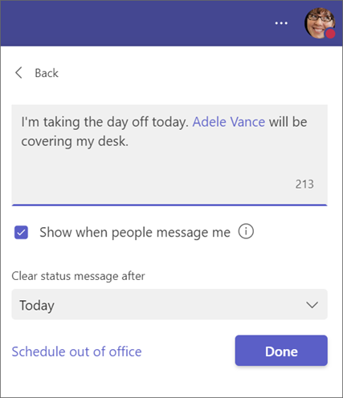

# Use a Teams status message to assign a delegate

Users in Microsoft Teams can set their status to Away or Do not disturb, and include a custom status message. A user who's going to be away can assign someone as a delegate who people can contact instead. The message delegation feature works as follows:

1. The user who's going to be away @mentions another user (the delegate) in their status message to let people know to contact the delegate instead while the user is away.

    

1. The user who's @mentioned gets notified that they're designated as a delegate.
1. When someone opens a chat with the away user and sees their status message, they see the delegate's name and can easily message them instead.

Users can initiate this process themselves. No admin involvement is required to enable the feature.

## Example scenario

Ravi Costa is a doctor on call at the radiology department. Ravi receives an urgent personal call and has to step away for the next couple of hours. Ravi asks a peer in the radiology department, Max Morin, to cover for them while they're away. They change their status in Teams to Away and set a status message that says "I'm unavailable for the next few hours. Contact @MaxMorin for any emergencies." Max is notified in Teams, and team members who try to contact Ravi see the status message and know to contact Max in the meantime.
