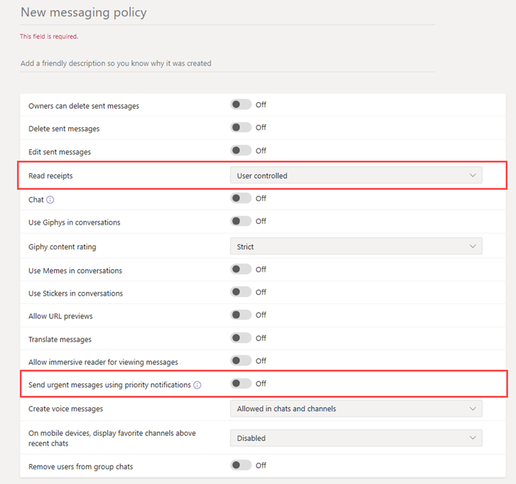

# Secure Messaging for healthcare organizations

Messaging policies are used to control which chat and channel messaging features are available to users in Microsoft Teams, and are part of the overall deployment of Secure Messaging for healthcare organizations like Hospitals, clinics, or doctor's offices, where having a message picked up and acted upon in a timely manner is crucial, as is knowing when crucial messages are read.

You can use the global (Org-wide default) policy or create one or more custom messaging policies for people in your organization. Users in your organization will automatically get the global policy unless you create and assign a custom policy. After you create a custom policy, assign it a user or groups of users in your organization. For example, you may choose to only allow certain job roles to use these features (perhaps doctors and nurses only) and other workers (like the janitorial or kitchen staff) to get a more limited set of features. Decide for yourself what needs your organization has, the guidance here is at most a suggestion.

Policies can be easily managed in the [Microsoft Teams admin center](https://admin.teams.microsoft.com) by logging in with administrator credentials and choosing **Messaging policies** in the left navigation pane.

 :::image type="content" source="media/hc-messaging-policy-admin-center-new.png" alt-text="Screenshot of the Messaging policies page." lightbox="media/hc-messaging-policy-admin-center-new.png":::
 
 To edit the existing default Messaging policy for your organization, click **Global (Org-wide default)**, and then make your changes. To create a new custom messaging policy, click **Add** and then select your settings. Choose **Save** when you are done.

The following settings are of special interest for Healthcare applications, and should be considered when designing a custom policy used in the Healthcare field:

## Read receipts

Read receipts allows the sender of a chat message to know when their message was read by the recipient in 1:1 and group chats 20 people or less. Use this setting to specify whether read receipts are user controlled, on for everyone, or off for everyone. Message read receipts are important in Healthcare organizations because they remove uncertainly about whether a message was read.

For Healthcare applications, choose either **User controlled** or **On for everyone**. Be aware that when using the **On for everyone** setting, the only way to set receipts for the whole  tenant is either to have only one messaging policy for the whole tenant (the default policy named "Global (Org-wide Default)") or to have all messaging policies in the tenant use the same settings for receipts. The read receipts feature is most effective when the feature is enabled to **On for everyone**.

*Usage example without read receipts:* Jakob Roth, a high risk patient, is admitted to the hospital.  Sofia Krause is a nurse working as part of the inter-disciplinary team (IDT) of medical workers, including different specialists, is assigned as the primary care coordinator in charge of this patient.  Sofia sends emails and other instant messages to a groups of nurses and doctors who use a variety of messaging clients and apps, and often gets no response or indication whether a message was read by team members. Due to tangled communication processes, Jakob's medication is misapplied and his hospital stay is extended.

*Usage example with read receipts:* Jakob Roth, a high risk patient, is admitted to the hospital.  Sofia Krause is a nurse working as part of the inter-disciplinary team (IDT) of medical workers, including different specialists, is assigned as the primary care coordinator in charge of this patient.  Sofia starts a group chat with a set of doctors and other nurses who will be working with the patient to coordinate care and starts an emergency triage.  The nurses and doctors communicate and collaborate over the patient's care plan throughout the care coordination process.  Important and urgent messages are sent through 1:1 and group chat conversations. Sofia uses the read receipts functionality to determine if messages sent requesting support are delivered and read by the targeted physicians or nurses. Jakob's patient outcomes are near-optimal and he goes home sooner because his health team communicates smoothly.

## Send urgent messages using priority notifications

A user can mark a message as *urgent* when sending chat messages to other users. This feature helps hospital staff alert one another when a critical incident requires their attention. Unlike regular *important* messages, [priority notifications](https://support.microsoft.com/article/mark-a-message-as-important-or-urgent-in-teams-ea99d5b6-1317-4550-8d75-86ff14cd4462) notify users every two minutes for up to 20 minutes or until the message is picked up and read by the recipient, maximizing the likelihood that the message is acted upon in a timely manner.

An admin can enable or disable the ability for users assigned this policy to send priority notifications. This feature is on by default. The recipient of the priority message might not have the same messaging policy, and will not have an option to disable receiving priority messages. For Healthcare applications, we recommend enabling the feature for at least some users, but you'll need to determine which ones.

*Usage example:* Sofia Krause is readmitting a high-risk patient, Jakob Roth. Manuela Carstens, a physician, is the primary care doctor for this patient.  Sofia sends a message to Manuela using a priority notification asking for immediate help with triage of Jakob.  Manuela's phone receives the message but Manuela didn't feel the phone vibration and does not reply. Teams re-notifies Manuela and will continue to persistently re-notify until she reads the message. If read receipts are also enabled, Sofia can be aware that the message was read by Manuela, even before Manuela decides how to respond.

## Related topics

- [Manage messaging policies in Teams](/microsoftteams/messaging-policies-in-teams)
- [Get started with Teams for Healthcare organizations](teams-in-hc.md)
