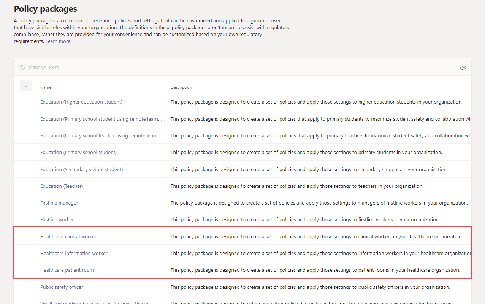
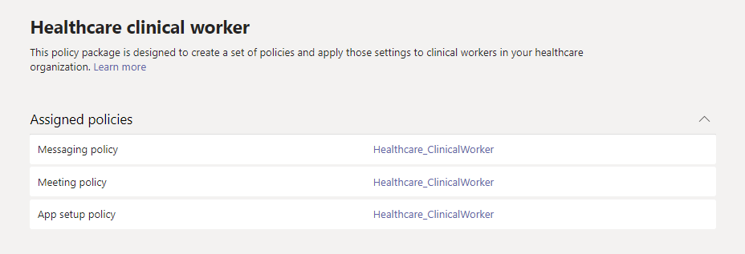
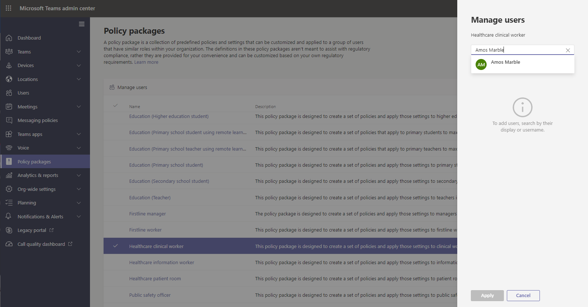

# Teams policy packages for healthcare

## Overview

A [policy package](manage-policy-packages.md) in Microsoft Teams is a collection of predefined policies and policy settings that you can assign to users who have similar roles in your organization. Policy packages simplify, streamline, and help provide consistency when managing policies. You can customize the settings of the policies in the package to suit the needs of your users. When you change the settings of policies in a policy package, all users who are assigned to that package get the updated settings. You can manage policy packages by using the Microsoft Teams admin center or PowerShell.

> [!VIDEO https://www.microsoft.com/videoplayer/embed/RE4Ht2o]

Policy packages pre-define policies for the following, depending on the package:

- Messaging
- Meetings
- Calling
- App setup
- Live events

Teams currently includes the following healthcare policy packages.

|Package name in the Microsoft Teams admin center|Best used for|Description |
|---------|---------|---------|
|Healthcare clinical worker  |Clinical workers in your healthcare organization  |Creates a set of policies and policy settings that give clinical workers such as registered nurses, charge nurses, physicians, and social workers full access to chat, calling, shift management, and meetings. |
|Healthcare information worker  |Information workers in your healthcare organization |Creates a set of policies and policy settings that give information workers such as IT personnel, informatics staff, finance personnel, and compliance officers, full access to chat, calling, and meetings.|
|Healthcare patient room  |Patient room devices|Creates a set of policies and policy settings that apply to patient rooms in your healthcare organization.|

Each individual policy is given the name of the policy package so you can easily identify the policies that are linked to a policy package. For example, when you assign the Healthcare clinical worker policy package to clinicians in your organization, a policy named Healthcare_ClinicalWorker is created for each policy in the package.

## Get started with policy packages

To get you started with Healthcare policy packages, on the Microsoft Admin Center onboarding hub, select **Healthcare**, and then select **Assign policy settings by role**. Once you’re ready to get started, decide which policy packages you'd like to assign individuals in your organization to.

Select **View policy details** to learn more about the specific policies in a package and their respective settings. These [can be customized](manage-policy-packages.md#customize-policies-in-a-policy-package) after assignment in the Teams Admin Center.

Choose one or multiple packages to assign and then click **Next**. You can search for and add people to the policy package best suited for their role. An individual can't be assigned to more than one policy package at one time.

Once you’ve added people to the right policy package, **Finish** finalizes your selections. You can continue to customize and manage policy packages in the Microsoft Teams admin center.

## Manage policy packages

### View

View the settings of each policy in a policy package before you assign a package. In the left navigation of the Microsoft Teams admin center, go to **Policy packages**, select the package name, and then select the policy name.

Decide whether the predefined values are appropriate for your organization or whether you need to customize them to be more restrictive or lenient based on your organization's needs.

### Customize

Customize the settings of policies in the policy package, as needed, to fit the needs of your organization. Any changes you make to policy settings are automatically applied to users who are assigned the package. To edit the settings of a policy in a policy package, in the left navigation of the Microsoft Teams admin center, go to **Policy packages**, select the policy package, select the name of the policy you want to edit, and then select **Edit**.

Keep in mind that you can also change the settings of policies in a package after you assign the policy package. To learn more, see [Customize policies in a policy package](manage-policy-packages.md#customize-policies-in-a-policy-package).

### Assign

Assign the policy package to users. If a user has a policy assigned, and then later you assign a different policy, the most recent assignment will take priority.

> [!NOTE]
> Each user will require the Advanced Communications add-on in order to receive a custom policy package assignment. For more information, see [Advanced Communications add-on for Microsoft Teams](/microsoftteams/teams-add-on-licensing/advanced-communications).

#### Assign a policy package to one or several users

To assign a policy package to one or multiple users, in the left navigation of the Microsoft Teams admin center, go to **Policy packages**, and then select **Manage users**.  

To learn more, see [Assign a policy package](assign-policy-packages.md).

If a user has a policy assigned, and then later you assign a different policy, the most recent assignment will take priority.

#### Assign a policy package to a group

**This feature is in private preview**

Policy package assignment to groups let you assign multiple policies to a group of users, such as a security group or distribution list. The policy assignment is propagated to members of the group according to precedence rules. As members are added to or removed from a group, their inherited policy assignments are updated accordingly. This method is recommended for groups of up to 50,000 users but will also work with larger groups.

To learn more, see [Assign a policy package to a group](assign-policy-packages.md#assign-a-policy-package-to-a-group).

#### Assign a policy package to a large set (batch) of users

Use batch policy package assignment to assign a policy package to large sets of users at a time. You use the [New-CsBatchPolicyPackageAssignmentOperation](/powershell/module/teams/new-csbatchpolicypackageassignmentoperation) cmdlet to submit a batch of users and the policy package that you want to assign. The assignments are processed as a background operation and an operation ID is generated for each batch.

A batch can contain up to 5,000 users. You can specify users by their object Id, UPN, SIP address, or email address. To learn more, see [Assign a policy package to a batch of users](assign-policy-packages.md#assign-a-policy-package-to-a-batch-of-users).

## Related topics

[Manage policy packages in Teams](manage-policy-packages.md)

[Assign policy packages to users and groups](assign-policy-packages.md)
