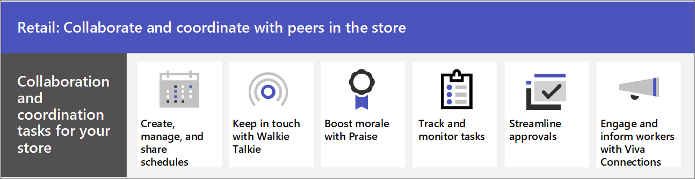

# Frontline team collaboration

Bring your frontline together to communicate, collaborate, and streamline operations with Microsoft Teams. Microsoft 365 and Teams can empower retail associates, healthcare workers, financial services providers, nonprofit organizers, manufacturing workers, and more to seamlessly communicate and collaborate.

> [!VIDEO https://www.microsoft.com/videoplayer/embed/RWRJVw] <!--daisy-->

> [!NOTE]
> These scenarios are also part of Microsoft Clouds for [Financial Services](/industry/financial-services), [Healthcare](/industry/healthcare), [Nonprofit](/industry/nonprofit), and [Retail](/industry/retail). You can do more with these scenarios when you also use other capabilities from the Microsoft Clouds, such as Microsoft Dynamics 365 and Azure.

## Day-to-day communications and collaboration in Teams

Microsoft Teams enables your on-the-ground staff to collaborate efficiently with included collaboration features and apps. Your frontline workforce can use Teams on either personal or shared devices depending on the needs of your organization.

Teams includes the following ways to communicate and share information:

- [Chat, post messages, and communicate](#chat-post-messages-and-communicate).
- [Call and meet with team members](#call-and-meet-with-team-members).
- [Store and share files and documents](#store-and-share-files-and-documents).

### Chat, post messages, and communicate

Your frontline workers can seamlessly communicate within and across locations to with individual and channel chat messaging. Teams provides a great out-of-the-box collaboration experience for your organization, and most organizations find that the default settings work for them.

See examples of how your organization can use chat:

|Industry |Example |
|:--------|:-------|
|Financial services |
|Healthcare |
|Nonprofit |
|Retail |
|Manufacturing |

[Learn how to manage Chat, teams, channels, and apps](/microsoftteams/deploy-chat-teams-channels-microsoft-teams-landing-page).

Share these trainings with your users:

- [Start chats](https://support.microsoft.com/office/start-and-pin-chats-a864b052-5e4b-4ccf-b046-2e26f40e21b5).
- [Work with posts and messages](https://support.microsoft.com/office/create-and-format-a-post-e66777da-636b-49eb-9408-b0d88b212885).

### Call and meet with team members

Managers can set up individual meetings, or use channel meetings to manage daily meetings, both with the power of Teams audio, video, screen sharing, recording, and transcription features. You'll need to configure settings for meetings and conferencing, and enable a Voice solution to use calling.

See examples of how your organization can use calls and meetings:

|Industry |Example |
|:--------|:-------|
|Financial services |
|Healthcare |
|Nonprofit |
|Retail |A manager can set up a morning video meeting with store associates in different departments to check their status before opening the store. |
|Manufacturing |

[Learn how to manage calling and meeting in Teams](/microsoftteams/deploy-meetings-microsoft-teams-landing-page).
[Plan your Teams Voice solution](/microsoftteams/cloud-voice-landing-page)

Share these trainings with your users:

- [Make calls](https://support.microsoft.com/office/overview-of-teams-calls-425d6970-6e27-47b6-bc61-4c38fff51c4f).
- [Join a meeting](https://support.microsoft.com/office/join-a-teams-meeting-078e9868-f1aa-4414-8bb9-ee88e9236ee4).

### Store and share files and documents

Sharing files allows in-store staff to easily access information such as merchandising diagrams without having to leave the sales floor or get help from a manager. Every team automatically comes with a Files tab that you can use to store and share documents. This tab actually represents a folder within the default team site document library in SharePoint that is automatically created when the team is created.

See examples of how your organization can use files and documents:

|Industry |Example |
|:--------|:-------|
|Financial services |
|Healthcare |
|Nonprofit |
|Retail |
|Manufacturing |

[Learn how SharePoint and OneDrive interact with Microsoft Teams](/sharepoint/teams-connected-sites).

Share this training with your user: [Upload and share files](https://support.microsoft.com/office/upload-and-share-files-57b669db-678e-424e-b0a0-15d19215cb12).

## Apps in Teams

Your team can use apps in Teams to coordinate and collaborate with each other on everyday tasks, such as the following:

- [Create, manage, and share schedules with Shifts](#create-manage-and-share-schedules-with-shifts)
- [Keep in touch with Walkie Talkie](#keep-in-touch-with-walkie-talkie)
- [Boost morale with Praise](#boost-morale-with-praise)
- [Track and monitor work with Tasks](#track-and-monitor-work-with-tasks)
- [Streamline approvals with Approvals](#streamline-approvals-with-approvals)
- [Check in on progress with Updates](#check-in-on-progress-with-updates)

### Create, manage, and share schedules with Shifts

Use Shifts to seamlessly manage and share schedules. Managers can create custom groups such as cashiers or greeters, assign shifts to employees, add custom labeling and breaks, and add open shifts that employees can request to take. Employees can use Shifts to set their availability, view their schedules, swap shifts with coworkers, and clock in and out.

|Industry |Example |
|:--------|:-------|
|Financial services |
|Healthcare |
|Nonprofit |
|Retail |
|Manufacturing |

[Learn how to Manage Shifts for your organization](/microsoftteams/expand-teams-across-your-org/shifts/manage-the-shifts-app-for-your-organization-in-teams).

Share this [Shifts video training](https://support.microsoft.com/office/what-is-shifts-f8efe6e4-ddb3-4d23-b81b-bb812296b821) with your users.

### Keep in touch with Walkie Talkie

The Walkie Talkie app provides instant push-to-talk communication. By using Walkie Talkie, employees and managers can communicate from anywhere in the store. For example, if a customer on one side of the store asks an employee if an item is in stock on the other side of the store, the employee can use Walkie Talkie to contact someone who works near the item. Because Walkie Talkie doesn’t have limited range, employees can also easily consult with experts in other stores or corporate offices.

|Industry |Example |
|:--------|:-------|
|Financial services |
|Healthcare |
|Nonprofit |
|Retail |
|Manufacturing |

[Learn how to manage Walkie Talkie for your organization](/microsoftteams/walkie-talkie).

Share this [Walkie Talkie video training](https://support.microsoft.com/office/use-walkie-talkie-in-teams-884a008a-761e-4b62-99f8-15671d9a2f69) with your users.

### Boost morale with Praise

The Praise app allows management and in-store associates to congratulate each other and share appreciation by sending badges. Praise helps employees feel recognized for achievements such as making sales goals and going above and beyond to help customers.

|Industry |Example |
|:--------|:-------|
|Financial services |
|Healthcare |
|Nonprofit |
|Retail |
|Manufacturing |

[Learn how to manage the Praise app for your organization](/microsoftteams/manage-praise-app).

Share this [Praise video training](https://support.microsoft.com/office/communication-and-praise-7d37ef80-542b-42e5-aa01-0fabbaa634b6) with your users.

### Track and monitor work with Tasks

Use Tasks in Teams to track to-do items for your whole retail team. Store managers and employees can create, assign, and schedule tasks, categorize tasks, and update status at any time from any device running Teams. IT pros and admins can also publish tasks to specific teams for your organization. For example, you could publish a set of tasks for daily cleaning or steps to set up a new display.

|Industry |Example |
|:--------|:-------|
|Financial services |
|Healthcare |
|Nonprofit |
|Retail |
|Manufacturing |

[Learn how to manage the Tasks app for your organization](/microsoftteams/manage-tasks-app).

Share this [Tasks video training](https://support.microsoft.com/office/use-the-tasks-app-in-teams-e32639f3-2e07-4b62-9a8c-fd706c12c070) with your users.

### Streamline approvals with Approvals

Use Approvals to streamline requests and processes with your team. Create, manage, and share approvals directly from your hub for teamwork. Start an approval flow from the same place you send a chat, in a channel conversation, or from the Approvals app itself. Just select an approval type, add details, attach files, and choose approvers. Once submitted, approvers are notified and can review and act on the request. You can allow the Approvals app for your organization and add it to Teams.

|Industry |Example |
|:--------|:-------|
|Financial services |
|Healthcare |
|Nonprofit |
|Retail |
|Manufacturing |

[Learn about Teams Approvals app availability](/microsoftteams/approval-admin).

Share this [Approvals video training](https://support.microsoft.com/office/what-is-approvals-a9a01c95-e0bf-4d20-9ada-f7be3fc283d3?wt.mc_id=otc_microsoft_teams) with your users.

### Check in on progress with Updates

The Updates in Microsoft Teams app provides a centralized place for members of your organization to create, review, and submit updates. By creating templates, you can use the Updates app to keep track of anything your organization needs. Updates is available for both desktop and mobile.

|Industry |Example |
|:--------|:-------|
|Financial services |
|Healthcare |
|Nonprofit |
|Retail |
|Manufacturing |

[Learn how to manage the Updates app for your organization](/microsoftteams/manage-updates-app).

Share this [Updates video training](https://support.microsoft.com/office/get-started-in-updates-c03a079e-e660-42dc-817b-ca4cfd602e5a) with your users.

## Set up your teams, channels, and apps

When you're ready to connect your retail associates in Teams, you can set up teams and channels for your store teams and managers with pre-built or custom templates. The easiest way is to start with a template. The **Organize a store** and **Retail for managers** [templates](/microsoftteams/get-started-with-retail-teams-templates) are pre-made templates that include channels and apps designed for retail. You can also create a template based off of an existing team. Even when you start with a template, you can customize the team and channels, and add more apps to suit your team's needs.

- Use channels with tabs to share news, keep employees in touch across shifts, and build community.
- Use teams templates to set up teams with similar structures (such as channels and tabs) across stores or regions.

### Create a team based on a template

1. In Microsoft Teams, select **Join or create a team**.

2. Select **Create a team** and then scroll down to see available templates.

More information: [Create a team with templates](https://support.microsoft.com/office/create-a-team-with-team-templates-702a2977-e662-4038-bef5-bdf8ee47b17b)

### Manage apps

Refine what's in your team with apps. You can allow or block apps for your organization, or configure settings for apps, in the Microsoft Teams admin center. For more information about managing apps, see [Manage apps in the Microsoft Teams admin center](/microsoftteams/manage-apps).

Your users can add any apps that you have allowed to their teams. Share this training with your users to show them how: [Find and use Apps](https://support.microsoft.com/office/find-and-use-apps-6e22a734-c002-4da0-ba63-681f155b142d).
