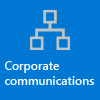

# Get started with Microsoft 365 for retail organizations

Retail environments, with their rotating schedules and on-the-go staff, have very different needs than other organizations. To get the most benefit for your retail organization, you first choose which scenarios Microsoft 365 and Microsoft Teams can help you with in your day-to-day business operations, and then make sure that you prepare your Teams environment with the right fundamentals, teams, and apps to support those scenarios.

1. [Choose your scenarios](#choose-your-scenarios) you want to implement for your business.
:::image type="content" source="media/retail-teams-scenarios.png" alt-text="Diagram showing Teams scenarios for retail." lightbox="media/retail-teams-scenarios.png":::
2. [Set up Microsoft 365](flw-setup-microsoft-365.md) - Set up Microsoft 365's core elements, Microsoft Teams, and any other services you need.
3. [Configure services and apps](#configure-services-and-apps) - Use team templates to set up the teams you need quickly, including the channels and apps you need for your business. Add in other apps from Microsoft as needed to support your scenarios.
:::image type="content" source="media/retail-teams-apps.png" alt-text="Diagram showing teams, team templates and apps that can be included." lightbox="media/retail-teams-apps.png":::

## Choose your scenarios

Microsoft 365 and Microsoft Teams offer several capabilities that can help retail organizations with their daily operations and digital transformation. We recommend the following scenarios for retail organizations:

     

> [!NOTE]
> These scenarios are also part of the Microsoft Cloud for Retail. You can do more with these scenarios when you also use other capabilities from the Microsoft Cloud for Retail, such as Microsoft Dynamics 365. Learn more about using this solution, which brings together capabilities from Azure, Dynamics 365, and Microsoft 365 at [Microsoft Cloud for Retail](/industry/retail).

### Download a poster with scenario overviews

Use the following poster to start envisioning what your organization can do with Microsoft 365 for frontline workers.

| Item | Description |
|:-----|:-----|
|   [PDF](https://go.microsoft.com/fwlink/?linkid=2206476) \| [Visio](https://go.microsoft.com/fwlink/?linkid=2206271)   Updated September 2022   |This poster provides an overview of the scenarios you can implement for your frontline workforce in a retail setting.|

### Video overviews

Watch the following video to see how you can help your store associates connect and collaborate:

> [!VIDEO https://www.microsoft.com/videoplayer/embed/RWRJVw]

Watch the following video to see how you can simplify business processes in retail environments:

> [!VIDEO https://www.microsoft.com/videoplayer/embed/RWRzfc]

### In-store communication and collaboration

Bring in-store associates and management together to collaborate and streamline operations with Teams and Teams apps.

**Key apps:** Shifts, Walkie Talkie, Tasks, Approvals, Chat, Praise, Lists, Files, Updates

**Additional services:** Outlook, Viva Connections, SharePoint, Power Platform and Power Apps

More information: [Frontline team collaboration](flw-team-collaboration.md)

### Cross-store communication and collaboration

Staff members can communicate and collaboration across multiple stores in a region, or with headquarters using the same tools and apps you use within your store.

**Key apps:** Shifts, Walkie Talkie, Tasks, Approvals, Chat, Praise, Lists, Files, Updates

**Additional services:** Outlook, Viva Connections, Viva Engage, SharePoint, Power Platform and Power Apps

More information: [Frontline team collaboration](flw-team-collaboration.md)

### Virtual fittings and consultations

Use the Virtual Appointments app or the Bookings app in Microsoft Teams to schedule and manage virtual appointments such as virtual shopping experiences for associates and customers.

**Key features and apps:** meetings, Virtual Appointments, Bookings

More information: [Virtual Appointments with Microsoft Teams](virtual-appointments.md)

### Simplify business processes

You can use Teams apps, Power Apps, and Power BI to simplify business processes. For example, you can:

- Set and maintain schedules for your employees with Shifts.
- Conduct store walks and inventories with Power Apps.
- Track key performance indicators (KPIs) with Power BI reports.

**Key apps:** Shifts, Tasks, Lists, Approvals

**Additional services:** Power Platform with Power Apps and Power BI

More information: [Simplify business processes](simplify-business-processes.md)

### Corporate communications

Employee engagement is a significant contributor to workplace satisfaction, loyalty, and productivity at any organization. Learn how to keep everyone informed and engaged using SharePoint, Teams, Viva Engage, Stream, and Viva Connections.

**Additional services:** Viva Connections, SharePoint, Stream, Viva Engage

More information: [Corporate communications with frontline workers](flw-corp-comms.md)

### Onboarding new employees

Make new employee onboarding a great experience by fostering an all-in-one hybrid work environment where new employees can find important resources, meet people in their organization, and prepare to be successful in their new role.

**Key apps:** Lists, Live Meetings

**Additional services:** Viva Learning, SharePoint, Viva Engage

More information: [Onboard new employees](flw-onboarding-training.md)

> [!NOTE]
> For all of these capabilities, users must have an appropriate license. Microsoft 365 for frontline workers F1 and F3 or Office 365 F3, Office 365 A3, A5, E3, and E5, as well as Microsoft 365 Business Standard, Business Premium, A3, A5, E3, and E5 are all supported. For more information about general Teams licensing, see [Manage user access to Teams](/microsoftteams//user-access). See [Licensing options for frontline workers](flw-licensing-options.md) for more about using Microsoft 365 for frontline workers in combination with other licenses.

## Configure services and apps

:::image type="content" source="media/retail-teams-apps.png" alt-text="Diagram of teams, team templates and apps that can be included.":::

### Apps and services for retail

Ensure that your workers can communicate, collaborate, and deliver great customer service with apps like Shifts, Walkie Talkie, Tasks, Lists, Praise, and more. You can determine which apps are available for your users by enabling them in the Teams admin center or by including them in a team template. More information about [managing Teams apps](/microsoftteams/manage-apps).

For retail environments, the following apps and services can help you transform your business processes and support communication:

| Teams apps and services | Description | Manage | Help |
| ----- | ----- | ----- | ----- |
| Approvals | Approvals can be integrated into chat for easy sign-off. | [Manage Approvals](/microsoftteams/approval-admin?bc=/microsoft-365/frontline/breadcrumb/toc.json&toc=/microsoft-365/frontline/toc.json) | [Use Approvals](https://support.microsoft.com/office/what-is-approvals-a9a01c95-e0bf-4d20-9ada-f7be3fc283d3) |
| Chat | Enable quick conversations and checkins between staff with secure, enterprise-grade communications tools, instead of consumer grade apps or SMS. | [Chat, teams, channels & apps in Microsoft Teams](/microsoftteams/deploy-chat-teams-channels-microsoft-teams-landing-page) | [Chat in Teams](https://support.microsoft.com/office/start-and-pin-chats-a864b052-5e4b-4ccf-b046-2e26f40e21b5?wt.mc_id=otc_microsoft_teams) |
| Documents | Share standard operating procedures, store policies, plans, and more. | [Teams and SharePoint integration](/sharepoint/teams-connected-sites) | [Share files](https://support.microsoft.com/office/upload-and-share-files-57b669db-678e-424e-b0a0-15d19215cb12) |
| Praise | Recognize coworkers for great teamwork with the Praise app. | [Manage the Praise app](/microsoftteams/manage-praise-app?bc=/microsoft-365/frontline/breadcrumb/toc.json&toc=/microsoft-365/frontline/toc.json) | [Send Praise to people](https://support.microsoft.com/office/send-praise-to-people-50f26b47-565f-40fe-8642-5ca2a5ed261e) |
| RealWear devices | Handsfree communication with devices. | [Microsoft Teams for RealWear](/microsoftteams/flw-realwear?bc=/microsoft-365/frontline/breadcrumb/toc.json&toc=/microsoft-365/frontline/toc.json) | [Use Microsoft Teams for RealWear](https://support.microsoft.com/office/using-microsoft-teams-for-realwear-af20d232-d18c-476f-8031-843a4edccd5f) |
| Shifts | Manage schedules and clock in and out with Shifts. | [Manage the Shifts app](/microsoftteams/expand-teams-across-your-org/shifts/manage-the-shifts-app-for-your-organization-in-teams?bc=/microsoft-365/frontline/breadcrumb/toc.json&toc=/microsoft-365/frontline/toc.json) | [Use Shifts](https://support.microsoft.com/office/what-is-shifts-f8efe6e4-ddb3-4d23-b81b-bb812296b821) |
| Tasks | Help employees know what they should focus on when not with customers by assigning tasks. Operations can use [task publishing](/microsoftteams/manage-tasks-app?bc=/microsoft-365/frontline/breadcrumb/toc.json&toc=/microsoft-365/frontline/toc.json#task-publishing) to send out tasks to locations and track progress across those locations. | [Manage the Tasks app](/microsoftteams/manage-tasks-app?bc=/microsoft-365/frontline/breadcrumb/toc.json&toc=/microsoft-365/frontline/toc.json) | [Use Tasks](https://support.microsoft.com/office/use-the-tasks-app-in-teams-e32639f3-2e07-4b62-9a8c-fd706c12c070) |
| Updates | Check in on recurring or one-off priorities such as daily cleaning. Managers can create templates for employees to fill out and submit. | [Manage the Updates app](/microsoftteams/manage-updates-app?bc=/microsoft-365/frontline/breadcrumb/toc.json&toc=/microsoft-365/frontline/toc.json) | [Use Updates](https://support.microsoft.com/office/get-started-in-updates-c03a079e-e660-42dc-817b-ca4cfd602e5a) |
| Walkie Talkie | Push to talk quick communication that's not constrained by geography like standard 2-way radios.| [Manage the Walkie Talkie app](/microsoftteams/walkie-talkie?bc=/microsoft-365/frontline/breadcrumb/toc.json&toc=/microsoft-365/frontline/toc.json) | [Use Walkie Talkie](https://support.microsoft.com/office/get-started-with-teams-walkie-talkie-25bdc3d5-bbb2-41b7-89bf-650fae0c8e0c) |
| Virtual Appointments| A central hub for all your virtual appointment needs. Schedule and manage virtual fittings and consultations, view analytics, and configure options, all in one place.| [Manage the Virtual Appointments app](/microsoftteams/manage-virtual-appointments-app?bc=/microsoft-365/frontline/breadcrumb/toc.json&toc=/microsoft-365/frontline/toc.json) | [What is the Virtual Appointments app?](https://support.microsoft.com/topic/22df0079-e6d9-4225-bc65-22747fb2cb5f) |
| Bookings |  Schedule and manage virtual fittings and consultations.| [Manage the Bookings app](/microsoftteams/bookings-app-admin?bc=/microsoft-365/frontline/breadcrumb/toc.json&toc=/microsoft-365/frontline/toc.json) | [Use Bookings](https://support.microsoft.com/office/what-is-bookings-42d4e852-8e99-4d8f-9b70-d7fc93973cb5) |

| More apps and services from Microsoft | Description | Manage | Help |
| ----- | ----- | ----- | ----- |
| Power Apps and the Power Platform | Integrate business processes and enable quick updates to data, such as store inventory, sales numbers, incident reports, and more. | [Teams integration with Microsoft Power Platform](/microsoftteams/platform/samples/teams-low-code-solutions) and [Manage Microsoft Power Platform apps in the Microsoft Teams admin center](/microsoftteams/manage-power-platform-apps) | -  |
| SharePoint | When you create a new team, a new SharePoint site is created and connected to the team. Many of the scenarios above rely on SharePoint features already embedded in Teams, such as sharing documents for team collaboration. | [Teams and SharePoint integration](/sharepoint/teams-connected-sites) | [Add a SharePoint page, list, or document library as a tab in Teams](https://support.microsoft.com/office/add-a-sharepoint-page-list-or-document-library-as-a-tab-in-teams-131edef1-455f-4c67-a8ce-efa2ebf25f0b)|
| Viva Connections | Viva Connections creates a hub in Teams where your retail associates can view a tailored news feed from your organization and a personalized dashboard with resources they need. | [Overview of Viva Connections](/sharepoint/viva-connections-overview) | [Viva Connections in Microsoft Teams](https://support.microsoft.com/office/your-intranet-is-now-in-microsoft-teams-8b4e7f76-f305-49a9-b6d2-09378476f95b) |
| Viva Learning | Provide training when needed, right in the flow of their work. | [Manage Viva Learning](/microsoft-365/learning/) | [Use Viva Learning](https://support.microsoft.com/office/viva-learning-preview-01bfed12-c327-41e0-a68f-7fa527dcc98a) |
| Viva Engage | Connect your organization and allow communication across departments and regions with Viva Engage. | [Overview of Viva Engage](/viva/engage/overview) | [Use Viva Engage](https://support.microsoft.com/topic/getting-started-with-microsoft-viva-engage-729f9fce-3aa6-4478-888c-a1543918c284) |

### Retail templates for teams

Create teams that include a predefined set of settings, channels, tabs, and pre-installed apps for communication and collaboration within an individual store, with a region, or between headquarters and your staff wherever they are.

- The Retail **Organize a store** template includes channels for General, Shift Handoff, Store Readiness, and Learning, and includes the Approvals, Tasks, and Wiki apps.
- The **Retail for managers** template includes channels for General, Operations, and Learning, and includes a Wiki tab.

You can also [create a custom template](/microsoftteams/create-a-team-template) to include the apps your store needs. More information: [Get started with Retail team templates](/microsoftteams/get-started-with-retail-teams-templates?bc=/microsoft-365/frontline/breadcrumb/toc.json&toc=/microsoft-365/frontline/toc.json)

## Get ready to roll out your scenarios - identify roles and responsibilities for scenarios

Now that you know what scenarios you want to implement and what you need to support them, you can gather your team so you can plan, roll out, and monitor how they're working in your organization. For example, the following roles might be needed to roll out these scenarios in your organization:

| Image | Role | Responsibilities | Department |
| ---- | ---- | ----- | ----- |
| | IT Administrator | Work with operations and retail management staff to define scenarios and how they'll work for the organization.   Configure settings in the Teams admin center, such as policies and templates, and enable apps.   Set up app settings (such as global Shifts settings) for the organization.   Add and license users.  | IT department |
|| Operations staff | Work with Administrators to define scenarios, and determine which settings, policies, templates, and apps are needed for Teams.   Create regional or divisional teams from templates.   Set up tasks, lists, and approval flows for coordination between stores within a region, or between stores and headquarters.   Set up learning framework for staff. | Central operations |
| | Store manager | Work with Administrators and Operations staff to define scenarios.   Create teams for the store from templates.   Set up channels and apps for the teams, as needed. For example: a channel for shift handovers.   Set up store schedules in Shifts.   Set up tasks, lists, updates, and approval flows that are specific to the store.   Set up learning tasks for staff. | Store management |

For more about successfully implementing and adopting Teams, see [Adopt Microsoft Teams](/microsoftteams/adopt-microsoft-teams-landing-page).
