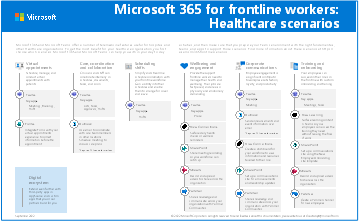

# Get started with Microsoft 365 for healthcare organizations

Microsoft 365 and Microsoft Teams offer a number of telemedicine features useful for hospitals and other healthcare organizations.

- Virtual Appointments and Electronic Healthcare Record (EHR) integration
- Teams policy packages for healthcare
- Messaging
- Team templates for healthcare
- Care coordination and collaboration

> [!NOTE]
> This functionality is also part of Microsoft Cloud for Healthcare. Learn more about using this solution, which brings together capabilities from Azure, Dynamics 365, and Microsoft 365 at [Microsoft Cloud for Healthcare](/industry/healthcare).

To get the most benefit for your healthcare organization, first choose which scenarios Microsoft 365 and Teams can help you with in your day-to-day activities, and then make sure that you prepare your Teams environment with the right fundamentals, teams, and apps to support those scenarios.

1. [Choose your scenarios](#scenarios-for-healthcare) you want to implement.
2. [Set up Microsoft 365](flw-setup-microsoft-365.md) - Set up Microsoft 365, Teams, and any other services you need.
3. [Configure services and apps](flw-setup-microsoft-365.md#step-7-configure-apps-for-your-scenario) - Use team templates to set up the teams you need quickly, including the channels and apps you need. Add in other apps from Microsoft as needed to support your scenarios.

## Scenarios for healthcare

Facilitate and centralize collaboration among care teams and across your entire healthcare organization.

- [Provide seamless virtual visits](#provide-seamless-virtual-visits)
- [Connect and engage the healthcare workforce](#connect-and-engage-the-healthcare-workforce)
- [Efficiently manage and motivate care teams](#efficiently-manage-and-motivate-care-teams)

The following scenarios support these goals:

| Scenario | Description | Requirements |
| -------- | -------- | -------- |
| [Virtual Appointments](virtual-appointments.md) | Schedule, manage, and conduct virtual appointments with patients. This scenario connects Teams and the Oracle Health or Epic platform to support virtual appointments. | Active subscription to Microsoft Cloud for Healthcare or subscription to Microsoft Teams EHR connector standalone offer.   Users must have an appropriate Microsoft 365 or Office 365 license that includes Teams meetings.   See also [Integration into Oracle Health EHR](ehr-admin-oracle-health.md#before-you-begin) or [Integration into Epic EHR](ehr-admin-epic.md#prerequisites). |
| [Team communication and collaboration](flw-team-collaboration.md) |Bring your health teams together to communicate, collaborate, and streamline operations with Teams. Viva Connections helps you create a dashboard that puts the information they need front and center on their devices, so they can reach out whenever they need to. |Users must have an appropriate license to use Teams apps.* |
| [Engage your employees and focus on employee wellbeing](flw-wellbeing-engagement.md) | Build deeper connections across your organization and create an inclusive workplace. |Users must have an appropriate license to use Teams apps.* |
| [Schedule your teams with Shifts](shifts-for-teams-landing-page.md) |Create and manage schedules for your teams in Shifts.|Users must have an appropriate license to use Teams apps.* |
| [Simplify business processes](simplify-business-processes.md) | Use task publishing to create standard processes across sites, lists to manage information and track ongoing processes, and streamline requests with Approvals. Automated workflows can speed up and automate actions, like collecting data or routing notifications. |Users must have an appropriate license to use Teams apps.* To use Power Apps and Power Automate, users need an appropriate license.*|

> [!NOTE]
> *For more information about general Teams licensing, see [Manage user access to Teams](/microsoftteams//user-access). Check out [Understand frontline worker user types and licensing](flw-licensing-options.md) to learn more about using Microsoft 365 for frontline workers in combination with other licenses. For a detailed comparison of what's included in Microsoft 365 plans for enterprises, see the [Modern work plan comparison](https://go.microsoft.com/fwlink/p/?linkid=2139145) table.

Depending on your business needs, you can choose to incorporate more [scenarios](flw-choose-scenarios.md) for Microsoft 365 for frontline workers.

### Download a poster with scenario overviews

Use the following poster to start envisioning what your organization can do with Microsoft 365 for frontline workers.

| Item | Description |
|:-----|:-----|
|   [PDF](https://go.microsoft.com/fwlink/?linkid=2206475) \| [Visio](https://go.microsoft.com/fwlink/?linkid=2206474)   Updated April 2024   |This poster provides an overview of the scenarios you can implement for your frontline workforce in a healthcare setting.|

## Provide seamless virtual visits

Use the complete meetings platform in Teams to schedule, manage, and conduct virtual appointments with patients and other providers.

- If your organization already uses an EHR system, you can integrate Teams for a more seamless experience. Teams EHR connector makes it easy for clinicians to launch a virtual appointment with a patient or a consultation with another provider in Teams directly from the EHR system. To learn more, see [Virtual Appointments with Teams - Integration into Oracle Health EHR](ehr-admin-oracle-health.md) and [Virtual Appointments with Teams - Integration into Epic EHR](ehr-admin-epic.md).
- If you aren't using a supported EHR system, you can use the Virtual Appointments app in Teams. To learn more, see [Virtual Appointments with Teams](virtual-appointments.md).

:::image type="content" source="media/virtual-appointments-teams-healthcare.png" alt-text="Diagram showing Virtual Appointments options in Teams through integration with an EHR system and through the Virtual Appointments app." lightbox="media/virtual-appointments-teams-healthcare.png":::

## Connect and engage the healthcare workforce

Bring your health team together to coordinate care and collaborate with Teams.

:::image type="content" source="media/teams-healthcare-collaborate-in-teams.png" alt-text="Diagram showing collaboration options for care teams in Teams." lightbox="media/teams-healthcare-collaborate-in-teams.png":::

Teams enables physicians, clinicians, nurses, and other staff to collaborate efficiently with collaboration features in Teams.

- Set up teams and channels for your health teams and information workers. Use channels with tabs as a way to structure their work, with additional help from tabs to which they can pin information sources.
- Chat, post messages, and communicate. Your team can have persistent conversations about different patients needing attention.
- Call and meet with members of the health team. Set up individual meetings, or use channel meetings to manage daily meetings, both with the power of Teams audio, video, screen sharing, recording, and transcription features.
- Store and share files and documents. Your health team is part of a single virtualized team that works and collaborates on Office documents.

### Messaging for healthcare organizations

Messaging policies in Teams are used to control which chat and channel messaging features are available to users. You can edit the settings in the global (Org-wide default) policy or create and assign custom messaging policies to turn on or turn off the features that you want.

For example, consider enabling the following messaging features for your health teams:

- Users can send urgent messages using priority notifications, so the recipient is repeatedly notified until they read the message.
- Users can use read receipts to know when the chat messages they send are read by the recipient.

Together, these features allow quicker attention to urgent messages and confidence that the message was received and read.

To learn more, see [Manage messaging policies in Teams](/microsoftteams/messaging-policies-in-teams) and [Messaging policies for healthcare organizations](messaging-policies-hc.md).

### Coordinate over email with Exchange Online

Email is a core communication tool for most workplaces. [Set up email with Exchange Online](flw-setup-microsoft-365.md#set-up-email-with-exchange-online) to help your frontline managers and workers coordinate with care team members in other locations or schedule meetings to discuss care plans. Users must have an F3 license to have an email mailbox.

You can also set up shared mailboxes to allow for incoming mail from customers (such as for customer service or scheduling requests) and have a group of workers who monitor and send email from a public email alias like info@contoso.com. For more information about shared mailboxes, see [About shared mailboxes](../admin/email/about-shared-mailboxes.md) and [Open and use a shared mailbox in Outlook](https://support.microsoft.com/office/open-and-use-a-shared-mailbox-in-outlook-d94a8e9e-21f1-4240-808b-de9c9c088afd).

## Efficiently manage and motivate care teams

Unburden and empower your teams with seamless shift scheduling, task management, and workflow automation so they can focus on what matters.

### Teams policy packages for healthcare

Apply Teams policy packages to define what different roles can do in Teams. For example, specify policies for:

- Clinical workers, such as registered nurses, charge nurses, physicians, and social workers, so that they can have full access to chat, calling, shift management, and meetings.
- Information workers in your healthcare organization, such as IT personnel, informatics staff, finance personnel, and compliance officers, can have full access to chat, calling, and meetings.
- Patient rooms, to control settings for patient room devices.

To learn more, see [Teams policy packages for healthcare](/microsoftteams/policy-packages-healthcare?bc=/microsoft-365/frontline/breadcrumb/toc.json&toc=/microsoft-365/frontline/toc.json).

### Team templates for healthcare organizations

Team templates allow you to quickly create teams by providing a predefined team structure of settings, channels, and preinstalled apps. Teams includes templates designed specifically for healthcare organizations, making it easier to create teams for staff to communicate and collaborate on patient care or operational needs.

To learn more, see [Use healthcare team templates](/microsoftteams/expand-teams-across-your-org/healthcare/healthcare-templates-admin-console?bc=/microsoft-365/frontline/breadcrumb/toc.json&toc=/microsoft-365/frontline/toc.json).

### Share lists and track information with the Lists app

The Lists app in Teams helps teams track information and organize work. The app is preinstalled for all Teams users and is available as a tab in every team and channel. Lists can be created from scratch, from predefined templates, or by importing data to Excel.

Health teams can use the Patients template to get started. They can create lists to track the needs and status of patients. Existing patient data on Excel spreadsheets can be brought in to create a list in Teams. These lists can be used for scenarios such as rounds and patient monitoring to coordinate care.

For example, a charge nurse creates a patient list in a team that includes all health team members. During rounds, the health team access Teams on their mobile devices and update patient information in the list, which everyone on the team can view to stay in sync. At rounding sessions where the health team gathers to discuss and evaluate key health performance metrics to ensure a patient is on the right glide path to discharge, they can share this information using Teams on a large display screen. Health team members who aren't on site can join remotely.

Here's an example list, which was set up for patient rounding.

:::image type="content" source="media/lists-patients-example.png" alt-text="Screenshot of example list for patient rounding." lightbox="media/lists-patients-example.png":::

To learn more, see [Manage the Lists app for your organization in Teams](/microsoftteams/manage-lists-app?bc=/microsoft-365/frontline/breadcrumb/toc.json&toc=/microsoft-365/frontline/toc.json).

### Track and monitor tasks with the Planner app

Use [Planner](https://support.microsoft.com/office/getting-started-with-planner-in-teams-7a5e58f1-2cee-41b0-a41d-55d512c4a59c) in Teams to track to do items for your whole health team. Your health team can create, assign, and schedule tasks, categorize tasks, and update status at any time, from any device running Teams. IT pros and admins can also publish tasks to specific teams for your organization. For example, you could publish a set of tasks for new safety protocols or a new intake step to be used across a hospital.

To learn more, see [Manage the Planner app for your organization in Microsoft Teams](/microsoftteams/manage-planner-app?bc=/microsoft-365/frontline/breadcrumb/toc.json&toc=/microsoft-365/frontline/toc.json).

### Streamline approvals with the Approvals app

Use [Approvals](https://support.microsoft.com/office/what-is-approvals-a9a01c95-e0bf-4d20-9ada-f7be3fc283d3) to streamline all your requests and processes with your team. Create, manage, and share approvals directly from your hub for teamwork. Start an approval flow from the same place you send a chat, in a channel conversation, or from the Approvals app itself. Just select an approval type, add details, attach files, and choose approvers. Once submitted, approvers are notified and can review and act on the request.

You can allow the Approvals app for your organization and add it to your teams. To learn more, see [Manage the Approvals app](/microsoftteams/approval-admin?bc=/microsoft-365/frontline/breadcrumb/toc.json&toc=/microsoft-365/frontline/toc.json).

### Create, manage, and share schedules with the Shifts app

Create and manage schedules for your health teams with Shifts. For example, nurse managers can set up and manage schedules for their staff. They can assign shifts, add open shifts, and approve shift requests from nurses on their team. Nurses can check their own and their team's schedule, request to swap or offer a shift, and more.

To learn more, see [Shifts for frontline workers](shifts-for-teams-landing-page.md).

## Help your clinical and information workers get going with Teams

There are many resources available to help all of the users in your organization get comfortable with using Teams:

- Check out the [Teams adoption center](https://adoption.microsoft.com/microsoft-teams/) for advice on rolling out Teams if you're just starting your organization's journey with Teams, or expanding Teams to more areas of your organization.
- Get help and training for your users on how to perform basic tasks in Teams on the [Teams help & learning site](https://support.microsoft.com/teams), including [quick training videos](https://support.microsoft.com/office/microsoft-teams-video-training-4f108e54-240b-4351-8084-b1089f0d21d7). This site also has help and training for the Teams apps, including [Virtual Appointments](https://support.microsoft.com/office/what-is-virtual-appointments-22df0079-e6d9-4225-bc65-22747fb2cb5f), [Lists](https://support.microsoft.com/office/get-started-with-lists-in-teams-c971e46b-b36c-491b-9c35-efeddd0297db), [Planner](https://support.microsoft.com/office/getting-started-with-planner-in-teams-7a5e58f1-2cee-41b0-a41d-55d512c4a59c), [Approvals](https://support.microsoft.com/office/what-is-approvals-a9a01c95-e0bf-4d20-9ada-f7be3fc283d3), and [Shifts](https://support.microsoft.com/office/what-is-shifts-f8efe6e4-ddb3-4d23-b81b-bb812296b821).
