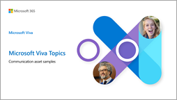

# Adoption resources for Microsoft Viva Topics

Use these downloadable resources and other information to spark ideas about how to help get the most out of Viva Topics in your organization.

## Downloadable resources

|Resource         |Download     |Description |
|---------|---------|---------|
| |[Viva Topics Scenario Catalog](https://download.microsoft.com/download/d/2/e/d2e894dd-c360-4edd-9c83-8e41787afda1/Viva-Topics-Scenario-Catalogue.pdf) |Knowledge-sharing scenarios to help you get inspired and get started quickly applying Viva Topics to achieve your organization's goals. |
|     |[Viva Topics Adoption Guide](https://download.microsoft.com/download/d/2/e/d2e894dd-c360-4edd-9c83-8e41787afda1/Viva-Topics-Adoption-Guide.pdf)          |Step-by-step guide to help your organization through the adoption journey — from planning to scaling — and realize the full value of Viva Topics.    |
|    |[Viva Topics Communication Asset Samples](https://download.microsoft.com/download/d/2/e/d2e894dd-c360-4edd-9c83-8e41787afda1/Viva-Topics-Communication-Asset-Samples.pptx)     |Customizable collection of Viva Topics communication asset samples you can use to help increase awareness of Viva Topics within your organization.   |

## Other resources

|Name     |Description  |
|---------|---------|
|[Adoption blog](https://techcommunity.microsoft.com/t5/microsoft-viva-blog/the-journey-to-viva-topics-adoption-success-intro/ba-p/2976552) |Read about how organizations are using Viva Topics to drive a knowledge-centric culture, including learnings, insights, and best practices. |
|[Viva Topics FAQ](https://resources.techcommunity.microsoft.com/viva-topics/faq/) |Find answers to frequently asked questions to help you understand more about Viva Topics.    |

