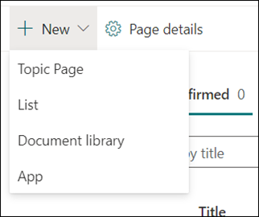
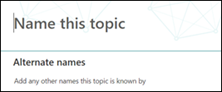
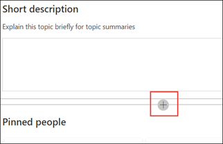

# Create a new topic (Preview)

> [!Note] 
> The content in this article is for Project Cortex Private Preview. [Find out more about Project Cortex](https://aka.ms/projectcortex).

In Topic Experiences, you can create a new topic if one was not discovered through indexing or if the AI technology did not find enough evidence to establish it as a topic.

## Requirements

To create a new topic, you need to:
- Have a Topic Experiences license.
- Have permissions to [**Who can create or edit topics**](https://docs.microsoft.com/microsoft-365/knowledge/topic-experiences-user-permissions). Knowledge admins can give users this permission in the Knowledge Network topic permissions settings. 

> [!Note] 
> Users who have permission to manage topics in the Topic center (knowledge managers) already have permissions to create and edit topics.

## To create a new topic:

1. On the Topic center page, select **New**, then select **Topic Page**. If you are not able to see the **New** option in the Topic Center, you may not have the required permissions.

    

2. On the new topic page, you can fill in the information on the new topic template:

    - In the **Name this topic** section, type the name of the new topic.
    
    - In the **Alternate names** section, type names or acronyms that are also used to refer to the topic.
    
    - In the **Short description** section, type a one or two sentence description of the topic. This text will be used for the associated topic card.
    
    - In the **People** section, type the names of subject matter experts for the topic. People you manually add to the topic will display in the topic page as **Pinned people**.
    
    - In the **Files and pages** section, select **Add** and then on the next page you can select associated OneDrive files or SharePoint Online pages.
    
    - In the **Sites** section, select **Add**. In the  **Sites** pane that displays, select the sites that are associated to the topic.

    
    
3. If you need to add other components to the page, such as text, images, web parts, links, etc., select the canvas icon in the middle of the page to locate and add them.

    

4. When you are done, select **Publish** to publish the topic page. Published topic pages will display in the **Pages** tab.

After you publish the article, the topic name, alternate name, description, and pinned people will display to all licensed users who view the article. Files, pages, and sites will only appear in the topic page if the viewer has Office 365 permissions to the item. 

The new topic page is made up of web parts that are *knowledge network aware*. This means that as AI gathers more information on the topic, the information in these web parts will be updated with suggestions to make the page more useful to users.

## See also

  

