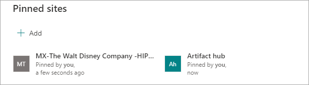
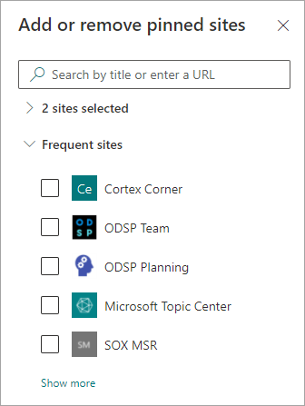
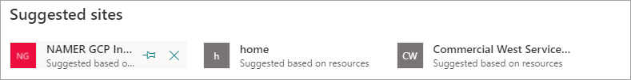

# Edit an existing topic in Microsoft Viva Topics 

 

> [!VIDEO https://www.microsoft.com/videoplayer/embed/RE4LA4n]  

 

In Viva Topics, you can edit an existing topic. You might need to do this if you want to correct or add additional information to an existing topic page. 

> [!Note] 
> While information in a topic that is gathered by AI is [security trimmed](topic-experiences-security-trimming.md), the topic description and people information that you manually add when editing an existing topic is visible to all users who have permissions to view topics. 

## Requirements

To edit an existing topic, you need to:
- Have a Viva Topics license.
- Have permissions to [create or edit topics](./topic-experiences-user-permissions.md). Knowledge admins can give users this permission in the Viva Topics topic permissions settings. 

> [!Note] 
> Users who have permission to manage topics in the topic center (knowledge managers) already have permissions to create and edit topics.

## How to edit a topic page

Users who have the *Who can create or edit topics* permission can edit a topic by opening the topic page from a topic highlight, and then selecting the **Edit** button on the top right of the topic page. The topic page can also be opened from the topic center home page where you can find all the topics that you have a connection to.

      

Knowledge managers can also edit topics directly from the **Manage topics** page by selecting the topic, and then selecting **Edit** in the toolbar.

   

### To edit a topic page

1. On the topic page, select **Edit**. This lets you make changes as needed to the topic page.

     

2. In the **Alternate names** section, type any other names that the topic might be referred to. 

    

3. In the **Description** section, type a couple of sentences that describes the topic. Or if a description already exists, update it if needed.

     

4. In the **Pinned people** section, you can "pin" a person to show them as having a connection the topic (for example, an owner of a connected resource). Begin by typing their name or email address in the **Add a new user** box, and then selecting the user you want to add from the search results. You can also "unpin" them by selecting the **Remove from list** icon on the user card.
 
     

    The **Suggested people** section shows users that AI thinks might be connected to the topic from their connection to resources about the topic. You can change their status from Suggested to Pinned by selecting the pin icon on the user card.

   

5. In the **Pinned files and pages** section, you can add or "pin" a file or SharePoint site page that is associated to the topic.

   
 
    To add a new file, select **Add**, select the SharePoint site from your Frequent or Followed sites, and then select the file from the site's document library.

    You can also use the **From a link** option to add a file or page by providing the URL. 

   > [!Note] 
   > Files and pages that you add must be located within the same Microsoft 365 tenant. If you want to add a link to an external resource in the topic, you can add it through the canvas icon in step 9.

6. The **Suggested files and pages** section shows files and pages that AI suggests to be associated to the topic.

   

    You can change a suggested file or page to a pinned file or page by selecting the pinned icon.

7.  In the **Pinned sites** section, you can add or “pin” a site that is associated to the topic. 

    

    To add a new site, select **Add** and then either search for the site, or select it from your list of Frequent or Recent sites.
    
    

8. The **Suggested sites** section shows the sites that AI suggests to be associated to the topic. 

     

    You can change a suggested site to a pinned site by selecting the pinned icon.

9. You can also add static items to the page — such as text, images, or links — by selecting the canvas icon, which you can find below the short description. Selecting it will open the SharePoint toolbox from which you can choose the item you want to add to the page.

   

10. Select **Publish** or **Republish** to save your changes. **Republish** will be your available option if the topic has been published previously.

