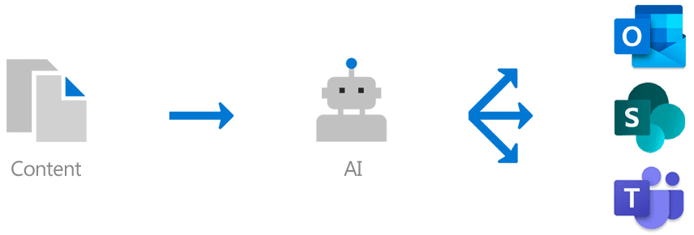

# Knowledge management Overview (Preview)

> [!Note] 
> The content in this article is for Project Cortex Private Preview. [Find out more about Project Cortex](https://aka.ms/projectcortex).

Knowledge management uses Microsoft AI technology, Microsoft 365, Delve, Search, and other components and services to build a knowledge network in your Microsoft 365 environment. 

      

It's goal is to deliver information to you users in apps they use everyday, such as Outlook, Teams, and SharePoint.

For example, users see unfamiliar terms in their emails, SharePoint sites, or in Teams conversations, that they want to know more about. Knowledge management uses AI to automatically searches for and identifies these **topics**, and compiles information about them, such as a short description, subject matter experts on the topic, and sites, files, and pages that are related to it. You can choose to update the topic information as needed. You can then make the topics available to your users, which means that for every instance of the topic that appears in apps such as Outlook, Teams, and SharePoint, the text will be highlighted. Users can choose to select the topic to learn more about it through the topic details.

## Topic indexing

Knowledge Management uses Microsoft AI technology to identify **topics** in your Office 365 environment.

A topic is a phrase or term that is organizationally significant or important. It has a specific meaning to the organization, and has resources related to it that can help people understand what it is and find more information about it.

When a topic is identified, a **topic page** is created for it that contains information that was gathered through topic indexing, such as:

- Alternate names and/or acronyms.
- A short description of the topic.
- Users who might be knowledgeable about the topic.
- Files, pages, and sites that are related to the topic.

## Topic discovery
When a topic is mentioned in content on SharePoint news and pages, you'll see it highlighted. Open the topic summary from the highlight. Open the topic details from the title of the summary. <!--(msg for Efren: not sure if I should use discovery for this; we use discovered in-product for indexing?)--> The mentioned topic could be identified automatically or have been added to the page with a direct reference to the topic by the page author.

You can also discover topics through Microsoft Search.

## Topic management

Topic management is done in your organization's **topic center**. The topic center site is created during setup and serves as your center of knowledge for your organization. It will contain a list of all topics that were discovered in your environment, as well as all topic pages that were created for these topics. 

Users who are provided the correct permissions will be able to do the following in the topic center:

- Confirm or reject topics that were discovered in your tenant.
- Create new topics manually as needed (for example, if not enough information was provided for it to be discovered through AI).
- Edit existing topic pages. 

See [Work with topic in the topic center](work-with-topics.md) for more information.  

## Admin controls

Admin controls in the Microsoft 365 admin center  allow you to manage your knowledge network. They allow a Microsoft 365 global or SharePoint admin to:

- Control which users in your organization are allowed to see topics in their client apps or in SharePoint search results.
- Control which SharePoint sites will be crawled to search for topics.
- Configure topic discovery to exclude specific terms that you don't want to be a topic.
- Control which users can to confirm or reject topics in the topic center.
- Control which users can create and edit topics in the topic center.

See [Manage your knowledge network](manage-knowledge-network.md) for more information. 

## Topic curation & feedback

AI will continually work to provide you suggestions to improve your topics as changes occur in your environment.

Users who you allow access to see topics in their daily work are allowed to make suggestions to improve them. For example, if a user views the topic page and sees information that is incorrect or needs to be added, a link on the topic page allows them to edit the information directly. Another example, if a user views a a highlight on a SharePoint news page, you will find questions asking whether or not the highlight is appropriate or the suggested topic is appropriate for your organization. Your answer will help determine what's shown on topic summaries and in topic details.

Additionally, users with proper permissions can tag items such as Yammer conversation that are relevant to a topic, and add them to a specific topic. <!--(msg for Efren: changed to Yammer, because we will not have shipped Teams yet)-->

## See also
[Set up knowledge management](set-up-knowledge-network.md) 
[Topic center overview](topic-center-overview.md)
