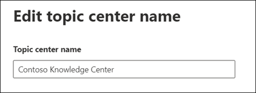

# Change the name of the topic center in Microsoft 365

After you [set up knowledge management](set-up-knowledge-network.md), at any time afterwards an admin can make adjustments to your configuration settings through the Microsoft 365 admin center.

For example, you may need to adjust your settings for any of the following:
- Add new SharePoint sources to mine topics.
- Change which users will have access to topics.
- Change which users have permissions to do tasks on the topic center.
- Change the name of your topic center

## Requirements 
You must have Global Admin or SharePoint admin permissions to be able to access the Microsoft 365 admin center and manage Organizational knowledge tasks.

## To access knowledge management settings:

1. In the Microsoft 365 admin center, select **Setup**, and then view the **Organizational Knowledge** section.
2. In the **Organizational Knowledge** section, click **Connect people to knowledge**. 

      

3. On the **Connect people to knowledge** page, select **Manage** to open the **Knowledge network settings** pane. 

      

##  Update your topic center name

Select the **Topic center** tab if you want to update the name of your topic center. 

1. On the **Topic center** tab, under **Topic center name**, select **Edit**.
2. On the **Edit topic center name** page, in the **Topic center name** box, type the new name for your topic center.
3. Select **Save**

       

## See also

  

