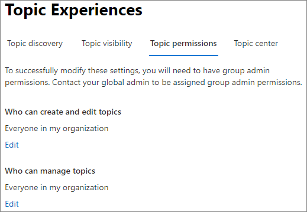
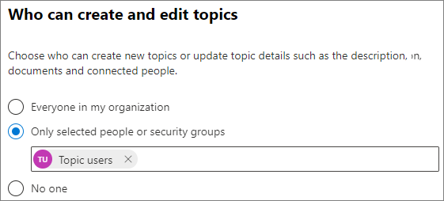
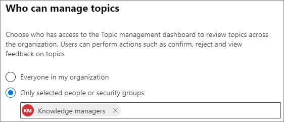

# Manage topic permissions in Microsoft 365

You can manage topic permissions settings in the [Microsoft 365 admin center](https://admin.microsoft.com). You must be a global administrator or SharePoint administrator to perform these tasks.

## To access knowledge management settings:

1. In the Microsoft 365 admin center, select **Setup**, and then view the **Organizational Knowledge** section.
2. In the **Organizational Knowledge** section, click **Connect people to knowledge**. 

     

3. On the **Connect people to knowledge** page, select **Manage** to open the **Knowledge network settings** pane.

     

## Change who has permissions to do tasks on the topic center

Select the **Topic permissions** tab if you want to update who has permissions to do the following in the topic center page:

- Which users can create and edit topics: Create new topics that were not found during discovery or edit existing topic page details.
- Which users can manage topics: Confirm or reject discovered topics.

To update who has permissions to create and edit topics:

1. On the **Topic permissions** tab, under **Who can create and edit topics**, select **Edit**.
2. On the **Who can create and edit topics** page, you can select:
    - **Everyone in your organization**
    - **Only selected people or security groups**
    - **No one**

      

3. Select **Save**.

To update who has permissions to manage topics:

1. On the **Topic permissions** tab, under **Who can manage topics**, select **Edit**.
2. On the **Who can manage topics** page, you can select:
    - **Everyone in your organization**
    - **Selected people or security groups**

      

3. Select **Save**.

## See also

  

