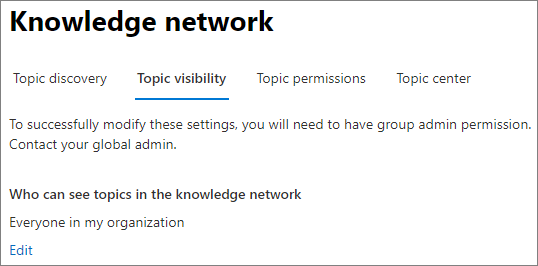
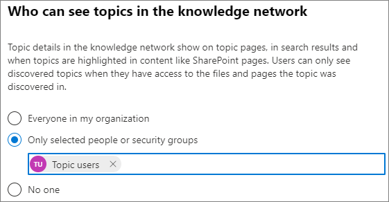

# Manage topic visibility in Microsoft 365

You can manage topic visibility settings in the [Microsoft 365 admin center](https://admin.microsoft.com). You must be a global administrator or SharePoint administrator to perform these tasks.

## To access topics management settings:

1. In the Microsoft 365 admin center, select **Setup**, and then view the **Organizational Knowledge** section.
2. In the **Organizational Knowledge** section, click **Connect people to knowledge**.

     

3. On the **Connect people to knowledge** page, select **Manage** to open the **Knowledge network settings** pane.

     

4. Select the **Topic visibility** tab. See the following sections for information about each setting.

##  Change who can see topics in your organization

You can change the users who can see topics in your organization.

1. On the **Topic visibility** tab, under **Who can see topics in the knowledge network**, select **Edit**.
2. On the **Who can see topics in the knowledge network** page, you choose who will have access to topic details, such as highlighted topics, topic cards, topic answers in search, and topic pages. You can select:
    - **Everyone in your organization**
    - **Only selected people or security groups**
    - **No one**

     

3. Select **Save**.  
 
> [!Note] 
> While this setting allows you to select any user in your organization, only users who have knowledge management licenses assigned to them will be able to view topics.

## See also

  

