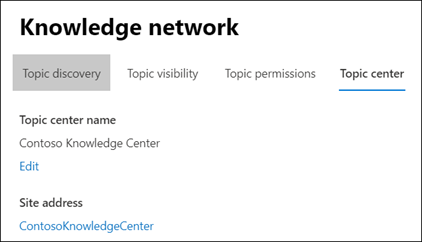
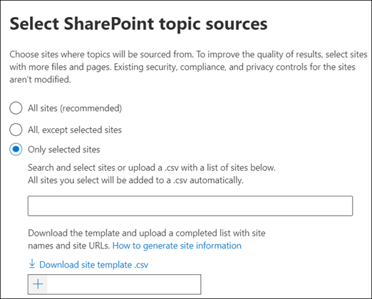

# Manage topic discovery in Microsoft 365

After you [set up knowledge management](set-up-knowledge-network.md), at any time afterwards an admin can make adjustments to your configuration settings through the Microsoft 365 admin center.

For example, you may need to adjust your settings for any of the following:
- Add new SharePoint sources to mine topics.
- Change which users will have access to topics.
- Change which users have permissions to do tasks on the topic center.
- Change the name of your topic center

## Requirements 
You must have Global Admin or SharePoint admin permissions to be able to access the Microsoft 365 admin center and manage Organizational knowledge tasks.

## To access knowledge management settings:

1. In the Microsoft 365 admin center, select **Setup**, and then view the **Organizational Knowledge** section.
2. In the **Organizational Knowledge** section, click **Connect people to knowledge**.

     

3. On the **Connect people to knowledge** page, select **Manage** to open the **Knowledge network settings** pane.

     

## Change how the knowledge network can find topics

Select the **Topic discovery** tab if you want to update your choices for  for SharePoint topic sources. This setting let you select the SharePoint sites in your tenant that will be crawled and mined for topics.

1. On the **Topic discovery** tab, under **Select SharePoint topic sources**, select **Edit**.
2. On the **Select SharePoint topic sources** page, select which SharePoint sites will be crawled as sources for your topics during discovery. This includes:
    a. **All sites**: All SharePoint sites in your tenant. This captures current and future sites.
    b. **All, except selected sites**: Type the names of the sites you want to exclude.  You can also upload a list of sites you want to opt out from discovery. Sites created in the future will be included as sources for topic discovery. 
    c. **Only selected sites**: Type the names of the sites you want to include. You can also upload a list of sites. Sites created in the future will not be included as sources for topic discovery. 

    
   
    If you have a number of sites that you want to exclude (if you select **All, except selected sites**) or include (if you selected **Only selected sites**), you can choose to upload a CSV file with the site names and URLs. You can select **Download site template .csv** if you want to use the CSV template file.

3. Select **Save**.

## See also

  

