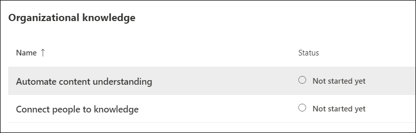
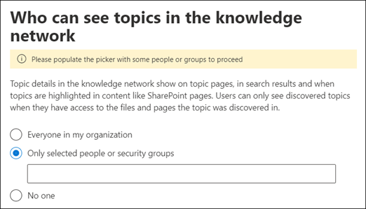
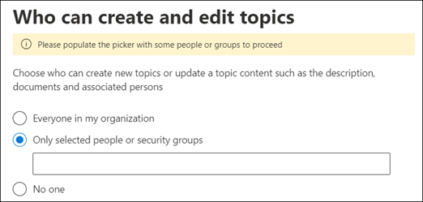
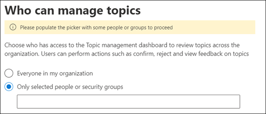

# Manage your knowledge management network (Preview)

> [!Note] 
> The content in this article is for Project Cortex Private Preview. [Find out more about Project Cortex](https://aka.ms/projectcortex).

After you [set up knowledge management](set-up-knowledge-network.md), at any time afterwards an admin can make adjustments to your configuration settings through the Microsoft 365 admin center.

For example, you may need to adjust your settings for any of the following:
- Add new SharePoint sources to mine topics.
- Change which users will have access to topics.
- Change which users have permissions to do tasks on the topic center.
- Change the name of your topic center

## Requirements 
You must have Global Admin or SharePoint admin permissions to be able to access the Microsoft 365 admin center and manage Organizational knowledge tasks.

## To access knowledge management settings:

1. In the Microsoft 365 admin center, select **Setup**, and then view the **Organizational Knowledge** section.
2. In the **Organizational Knowledge** section, click **Connect people to knowledge**. 

      

3. On the **Connect people to knowledge** page, select **Manage** to open the **Knowledge network settings** pane. 

      

## Change how the knowledge network can find topics

Select the **Topic discovery** tab if you want to update your choices for  for SharePoint topic sources. This setting let you select the SharePoint sites in your tenant that will be crawled and mined for topics.

1. On the **Topic discovery** tab, under **Select SharePoint topic sources**, select **Edit**.
2. On the **Select SharePoint topic sources** page, select which SharePoint sites will be crawled as sources for your topics during discovery. This includes: 
    a. **All sites**: All SharePoint sites in your tenant. This captures current and future sites. 
    b. **All, except selected sites**: Type the names of the sites you want to exclude.  You can also upload a list of sites you want to opt out from discovery. Sites created in the future will be included as sources for topic discovery.  
    c. **Only selected sites**: Type the names of the sites you want to include. You can also upload a list of sites. Sites created in the future will not be included as sources for topic discovery.  

      
   
    If you have a number of sites that you want to exclude (if you select **All, except selected sites**) or include (if you selected **Only selected sites**), you can choose to upload a CSV file with the site names and URLs. You can select **Download site template .csv** if you want to use the CSV template file.

3. Select **Save**.

##  Change who can see topics in your organization

Select the **Topic discovery** tab if you want to update who in your organization can see discovered topics in search results and when topics are highlighted in content like SharePoint pages.

1. On the **Topic discovery** tab, under **Who can see topics in the knowledge network**, select **Edit**.
2. On the **Who can see topics in the knowledge network** page, you choose who will have access to topic details, such as highlighted topics, topic cards, topic answers in search, and topic pages. You can select: 
    a. **Everyone in your organization** 
    b. **Only selected people or security groups** 
    c. **No one** 

       
3. Select **Save**.  
 
> [!Note] 
> While this setting allows you to select any user in your organization, only users who have knowledge management licenses assigned to them will be able to view topics.

## Change who has permissions to do tasks on the topic center

Select the **Topic permissions** tab if you want to update who has permissions to do the following in the topic center page:

- Which users can create and edit topics: Create new topics that were not found during discovery or edit existing topic page details.
- Which users can manage topics: Confirm or reject discovered topics.

To update who has permissions to create and edit topics:

1. On the **Topic permissions** tab, under **Who can create and edit topics**, select **Edit**. 
2. On the **Who can create and edit topics** page, you can select: 
    a. **Everyone in your organization** 
    b. **Only selected people or security groups** 

       

3. Select **Save**. 

To update who has permissions to manage topics:

1. On the **Topic permissions** tab, under **Who can manage topics**, select **Edit**. 
2. On the **Who can manage topics** page, you can select: 
    a. **Everyone in your organization** 
    b. **Selected people or security groups** 

       

3. Select **Save**. 

##  Update your topic center name

Select the **Topic center** tab if you want to update the name of your topic center. 

1. On the **Topic center** tab, under **Topic center name**, select **Edit**.
2. On the **Edit topic center name** page, in the **Topic center name** box, type the new name for your topic center.
3. Select **Save**

       

## See also

  

