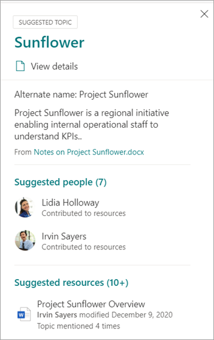
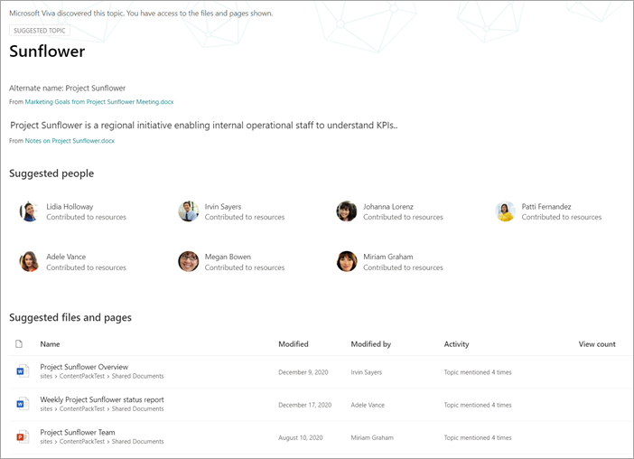
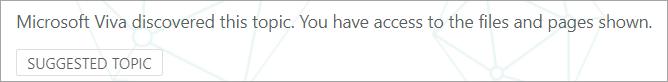
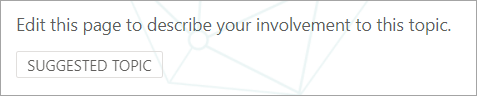
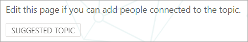
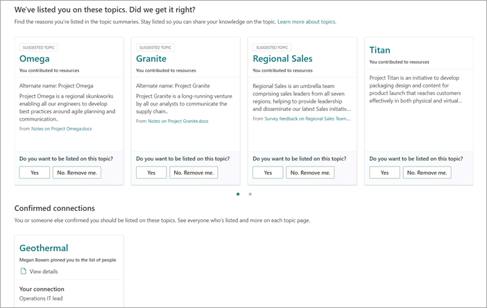

# Manage topics at scale in Microsoft Viva Topics

When you index your SharePoint sites or your entire organization for Viva Topics, many topics might be generated. When this happens and you see thousands of suggested topics on the **Manage topics** page, it can be challenging to know where to start. This article describes how Viva Topics helps you optimize which topics and information are shown to users who are searching for information, even in large organizations with large numbers of topics.

First, a reminder of the [four stages for topics](manage-topics.md#topic-stages):

- **Suggested**: A topic has been identified by AI and has enough supporting resources, connections, and properties. (These are marked as a **Suggested Topic** in the UI.)

- **Confirmed**: A topic that has been discovered by AI and has been validated. Topic validation occurs when either:

   - A knowledge manager confirms a topic. A knowledge manager [confirms a topic](manage-topics.md#confirmed-topics) on the **Manage topics** page.

   - Multiple users confirm a topic. There must be a net of two positive votes received from users who voted using the feedback mechanism on the topic card. For example, if one user voted positive and one user voted negative for a particular topic, you would still need two more positive votes for the topic to be confirmed.
 
- **Published**: A topic that has been curated. Manual edits have been made to improve its quality, or it has been created by a user.

- **Removed**: A topic that has been rejected and will no longer be visible to viewers. A topic can be removed in any state (suggested, confirmed, or published). Topic removal occurs when either:

   - A knowledge manager removes a topic. A knowledge manager removes a topic on the **Manage topics** page.

   - Multiple users cast negative votes using the feedback mechanism on the topic card. For a topic to be removed, there must be a net of two negative votes received from users. For example, if one user voted negative and one user voted positive for a particular topic, you would still need two more negative votes for the topic to be removed.

  When a published topic is removed, the page with the curated details will need to be deleted manually through the Pages Library of the topic center.

## Knowledge manager role 

When you configure Viva Topics, you'll add a group of users who are granted permissions to see the **Manage topics** page in the topic center. It will appear only for these users who hold the role of primary curation for the topics. They'll have access to data about the topics and will be able to see lists of all topics that they have access to review and curate.

Employees in this role should have broad permissions to view a wide array of topics. Or if permissions are segmented, you might want to select a group of users that represent different areas of the business and can curate for their own areas.

When you first review topics in the topic center, suggested topics are purely AI-defined. Knowledge managers might want to review each one before rolling out Viva Topics to a broad user community. When working at scale, this approach is rarely a practical because of the thousands of topics.

The recommended approach is to find a balance of the most pertinent or important topics for your initial set of users and focus on curation of those topics before rollout of Viva Topics. Begin to collect feedback from the users and allow crowdsourcing to determine the usage and contribution patterns of your users to inform the strategies suggested in this article.

It's important to recognize that the system will identify and show both AI-suggested and human-curated published topics to all users. However, this doesn't mean that every suggested topic will be shown to all end users. The security settings in place will show only the topics that each employee can access based on the permissions that are set on the content itself.

As a knowledge manager with permissions to view the **Manage topics** page, you might see a much larger number of topics listed because of your own elevated permissions, depending on your role in the organization and level of access. You'll also have access to views that allow you see topics listed in a single location rather than accessing them by using highlights or search.

In addition, there is likely a smaller percentage of topics that will be viewed by most users and a larger set of more topics that will be seen much less frequently due to permissions. As a result, it is good to first focus any curation tasks on the topics that are the most important for your organization and that are the most likely to be seen more broadly.

This article covers a few strategies for curation. These strategies might mean that the less frequent or less common topics might not be fully curated by knowledge managers. However, these suggested topics remain useful and can provide insight or a pointer to a person, which can save an employee hours of looking for a starting point. Allowing crowdsourced updates to topics is beneficial and provides more content and coverage for the less common topics.

This article provides some guidance and best practices to approach topic management and curation.

## Understanding suggested topics

When topics are discovered by AI, they're marked as a **Suggested Topic**, both on the **Manage topics** page, and in the topic cards that are presented to users. Any topic that hasn't been marked as removed will be shown to users—this includes confirmed, published, and suggested topics. Topics in all three states are available to end users.

Within a topic card or page, we use various cues to show how the AI has generated the information. The system uses a variety of evidence to add the resources, primarily through the content itself.

- Labels show that a topic is suggested and that it was discovered by Viva Topics.  

   

- Information on the card states where a definition has come from by specifying its source.

- Suggested people are derived by aggregating people who have written or edited documents with topic evidence. If a person writes a document that has a topic name in the title, and that document has many views, it might only require one document to establish the person as related. However, in many cases more evidence is better, and people who are listed have worked on multiple documents.  

   

- For the files and pages shown, the system identifies how many times the topic has been mentioned in the document, but the topic also must be mentioned in a specific context that identifies the reference to the topic of specific type (such as project or team). This is what counts as evidence for the AI. The system also considers the occurrence of a topic name in the titles of documents, types of documents, and other analytics features (such as views).

   

   

   

These attributes demonstrate that the content has been added by AI, and how the AI has made that determination.

### Communication

When communicating to your users about Viva Topics, it's important to clarify the difference between AI-suggested topics and content and their curated equivalents.

As a reader, you should view suggested topics with a more critical eye. They shouldn't be perceived as authoritative sources of organizational truth. Rather, they're a way-finding tool to access tacit knowledge that is presented through the content that you have access to. The AI has discovered the topic and has enough evidence to show it to you, but its value hasn't been confirmed by a person.

### Crowdsourced controls

Suggested topics can be improved by curation of the page and through crowdsourced feedback on the topic.

When users interact with a suggested topic, they might be asked a simple question in the UI. For example: *Was this topic relevant to the page?* *Is this person relevant for the topic?* *Was this definition accurate?* By using the feedback to such questions, the accuracy of the topics can increase without the need for a named individual to curate the page.

The home page of a topic center is another location where feedback on suggested topics is gathered. In the topic center, a user can see the topics that they have been associated with and are given the option to either confirm this association or have it removed.

   

When you allow broad crowdsourcing of topics, you should consider the following factors:

-   Users will see the **Edit** option on topic pages and can edit the pages in the same experience as other modern SharePoint pages.

-   Some **Suggested Topic** web parts can't be removed. The topic name, alternate names, definition, suggested people, and suggested resources can't be removed.

-   It can take some time for a suggested or confirmed topic that has been published to be moved to the **Published** list on the **Manage topics** page.

    -   The estimated time for a topic to appear in search, highlights, hashtags, or annotations is 2 hours.

    -   The estimated time for a topic to appear in **Published** list on the **Managed topics** page is no more than 24 hours in most cases. You should see them within 2 hours, but because there's a full sync every 24 hours, the wait shouldn't be longer than 24 hours.

-   It's possible that a user might leave a published topic in a checked-out or editing state. A knowledge manager can see these in the Pages Library of the topic center and either can discard the user's changes to republish the topic or contact that user to request that they check in the topic.

### Topic visibility and content is based on a user's permissions

When you review the list of suggested topics as a knowledge manager, keep in mind that the contents on a suggested topic will be dynamically based on permissions. The suggested content and people that are shown to you might not be the same as those who are presented to any user or another knowledge manager.

Based on the permissions to view content that is associated with a topic, each user might see a different set of suggested resources, people, alternative names, and definition.

## Prioritize the topics for curation

You can use the following strategies to identify topics that are likely to be prominent, and therefore are good candidates for curation. 

### Taxonomies

Using existing taxonomies can provide a list of topics that are likely to be prominent for users. For example, these could be:

-   Products and services that your organization provides

-   Teams in your organization

-   High-profile projects

This approach could also be taken on a departmental or functional level, with subject-matter experts who understand that area of your organization. The goal isn't to have them review a selection or all of the topics. Rather, they bring their own domain expertise to guide selective curation.

### Search

Common search terms are often discovered as topics. By using the [top query reports in Microsoft Search](/sharepoint/view-search-usage-reports), you can identify the most frequent search terms in your organization. If topics have been discovered for these terms, they're good candidates for curation. These topics can be presented as answer cards in Microsoft Search.

If you're currently using [Microsoft Search bookmarks](/microsoftsearch/manage-bookmarks), consider which of these can be replaced with a topic. A bookmark answer card contains a title, description, and URL. In some circumstances, a topic card might be more useful to a user, and a topic card also shows resources and people.

In the user's search experience, when a user searches for a term like *travel*, search results are displayed in the following priority order in Microsoft Search:

1.  Published or confirmed topics

2.  Bookmarks

3.  Suggested topics

### Impressions and quality score

The [impressions](manage-topics.md#impressions) count and [quality score](manage-topics.md#quality-score) are important metrics for understanding the behavior of a topic. The value of these metrics will be limited when only knowledge managers or IT teams have access to topics. Exposing topics to a pilot group of users will generate more representative data for these measures.

Topics with a high impression count are likely to be more frequently interacted with. The quality score for these topics will give a sense of how rich those topics are. Topics with a high impression count and a low quality score are good targets for curation.

### Key terms from the information architecture of larger organizational sites

Larger portal sites within your organization might have invested time in organizing their information architecture and the navigation of their site around key topic areas for their business units, product lines, major projects, and so on. Reviewing these terms and identifying and curating topics for these terms can help users who are looking for information on these areas.

### Leverage internal knowledge bases or wiki sites

If your organization has invested in knowledge bases or wiki sites, these can provide a list of topics to use for your initial curation efforts. If they're particularly large, select the most viewed or edited topics as a starting point.

## See also

[Manage topics in the topic center](manage-topics.md)

[Topic center overview](topic-center-overview.md)
