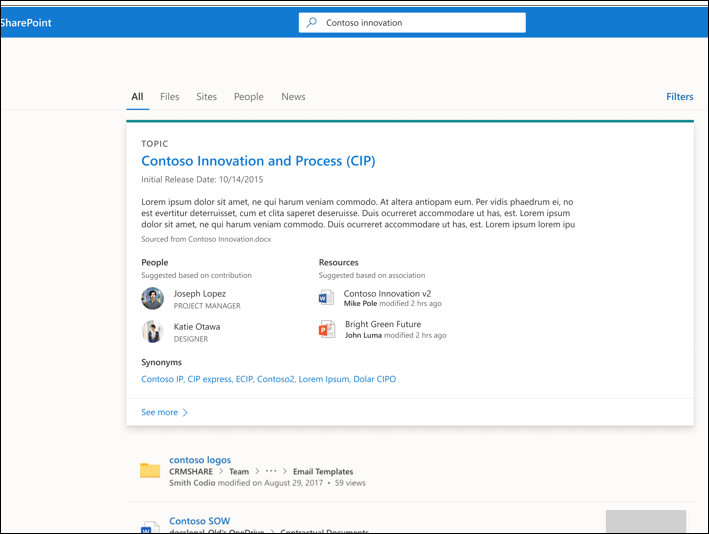

# Use Microsoft Search to find topics in Microsoft Viva Topics

While Viva Topics users can find topics through topic highlights in their SharePoint sites, they can also find them through Microsoft Search. 

## Topic Answer

When you search for a specific topic in Microsoft Search (for example, "Saturn"), if a topic exists and is found, it will display the result in the Answers suggestion format.

The topic answer will display:
- Topic name
- Alternate names: Alternate names or acronyms for the topic.
- Definition: Description of the topic provided by AI or manually added by a person.
- Suggested or Pinned people: People suggested by AI or pinned to the topic by a person
- Suggested or Pinned resources: Files, pages, or sites either suggested by AI or pinned to the topic by a person. 

    

The topic page can display in the search results even if the topic answer card doesn't appear.

The search results in Word and PowerPoint will also show the topic answer when one is found.

## Acronyms

In Viva Topics, you can manually edit a topic to include an acronym for it as an <b>Alternate Name</b>. This allows a user who is searching by only the topic's acronym to find the topic answer through Microsoft Search.

[Acronym Answers](/microsoftsearch/manage-acronyms) is a feature provided though Microsoft Search and is managed separately from Viva Topics.

## Bookmarks and topics

[Bookmarks](/microsoftsearch/manage-bookmarks) are a Microsoft Search feature that help people quickly find important sites and tools with just a search (for example, a travel booking tool on an external site outside of their Microsoft 365 tenant). They're created by search admins in the Microsoft 365 admin center. 

For users who are looking for information about booking a trip for work:

- If some users know the travel tool name (for example, "Concur"), it's easier to create a bookmark to go directly to the external site.
- For users who search generally for "travel", create a topic on "Travel" that has the information they expect to see. Consider adding a link to the Concur external site in the description of the topic. If the link is instead to an internal travel booking site hosted on the Microsoft 365 tenant, you can add it to the “Pinned Resources”.
 
### Search results priority 
 
In the users search experience, when a user searches for a term like “travel”, search results will display in the following priority in Microsoft Search
1. Published or Confirmed topics 
2. Bookmarks
3. Suggested topics
