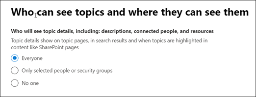
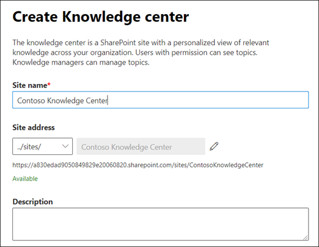
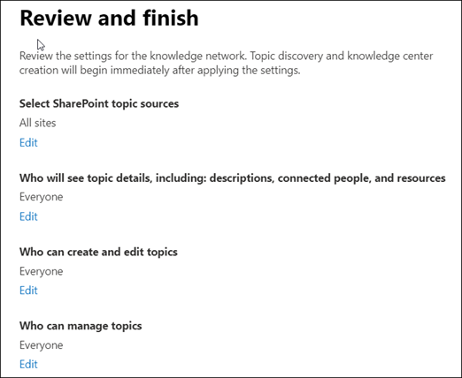
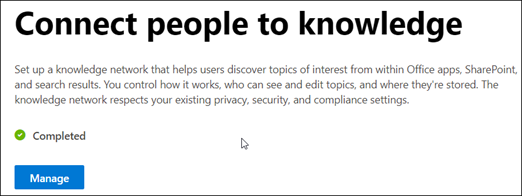

# Set up Knowledge Management (Preview)

> [!Note] 
> The content in this article is for Project Cortex Private Preview. [Find out more about Project Cortex]().

Use the Microsoft 365 admin center to set up and configure Knowledge Management. 

> [!Important]
> It is important to plan the best way to set up and configure Knowledge Management in your environment. For example, who should you initially give access to and which sites do I analyze?  Much of this type of information is needed during the setup steps. Before going through the setup steps, make sure to [make all your planning considerations]().

## Requirements 
You must have Global Admin permissions to be able to access the Microsoft 365 admin center and set up Project Cortex.

## Set up your knowledge network

Setting up your knowledge network walks you through the following:

- Topic discovery: Selecting topic source sites and topics to exclude from discovery.
- Topic visibility: Selecting who can view topics and see suggested topics.
- Topic permissions: Selecting who can create, edit, and manage topics.
- Knowledge center: Create your knowledge center.
- Review: Check and apply your settings.

To set up your knowledge network:

1. In the Microsoft 365 admin center, select **Setup**, and then view the **Organizational Knowledge** section.
2. In the **Organizational Knowledge** section, click **Connect people to knowledge**. 

      

3. On the **Connect people to knowledge** page, click **Get started** to walk you through the setup process. 

      

4. On the **Choose how the knowledge network can find topics** page, you will configure topic discovery. In the **Select SharePoint topic sources** section, select which SharePoint sites will be mined as sources for your topics during discovery. This includes: 
    a. **All sites**: All SharePoint sites in your tenant. 
    b. **All, except selected sites**: Type the names of the sites you want to exclude. 
    c. **Only selected sites**: Type the names of the sites you want to include. 

      
   
5. In the **Exclude topics by name** section, you can choose to includes names of topics you don't want to be in the discovery results. Your options include: 
    a. **Don't exclude any topics**: If you have a number of topics to exclude, you choose to include them in a CSV file. Select **Choose** to import your CSV file. 
    b. **Exclude topic that contain these terms**
    Select **Next**. 

    Note that before any discovered topics are available to users, they must first be confirmed or rejected in the knowledge center.

6. On the **Who can see topics and where they can see them** page, you will configure topic visibility. In the **Who will see topic details, including: descriptions, connected people, and resources** section, you choose who will have access to topic details, such as highlighted topics, topic cards, and topic pages. You can select:
    a. **Everyone** 
    b. **Only selected people or groups** 
    c. **No one** 

       
   
7. In the **Who will see suggested topics to add to their profile** section, you choose who will be able to add suggested topics to their profiles, based on their activity in Microsoft 365. You can select: 
    a. **Everyone** 
    b. **Everyone, except selected people or groups** 
    c. **Only selected people or groups** 
    d. **No one** 

    Select **Next**.
8. In the **Permissions for topic management** page, you choose who will be able to create, edit, or manage topics. In the **Who can create and edit topics** section, you can select: 
    a. **Everyone** 
    b. **Everyone, except selected people or groups** 
    c. **Only selected people or groups** 
9. In the **Who can manage topics** section, you can select: 
    a. **Everyone** 
    b. **Selected people or groups** 

    Select **Next**. 
10. On the **Create Knowledge Center** page, you can create your Knowledge Center site in which topics are managed.  In the **Site name** box, type a name for your Knowledge Center. You can optionally type a short description in the **Site description** box. Select **Next**. 

       

11. On the **Review and finish** page, you can look at your selected setting and choose to make changes. If you are satisfied with your selections, select **Apply settings**.

       

12. The **Knowledge Network settings applied** page will display, confirming that the system will now start analyzing your selected sites for topics and creating the Knowledge Center site. Select **Done**.

13. You'll be returned to your **Connect people to knowledge** page. From this page, you can select **Manage** to make any changes to your configuration settings. 

         

## See also

  

