# Set up Microsoft Viva Topics

You can use the Microsoft 365 admin center to set up and configure [Topics](topic-experiences-overview.md). 

It is important to plan the best way to set up and configure topics in your environment. Be sure to read [Plan for Microsoft Viva Topics](plan-topic-experiences.md) before you begin the procedures in this article.

You must be [subscribed to Viva Topics](https://www.microsoft.com/microsoft-viva/topics) and be a global administrator or SharePoint administrator to access the Microsoft 365 admin center and set up Topics.

If you have configured SharePoint to [require managed devices](/sharepoint/control-access-from-unmanaged-devices), be sure to set up Topics from a managed device.

## Video demonstration

This video shows the process for setting up Topics in Microsoft 365.

 

> [!VIDEO https://www.microsoft.com/videoplayer/embed/RE4Li0E]  

 

## Assign licenses

You must assign licenses for the users who will be using Topics. Only users with a license can see information on topics including highlights, topic cards, topic pages and the topic center. 

To assign licenses:

1. In the Microsoft 365 admin center, under **Users**, click **Active users**.

2. Select the users that you want to license, and click **Licenses and apps**.

3. Under **Licenses**, select **Viva Topics**.

4. Under **Apps**, make sure **Graph Connectors Search with Index (Viva Topics)** and **Viva Topics** are both selected.

   > [!div class="mx-imgBorder"]
   > 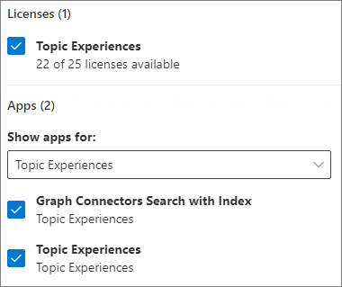

5. Click **Save changes**.

It may take up to an hour for users to get access to Topics after the licenses are assigned.

## Set up Topics

To set up Topics

1. In the [Microsoft 365 admin center](https://admin.microsoft.com), select **Setup**, and then view the **Files and content** section.
2. In the **Files and content** section, click **Connect people to knowledge**.

    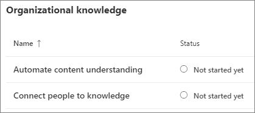 

3. On the **Connect people to knowledge** page, click **Get started** to walk you through the setup process.

    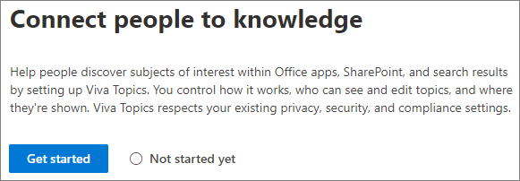 

4. On the **Choose how Viva Topics can find topics** page, you will configure topic discovery. In the **Select SharePoint topic sources** section, select which SharePoint sites will be crawled as sources for your topics during discovery. Choose from:
    - **All sites**: All SharePoint sites in your organization. This includes current and future sites.
    - **All, except selected sites**: Type the names of the sites you want to exclude.  You can also upload a list of sites that you want to opt out from discovery. Sites created in future will be included as sources for topic discovery. 
    - **Only selected sites**: Type the names of the sites you want to include. You can also upload a list of sites. Sites created in the future will not be included as sources for topic discovery.
    - **No sites**: Do not include any SharePoint sites.

    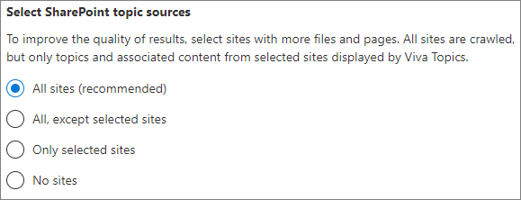 
   
5. In the **Exclude topics by name** section, you can add names of topics you want to exclude from topic discovery. Use this setting to prevent sensitive information from being included as topics. The options are:
    - **Don't exclude any topics** 
    - **Exclude topics by name**

    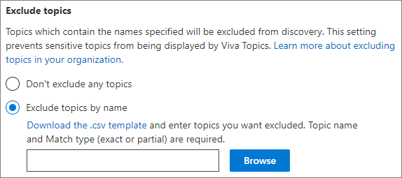 

    (Knowledge managers can also exclude topics in the topic center after discovery.)

    #### How to exclude topics by name    

    If you need to exclude topics, after selecting **Exclude topics by name**, download the .csv template and update it with the list of topics that you want to exclude from your discovery results.

    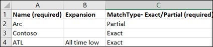 

    In the CSV template, enter the following information about the topics you want to exclude:

    - **Name**: Type the name of the topic you want to exclude. There are two ways to do this:
        - Exact match: You can include the exact name or acronym (for example, *Contoso* or *ATL*).
        - Partial match: You can exclude all topics that have a specific word in it.  For example, *arc* will exclude all topics with the word *arc* in it, such as *Arc circle*, *Plasma arc welding*, or *Training arc*. Note that it will not exclude topics in which the text is included as part of a word, such as *Architecture*.
    - **Stands for (optional)**: If you want to exclude an acronym, type the words the acronym stands for.
    - **MatchType-Exact/Partial**: Type whether the name you entered was an *exact* or *partial* match type.

    After you've completed and saved your .csv file, select **Browse** to locate and select it.
    
    Select **Next**.

6. On the **Who can see topics and where can they see them** page, you will configure topic visibility. In the **Who can see topics** setting, you choose who will have access to topic details, such as highlighted topics, topic cards, topic answers in search, and topic pages. You can select:
    - **Everyone in my organization**
    - **Only selected people or security groups**
    - **No one**

    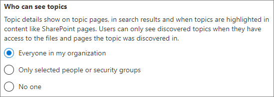  

    > [!Note] 
    > While this setting allows you to select any user in your organization, only users who have Topic Experiences licenses assigned to them will be able to view topics.

7. In the **Permissions for topic management** page, you choose who will be able to create, edit, or manage topics. In the **Who can create and edit topics** section, you can select:
    - **Everyone in my organization**
    - **Only selected people or security groups**
    - **No one**

    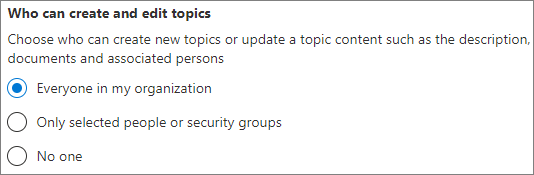 

8. In the **Who can manage topics** section, you can select:
    - **Everyone in my organization**
    - **Only selected people or security groups**

    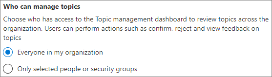 

    Select **Next**.

9. On the **Create topic center** page, you can create your topic center site in which topic pages can be viewed and topics can be managed. In the **Site name** box, type a name for your topic center. You can optionally type a short description in the **Description** box. 

   Select **Next**.

   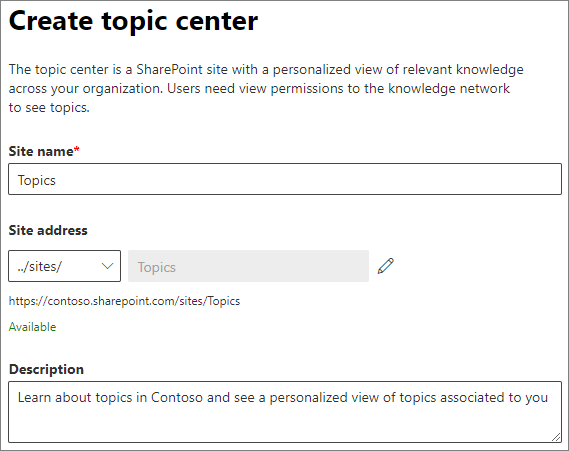  

10. On the **Review and finish** page, you can look at your selected setting and choose to make changes. If you are satisfied with your selections, select **Activate**.

11. The **Viva Topics activated** page will display, confirming that the system will now start analyzing your selected sites for topics and creating the topic center site. Select **Done**.

12. You'll be returned to your **Connect people to knowledge** page. From this page, you can select **Manage** to make any changes to your configuration settings. 

    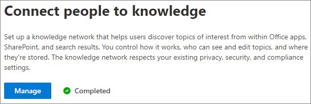    

Note that the first time topic discovery is enabled, it may take up to two weeks for all suggested topics to appear in the Manage Topics view. Topic discovery continues as new content or updates to content are made. It is normal to have fluctuations in the number of suggested topics in your organization as Viva Topics evaluates new information.

## Manage topic experiences

Once you have set up Topics, you can change the settings that you chose during setup in the [Microsoft 365 admin center](https://admin.microsoft.com/AdminPortal#/featureexplorer/csi/KnowledgeManagement). See the following references:

- [Manage topic discovery in Microsoft Viva Topics](topic-experiences-discovery.md)
- [Manage topic visibility in Microsoft Viva Topics](topic-experiences-knowledge-rules.md)
- [Manage topic permissions in Microsoft Viva Topics](topic-experiences-user-permissions.md)
- [Change the name of the topic center in Microsoft Viva Topics](topic-experiences-administration.md)

## See also

[Topic Experiences Overview](topic-experiences-overview.md)
