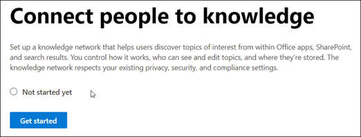
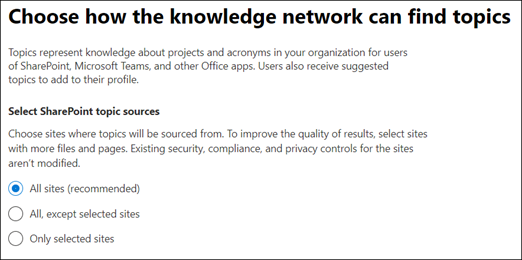
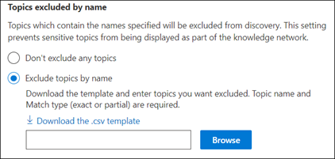
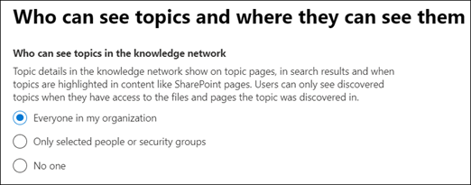
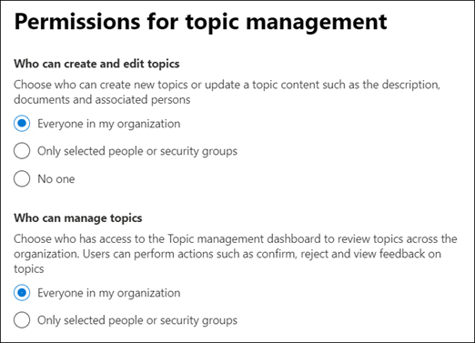
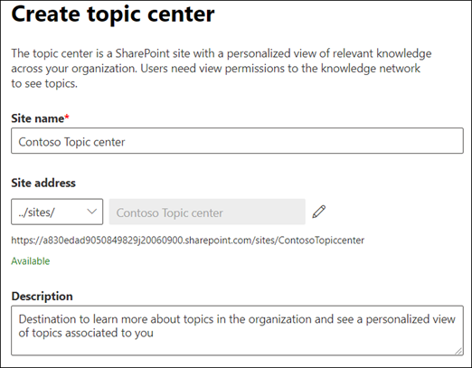
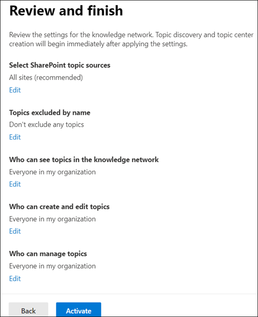
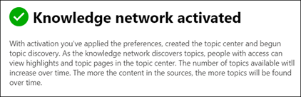
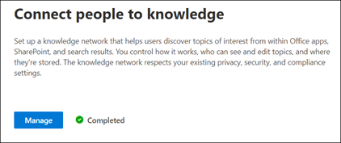

# Set up Knowledge Management (Preview)

> [!Note] 
> The content in this article is for Project Cortex Private Preview. [Find out more about Project Cortex](https://aka.ms/projectcortex).

You can use the Microsoft 365 admin center to set up and configure [Knowledge Management](knowledge-management-overview.md). 

> [!Important]
> It is important to plan the best way to set up and configure Knowledge Management in your environment. For example, you will need to make considerations about the following:
- Which SharePoint sites you want to analyze for topics.
- Which users you want to make topics visible to.
- Which users you want to give permissions to manage topics in the topic center.
- Which users you want to give permissions to create or edit topics in the topic center.
- What name you want to give your topic center.

> [!Note]
> You may find it useful to create security groups to assign your users the permissions needed to view topics, manage topic, and create and edit topics.

An admin can also [make changes to your selected settings anytime after setup](topic-experiences-discovery.md) through the Knowledge Management settings in the Microsoft 365 admin center.

## Requirements 
You must have Global Admin or SharePoint admin permissions to be able to access the Microsoft 365 admin center and set up Organizational knowledge tasks.

## Set up your knowledge network

Setting up your knowledge network walks you through the following:

- Topic discovery: Selecting topic sources and topics to  exclude from discovery.
- Topic visibility: Selecting who can view topics as highlights, in search and topic pages.
- Topic permissions: Selecting who can create, edit, and manage topics.
- Topic center: Create your topic center.
- Review: Check and apply your settings.

To set up your knowledge network:

1. In the Microsoft 365 admin center (admin.microsoft.com), select **Setup**, and then view the **Organizational Knowledge** section.
2. In the **Organizational Knowledge** section, click **Connect people to knowledge**. 

      

3. On the **Connect people to knowledge** page, click **Get started** to walk you through the setup process. 

      

4. On the **Choose how the knowledge network can find topics** page, you will configure topic discovery. In the **Select SharePoint topic sources** section, select which SharePoint sites will be crawled as sources for your topics during discovery. This includes: 
    a. **All sites**: All SharePoint sites in your tenant. This captures current and future sites. 
    b. **All, except selected sites**: Type the names of the sites you want to exclude.  You can also upload a list of sites that you want to opt out from discovery. Sites created in future will be included as sources for topic discovery.  
    c. **Only selected sites**: Type the names of the sites you want to include. You can also upload a list of sites. Sites created in the future will not be included as sources for topic discovery.  

      
   
5. In the **Exclude topics by name** section, you can choose to includes names of topics you don't want to be in the discovered results. Use this setting to prevent sensitive topics from being included as part of the knowledge network. Your options include: 
    a. **Don't exclude any topics**  
    b. **Exclude topics by name**:  If you have topics you don’t want shown to users as part of the knowledge network. 

      

    #### How to exclude topics by name    

    If you need to exclude topics, after selecting **Exclude topics by name**, select **Download the .csv template**. Use the Excel .CSV template to include a list of topics that you want to exclude from your discovery results.

      

    In the CSV template, enter the following information about the topics you want to exclude:

    - **Name**: Type the name of the topic you want to exclude. There are two ways to do this: 
        - Exact match: You can include the exact name or acronym (for example, *Contoso* or *ATL*). 
        - Partial match: You can exclude all topics that have a specific word in it.  For example, *arc* will exclude all topics with the word *arc* in it, such as *Arc circle*, *Plasma arc welding*, or *Training arc*. Note that it will not exclude topics in which the text is included as part of a word, such as *Architecture*. 
    - **Expansion (optional)**: If you want to exclude an acronym, type the words the acronym stands for. 
    - **MatchType-Exact/Partial**: Type whether the name you entered was an *exact* or *partial* match type. 

    After you've completed and saved your CSV template file, select **Browse** to locate and select it.
    
    Select **Next**. 

6. On the **Who can see topics and where they can see them** page, you will configure topic visibility. In the **Who can see topics in the knowledge network** setting, you choose who will have access to topic details, such as highlighted topics, topic cards, topic answers in search, and topic pages. You can select: 
    a. **Everyone in your organization** 
    b. **Only selected people or security groups** 
    c. **No one** 

       

 > [!Note] 
 > While this setting allows you to select any user in your organization, only users who have knowledge management licenses assigned to them will be able to view topics. 

7. In the **Permissions for topic management** page, you choose who will be able to create, edit, or manage topics. In the **Who can create and edit topics** section, you can select: 
    a. **Everyone in your organization** 
    b. **Only selected people or security groups** 
8. In the **Who can manage topics** section, you can select: 
    a. **Everyone in your organization** 
    b. **Selected people or security groups** 

      

    Select **Next**. 
9. On the **Create Topic  Center** page, you can create your topic center site in which topic pages can be viewed and topics can be managed.  In the **Topic center name** box, type a name for your Topic center. You can optionally type a short description in the **Site description** box.  

Select **Next**. 

      

10. On the **Review and finish** page, you can look at your selected setting and choose to make changes. If you are satisfied with your selections, select **Activate**.

       

11. The **Knowledge network activated** page will display, confirming that the system will now start analyzing your selected sites for topics and creating the Knowledge Center site. Select **Done**. 

       

12. You'll be returned to your **Connect people to knowledge** page. From this page, you can select **Manage** to make any changes to your configuration settings. 

         

> [!Note]
> After setup, an admin can [make changes to your selected knowledge management settings](topic-experiences-discovery.md) any time by returning to this page.

## See also

  

