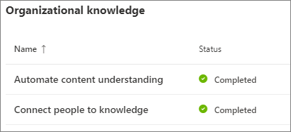
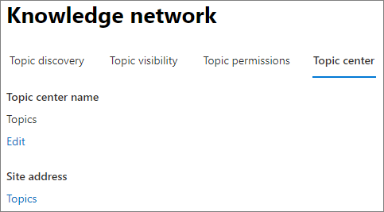
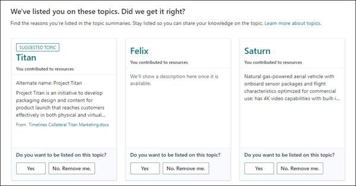
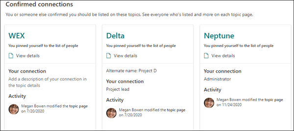

# Topic center overview in Microsoft Viva Topics

In Microsoft Viva Topics, the topic center is a modern SharePoint site that serves as a center of knowledge for your organization​. It's created during [Viva Topics setup](set-up-topic-experiences.md) in the Microsoft 365 admin center.

The topic center has a default home page with the **Topics** web part where all licensed users can see the topics to which they have a connection. 

While all licensed users who can view topics will have access to the topic center, knowledge managers can also manage topics through the **Manage topics** page. The **Manage topics** tab will only display to users who have the Manage topics permissions. 

## Where is my topic center

The topic center is created during Viva Topics setup. After setup completes, an admin can find the URL on the [Topic center management page](./topic-experiences-administration.md#to-access-topics-management-settings).

1. In the Microsoft 365 admin center, select **Settings**, and then select **Org settings**.
2. On the **Services** tab, select **Topic Experiences**.

      

3. Select the **Topic center** tab. Under **Site address** is a link to your Topic center.

      

## Home page

 

> [!VIDEO https://www.microsoft.com/videoplayer/embed/RE4LAhZ]  

 

On the topic center home page, you can see the topics in your organization to which you have a connection.

- Suggested connections - You will see topics listed under **We've listed you on these topics. Did we get it right?** These are topics in which your connection to the topic has been suggested through AI. For example, you might be an author of a related file or site. You are asked to confirm that you should stay listed as a related person for the topic.

     
 
- Confirmed connections - These are topics in which you are pinned on the topic page or you've confirmed a suggested connection to the topic. Topics will move from the suggested to confirmed section when you confirm a suggested connection.
 
     

Once a user confirms their connection to a topic, the user can make edits to the topic page to curate their connection. For example, they can provide more information about their connection to the topic.

## Manage topics page

To work in the **Manage Topics** section of topic center, you need to have the required Manage Topic permissions needed for the knowledge manager role. Your admin can assign these permissions to users during [knowledge management setup](set-up-topic-experiences.md), or new users can be [added afterwards](topic-experiences-knowledge-rules.md) by an admin through the Microsoft 365 admin center.

On the Manage Topics page, the topic dashboard shows all the topics, you have access to, that were identified from your specified source locations. Each topic will show the date the topic was discovered. A user who was assigned Manage topics permissions can review the unconfirmed topics and choose to:
- Confirm the topic: Indicates to users that an AI-suggested topic has been validated by a human curator. 
- Publish the topic: Edit the topic information to improve the quality of the topic that was initially identified, and highlights the topic to all users who have view access to topics. 
- Remove the topic: Makes the topic undiscoverable to end users. The topic is moved to the **Removed** tab and can be confirmed later if needed. 

> [!Note] 
> See [Manage topics](manage-topics.md) for more details about topic managing topics in the Manage topics page.

## Create or edit a topic

If you have Create and edit topics permissions, you can:

- [Edit existing topics](edit-a-topic.md): You can make changes to existing topic pages that were created through discovery.
- [Create new topics](create-a-topic.md): You can create new topics for ones that were not found through discovery, or if AI tools did not find enough evidence to create a topic.

## See also

[Manage topics in the topic center](manage-topics.md)

