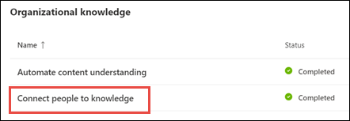
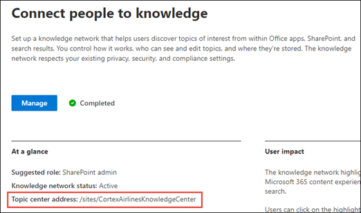

# Topic center overview (Preview)

> [!Note] 
> The content in this article is for Project Cortex Private Preview. [Find out more about Project Cortex](https://aka.ms/projectcortex).

The topic center is a Modern SharePoint site that serves as a center of knowledge for your organization​. It is created during [Topic Experiences setup](set-up-topic-experiences.md) in the Microsoft 365 admin center.

The Topic center has a default home page (My topics) where all Topic Experience users can see the topics to which they have a connection. 

While all licensed users who can view topics will have access to the Topic center, knowledge managers will also be able to manage topics through the **Manage topics** page. The Manage topics tab will only display to users who have the **Manage topics** permissions. 

## Where is my Topic center

The Topic center is created during Topic Experiences setup. After setup completes, an admin can find the URL on the [Topic center management page](https://docs.microsoft.com/microsoft-365/knowledge/topic-experiences-administration#to-access-topics-management-settings).

1. In the Microsoft 365 admin center, select **Setup** in the navigation pane, and in the **Organizational Knowledge** section, select **Connect people to knowledge**.

     

2. On the **Connect people to knowledge** page, in the **At a glance** section, see **Topic center address** for the site URL.
 
     

## Home page

On the Topic center home page, you can see the topics in your organization to which you have a connection.

- Suggested connections - You will see suggested topics listed under **We've listed you on these topics. Did we get it right?**. These are topics where your connection to the topic has been suggested through AI. For example, you may be the owner of a related file or site. Suggested topics will ask you to confirm you connection to the topic.

     
 
- Confirmed connections - These are topics where you are pinned on the topic by another user or you've confirmed your connection to the topic. Topics will move from the suggested to confirmed section when you confirm a suggested connection.
 
     

Once a user confirms their connection to a topic, the user can make edits to the topic page to curate their connection. For example, they can provide more information about their connection to the topic.

## Manage topics page

To work in the **Manage Topics** section of Topic center, you need to have the required *Manage topics* permissions needed for the knowledge manager role. Your admin can assign these permissions to users during [knowledge management setup](set-up-topic-experiences.md), or new users can be [added afterwards](give-user-permissions-to-the-topic-center.md) by an admin through the Microsoft 365 admin center.

On the Manage Topics page, the topic dashboard shows topics that were identified from your specified source locations. Each topic will show the date the topic was discovered and if any feedback has been provided on it. A user who was assigned **Manage topics** permissions can review the unconfirmed topics and choose to:
- Confirm the topic: Highlights the topic to users who have access and lets them see the associated topic card and topic page.
- Reject the topic: Makes the topic not available to users. The topic is moved to the **Rejected** tab and can be confirmed later if needed.a knowledge manager can guide 

> [!Note] 
> See [Manage topics](manage-topics.md) for more details about topic managing topics in the Manage topics page.

## Create or edit a topic

<Note to CJ:  Not sure how this fits in. Knowledge managers can select a topic in the dashboard, and click Edit in the toolbar menu to edit it. Regular users don't see this at all. If you are only a contributor, what does your topic center menu look like?  I'm assuming they don't see the manage topics tab.  How do they select and edit topics? >

If you have **Create and edit topics** permissions, you will be able to:

- [Edit existing topics](edit-a-topic.md): You can make changes to existing topic pages that were created through discovery.
- [Create new topics](create-a-topic.md): You can create new topics for ones that were not found through discovery, or if AI tools did not find enough evidence to create a topic.

## See also

  

