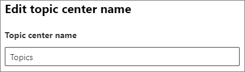

# Change the name of the topic center in Microsoft 365

You can change the name of your topic center in the [Microsoft 365 admin center](https://admin.microsoft.com). You must be a global administrator or SharePoint administrator to perform these tasks.

## To access topics management settings:

1. In the Microsoft 365 admin center, select **Setup**, and then view the **Organizational Knowledge** section.
2. In the **Organizational Knowledge** section, click **Connect people to knowledge**. 

     

3. On the **Connect people to knowledge** page, select **Manage** to open the **Knowledge network settings** pane.

     

4. Select the **Topic center** tab. See the following sections for information about each setting.

##  Update your topic center name

To change the name of the topic center

1. On the **Topic center** tab, under **Topic center name**, select **Edit**.
2. On the **Edit topic center name** page, in the **Topic center name** box, type the new name for your topic center.
3. Select **Save**

      

## See also

[Manage topic discovery in Microsoft 365](topic-experiences-discovery.md)

[Manage topic visibility in Microsoft 365](topic-experiences-knowledge-rules.md)

[Manage topic permissions in Microsoft 365](topic-experiences-user-permissions.md)
