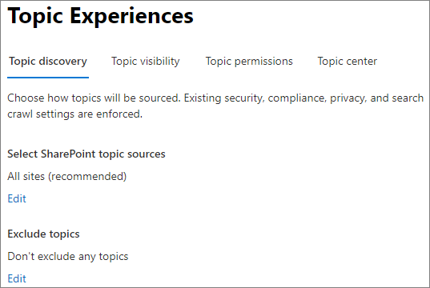
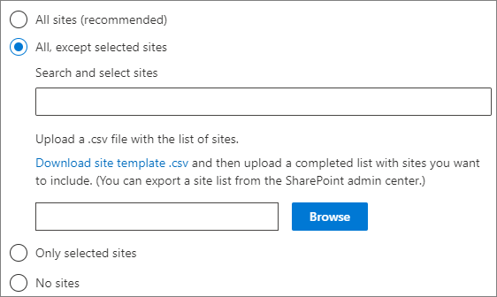

# Manage topic discovery in Microsoft Viva Topics

You can manage topic discovery settings in the [Microsoft 365 admin center](https://admin.microsoft.com). You must be a global administrator or SharePoint administrator to perform these tasks.

## To access topics management settings:

1. In the Microsoft 365 admin center, click **Settings**, then **Org settings**.
2. On the **Services** tab, click **Topic experiences**.

     

3. Select the **Topic discovery** tab. See the following sections for information about each setting.

     

## Select SharePoint topic sources

You can change the SharePoint sites in your organization that will be crawled for topics.

If you want to include or exclude a specific list of sites, you can use the following .csv template:

``` csv
Site name,URL
```

If you add sites using the site picker, they are added to the existing list of sites to include or exclude. If you upload a .csv file, it overwrites any existing list. If you have previously included or excluded specific sites, you and download the list as a .csv file, make changes, and upload the new list.

To choose sites for topic discovery

1. On the **Topic discovery** tab, under **Select SharePoint topic sources**, select **Edit**.
2. On the **Select SharePoint topic sources** page, select which SharePoint sites will be crawled as sources for your topics during discovery. This includes:
    - **All sites**: All SharePoint sites in your tenant. This captures current and future sites.
    - **All, except selected sites**: Type the names of the sites you want to exclude.  You can also upload a list of sites you want to opt out from discovery. Sites created in the future will be included as sources for topic discovery. 
    - **Only selected sites**: Type the names of the sites you want to include. You can also upload a list of sites. Sites created in the future will not be included as sources for topic discovery.
    - **No sites**: Topics won't be automatically generated or updated with SharePoint content. Existing topics remain in the topic center.

    
   
3. Click **Save**.

## Exclude topics by name

You can exclude topics from discovery by uploading a list using a .csv file. If you've previously excluded topics, you can download the .csv, make changes, and upload it again.

1. On the **Topic discovery** tab, under **Exclude topics**, select **Edit**.
2. Click **Exclude topics by name**.
3. If you need to create a list, download the .csv template and add the topics that you want to exclude (see *Working with the .csv template* below). When the file is ready, click **Browse** and upload the file. If there's an existing list, you can download the .csv containing the list.
4. Click **Save**.

    

### Working with the .csv template

You can copy the csv template below:

``` csv
Name (required),Expansion,MatchType- Exact/Partial (required)
```

In the CSV template, enter the following information about the topics you want to exclude:

- **Name**: Type the name of the topic you want to exclude. There are two ways to do this:
    - Exact match: You can exclude the exact name or acronym (for example, *Contoso* or *ATL*).
    - Partial match: You can exclude all topics that have a specific word in it.  For example, *arc* will exclude all topics with the word *arc* in it, such as *Arc circle*, *Plasma arc welding*, or *Training arc*. Note that it will not exclude topics in which the text is included as part of a word, such as *Architecture*.
- **Stands for (optional)**: If you want to exclude an acronym, type the words the acronym stands for.
- **MatchType-Exact/Partial**: Type whether the name you entered was an *exact* or *partial* match type.

     

## See also

[Manage topic visibility in Microsoft 365](topic-experiences-knowledge-rules.md)

[Manage topic permissions in Microsoft 365](topic-experiences-user-permissions.md)

[Change the name of the topic center in Microsoft 365](topic-experiences-administration.md)
