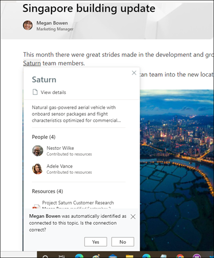
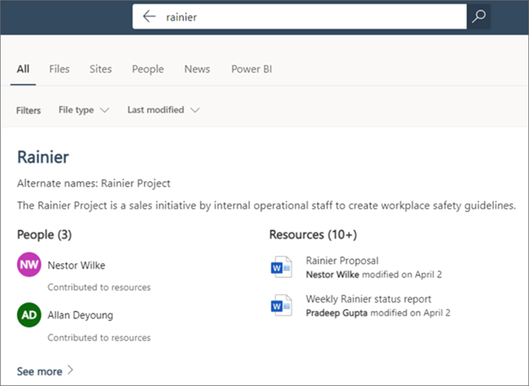
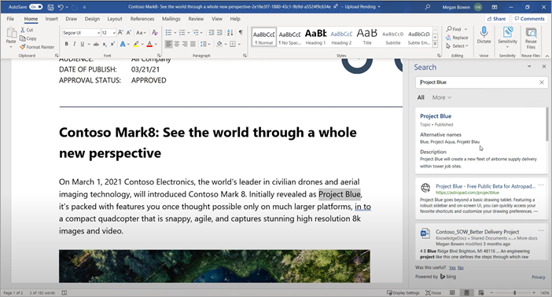
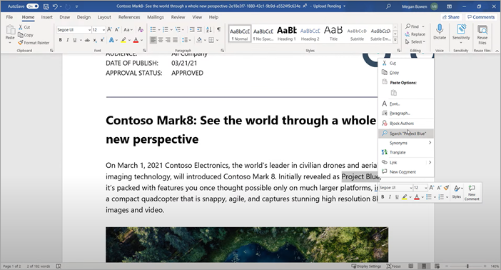

# Microsoft Viva Topics overview 

Viva Topics uses Microsoft AI technology, Microsoft 365, Microsoft Graph, Search, and other components and services to bring knowledge to your users in the Microsoft 365 apps they use everyday, starting with SharePoint modern pages, Microsoft Search, and Search in Word, PowerPoint, Outlook, and Excel.

 

> [!VIDEO https://www.microsoft.com/videoplayer/embed/RE4LhZP]  

 

Viva Topics helps to address a key business issue in many companies — providing the information to users when they need it. For example, new employees need to learn a lot of new information quickly, and encounter terms they know nothing about when reading through company information. To learn more, the user might need to step away from what they are doing and spend valuable time searching for details, such as information about what the term is, who in the organization is a subject matter expert, and maybe sites and documents that are related to the term.

Viva Topics uses AI to automatically search for and identify *topics* in your organization. It compiles information about them, such as a short description, people working on the topic, and sites, files, and pages that are related to it. A knowledge manager or contributor can choose to update the topic information as needed. The topics are available to your users, which means that for every instance of the topic that appears in a modern SharePoint site in news and pages, the text will be highlighted. Users can choose to select the topic to learn more about it through the topic details. Topics can also be found in SharePoint Search.

## How topics are displayed to users

Topics are displayed to users through:

- [Topic highlights](topic-experiences-overview.md#topic-highlights) in SharePoint pages.
- Topic answers in [search results](topic-experiences-overview.md#search-results).
- Search in [office applications](topic-experiences-overview.md#office-application-search).

### Topic highlights

When a topic is mentioned in content on SharePoint news and pages, you'll see it highlighted. You can open the topic summary from the highlight. Open the topic details from the title of the summary to view the full topic page. The mentioned topic could be identified automatically or could have been added to the page with a direct reference to the topic by the page author. 

    

### Search results

You can see a [topic answer](search.md#topic-answer) in search results when you search from your SharePoint home page, search on office.com, or search from a SharePoint site after you you change the search scope to include the full organization. The topic answer will appear at the topic of the results list and give you a short set of information related to that topic. 

    

### Office application search

When you use Search in Office apps such as Word, PowerPoint, Outlook, or Excel — either through the search box or by selecting **Search** in the context menu — topic answers are displayed in the search results.

   

   

## Knowledge indexing

Viva Topics uses Microsoft AI technology to identify *topics* in your Microsoft 365 environment.

A topic is a phrase or term that is organizationally significant or important. It has a specific meaning to the organization, and has resources related to it that can help people understand what it is and find more information about it. There are lots of different types of topics that will be important to your organization. Initially, the Microsoft AI technology focuses on the following types:

- Project
- Event
- Organization
- Location
- Product
- Creative work
- Field of study

When a topic is identified and AI determines that it has enough information for it to be a suggested topic, a *topic page* displays the information that was gathered through topic indexing, such as:

- Alternate names and acronyms.
- A short description of the topic.
- People who might be knowledgeable about the topic.
- Files, pages, and sites that are related to the topic.

Your knowledge admins can choose to crawl all SharePoint sites in your tenant for topics, or to just select certain ones.

For more information, see [Topic discovery and curation](./topic-experiences-discovery-curation.md).

## Roles

When you use Viva Topics in your Microsoft 365 environment, your users will have the following roles:

- Topic viewers: Users who can see topic highlights on SharePoint modern sites that they have at least *Read* access to, and in Microsoft Search. They can select topic highlights to see topic details in topic pages. Topic viewers can provide feedback on how useful a topic is to them.

- Contributors: Users who have rights to edit existing topics or create new ones. Knowledge admins assign contributor permissions to users through the Viva Topics settings in the Microsoft 365 admin center. Note that you can also choose to give all topic viewers the permission to edit and create topics so that everyone can contribute to topics that they see.

- Knowledge managers: Users who guide topics through the topic lifecycle. Knowledge managers use the **Manage topics** page in the topic center to confirm AI-suggested topics, remove topics that are no longer relevant, as well as edit existing topics or create new ones, and are the only users who have access to it. Knowledge admins assign knowledge manager permissions to users through the Viva Topics admin settings in the Microsoft 365 admin center. 

- Knowledge admins: Admins set up Viva Topics and manage it through the admin controls in the Microsoft 365 admin center. Currently, a Microsoft 365 global or SharePoint administrator can serve as a knowledge admin.

For more information, see [Viva Topics roles](topic-experiences-roles.md).

## Topic management

Topic management is done in the **Manage topics** page in your organization's *topic center*. The topic center is created during setup and serves as your center of knowledge for your organization. 

While all licensed users can see topics they're connected with in the topic center, only users with *Manage topics* permissions (knowledge managers) can view and use the **Manage topics** page.

Knowledge managers can:

- Confirm or remove topics that were discovered in your tenant.
- Create new topics manually as needed (for example, if not enough information was provided for it to be discovered through AI).
- Edit existing topic pages.

For more information, see [Manage topics in the topic center](manage-topics.md).  

## Admin controls

Admin controls in the Microsoft 365 admin center allow you to manage Viva Topics. They allow a Microsoft 365 global or SharePoint administrator to:

- Control which users in your organization are allowed to see topics in SharePoint modern pages or in SharePoint search results.
- Control which SharePoint sites will be crawled to identify topics.
- Exclude specific topics from being found.
- Control which users can manage topics in the topic center.
- Control which users can create and edit topics.
- Control which user can view topics.

For more information about admin controls, see [assign user permissions](./plan-topic-experiences.md#user-permissions), [manage topic visibility](./topic-experiences-knowledge-rules.md), and [manage topic discovery](./topic-experiences-discovery.md).

## Topic curation & feedback

AI will continually work to provide you suggestions to improve your topics as changes occur in your environment. 

Users with edit or create topics permissions can make updates to topic pages directly if they want to make corrections or add additional information. They can also add new topics that AI wasn't able to identify. If there's enough information on these manually added topics, and AI is able to identify this type of topic, additional suggestions from AI might enhance these manually added topics.

Users that you allow access to see topics in their daily work might be asked if the topic was useful to them. The system looks at these responses and uses them to improve the topic highlight, and help determine what's shown on topic summaries and in topic details.

Additionally, users with proper permissions can tag items such as Yammer conversation that are relevant to a topic, and add them to a specific topic. 

For more information, see [Topic discovery and curation](./topic-experiences-discovery-curation.md).

## See also

[Use Microsoft Search to find topics in Viva Topics](./search.md)