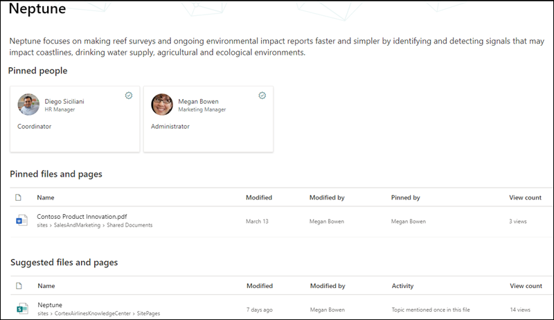
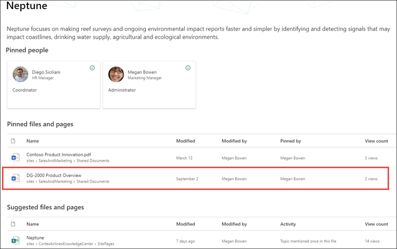

# Microsoft Viva Topics security trimming 

Viva Topics users can't view information in topics that their existing Office 365 permissions prevent them from seeing. Everything a user sees on a topic page (for example, SharePoint sites, documents, files) will be information they are already allowed to see. Viva Topics does not make changes to any existing permissions.

## Why two users may have different views of the same topic

When a topic is created through AI or manual curation, it can contain a description of the topic, alternative names, people associated with the topic, as well as sites, pages, and files related to the topic. When this information is viewed on a topic page, it is possible that two users who are viewing the same topic my not see the same information.
  
For example, when User 1 views the Neptune topic page, they might see this view of the topic page.

   

However, when User 2 looks at the same Neptune topic page, their view differs from User 1.  User 2 is able to see the *DG-2000 Product Overview* file in the **Pinned files and pages** section of the topic page, which does not appear for User 1. 

   

The difference in what users may see on the same topic is because users may not have the Office 365 permissions to view a related site or file.  Viva Topics respects the permissions that are set on items in a topic, and cannot change access to them. In our example, User 1 is not able to view the *DG-2000 Product Overview* file in their topic page for Neptune because User 1 does not have Office 365 permissions to view the file.

If a user is not able to see enough information in a topic for it to be useful, the topic will not be available to the user. When this happens, the user will not see the highlighted topic. A different user who has permissions to more information in the topic for it to be useful, will be able to see the topic.

## Topic permissions for knowledge managers and topic contributors

Users that are assigned permissions to manage topics - knowledge managers - will only be able to view information they have permissions to see within topics.

Similarly, users who have create and edit topic permissions - topic contributors - will only be able to view information they have permissions to see within topics. 

## AI versus manually curated topic information

Topics can contain information generated by AI and information added or edited by topic contributors or knowledge managers.

 - Information in a topic that was added by AI is only visible to people who have access to the source content.
 - Topic description and people information that has been manually added or edited by a topic contributor or knowledge manager is visible to everyone who can see the topic.
 - Files, pages, and sites are only visible to users who have permissions to the source content, whether manually added or added by AI.

The following table describes what users - topic viewers, contributors, and knowledge managers - can see in a given topic based on their permissions.

|Topic item|What users can see|
|:---------|:------------------|
|Topic name|Users can see the topic name of topics in the topic center. Some topics may not be visible if users don't have permissions to the source content or have a low relevancy to the user.|
|Topic description|AI-generated descriptions are visible only to users who have permissions to the source content. Manually entered or edited descriptions are visible to all users.|
|People|Pinned people are visible to all users. Suggested people are only visible to users who have permissions to the source content.|
|Files|Files are only visible to users who have permissions to the source content.|
|Pages|Pages are only visible to users who have permissions to the source content.|
|Sites|Sites are only visible to users who have permissions to the source content.|

## See also

