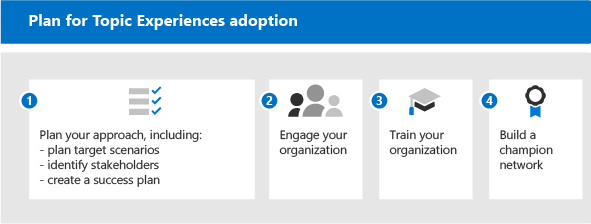
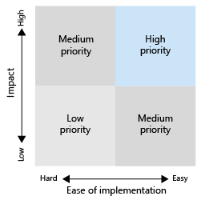

# Get started driving adoption of Microsoft Viva Topics

Before you get started with adoption, you need to understand the concepts involved in knowledge management and Viva Topics. The following diagram shows what happens during topic discovery and curation:

- **Discovery**: Users can discover knowledge in the apps they use every day through topic cards - they can also discover topics in Microsoft Search.
- **Curation**: Subject matter experts (SMEs) refine topics through topic pages, and AI learns from their input. The Topic center contains topic pages that users can explore and experts can manage.
- **Identification**: With Microsoft Graph and Artificial Intelligence (AI) knowledge and people (topics, skills, and so on) are identified and automatically organized into related topics. SharePoint content is indexed with security content.
- **Extension**: With Microsoft Graph content connectors (coming soon), you can ingest knowledge from external services and data repositories.

For more information, you can review the [overview](topic-experiences-overview.md) for an introduction.

Keep in mind that:

- Topic discovery is improved when more content is available.
- The security, privacy, and location of your data is preserved even though the information is presented in a new experience.
- Users need a license to view Viva Topics.
- Discovery is initially on English language content.

To help prepare, think through these questions:

- What content should be used for topic discovery?
- Who will manage topics?
- Who will see topic cards and highlights?
- Which topics are expected?

Review this list of prerequisites for getting the most out of Viva Topics:

|Product or feature |Description |
|:-------|:--------|
|SharePoint Online with modern SharePoint pages |Topic mining only includes content on SharePoint sites, and topic cards can only be surfaced on modern pages.|
|Microsoft Graph |You can control whether topics are included or excluded from Search or Delve with the Microsoft Graph settings. |

## Plan for adoption

To plan for adoption of Viva Topics, you need to:

1. Plan your approach and target scenarios:
    - Think about defining and prioritizing the [scenarios](#target-scenarios).
    - Think about the [stakeholders](#identify-stakeholders) and project team members you need to have involved.  
    - Figure out what business impact you want to drive towards and how you're going to [measure success](#create-a-success-plan).

2. Engage your organization:
    - Identify the business groups and business teams that need to be involved and gain alignment across those and the scenarios that you're planning.
    - Start thinking about how to engage some early adopters to get critical, early feedback so you can iterate to get to the best solution.
    - Start building the community and think about how Viva Topics can be used across your organization by these different groups.

3. Train your organization: Most people will intuitively understand the concept of topics and how topic cards compile relevant information, and understand and see the value. But you might want to create training that is tailored to your own culture and organization, to show how you want Viva Topics to be used. Some training resources:
    - [Project Cortex Resource Center](https://aka.ms/projectcortex). Includes overviews and feature information, recorded office hour videos and presentations, and information about partners and their offerings.
    - Coming soon, training videos and help for end users.

4. [Build a champion network](#build-a-champion-network):
    - You might have communities of practice or champion networks already in place. These are great ways to socialize and evangelize and get peers involved in helping each other. And they can share success stories which can be valuable. They can offer advice and generate excitement.

### Target scenarios

Determine how you want to use Viva Topics in your organization so that you use them successfully. Here are a few scenarios where knowledge management and topics can help your organization:

- Role onboarding & training: Understanding a new organization's terminology, key projects, and culture are important steps in onboarding. Easy discovery of topics can help new employees ramp up on new job, roles, or projects quickly.
- Expertise finding and information sharing: When topics are managed and shared, people in your organizations can more easily find information and experts to help them in their day to day work.
- Expanded decision making and improved time to market: When information and experts are easy to reach, you can make decisions more easily and shave time off projects.

#### Example scenario for role onboarding

An HR manager needs to provide information to new employees that will help them quickly onboard to the company and their teams. They want to point them to the correct resources, documents, and team members that they’ll need to onboard quickly and efficiently. They’re looking for a solution that allows the new employee to quickly find the information they need without having to search across multiple repositories or leave the applications they’re already using.

For example:

- An employee (Jordan) is taking on a new role, or has been newly hired and is just starting with a role. Jordan wants to get involved and productive as quickly as possible. But Jordan also needs help with finding a starting place.
- A colleague (Kim) who was in the role before Jordan created topic pages that can help out new employees and anyone else looking for that information.
- Kim was an SME and had permissions to look at unconfirmed topic pages. Unconfirmed topic pages are great starting points for what the AI has discovered and created, and Kim was able to edit them to add expert resources, definitions, and pin other resources.
- As Jordan reads through a new post on SharePoint, they see a topic highlight, and hover over it to quickly get a definition of the term and who to contact with more questions. Before, Jordan might have had to hunt around for this information and contact colleagues to see who to ask about something.
- Exposing this information through topics can be powerful, because although this information may have been available before, it might have been siloed and hard to find. Bringing it into the applications that Jordan is using and helping them find these experts can also drive a sense of engagement and community. It can also help them feel more empowered when dealing with the new role.

When you automate this scenario, you can ensure that:

- New employees can quickly connect with the right people on the right projects.
- New employees have instant access to the latest project information within the flow of their work.
- Search times are greatly reduced.
- Onboarding times are greatly reduced.

#### Example scenario for customer call center

You can enable customer service to quickly find files and experts to help out with unusual tax questions and quickly document the answer for others to easily access with Viva Topics.

For example, a support representative needs to quickly find knowledge base articles, documents and policies so that they can support customers. They want to find the right information at the right time, without having to manually sift through several data bases, repositories, or applications, or dispatching a call. And they're looking for a solution that allows them to remain within their main call prompt and access policies, regulations, and guidelines in the flow of their conversations, so they can quickly respond to questions and update the case.

When you automate this scenario with Viva Topics, you can ensure that:

- Support call times are reduced.
- Escalations to 2nd and 3rd tier support are reduced.
- Number of call-backs on a given case are reduced.
- Customer satisfaction is increased.

#### Prioritize your scenarios

After you identify your scenarios, you can prioritize the scenarios:

One way to prioritize them is to plot out your scenarios in a grid showing impact vs. ease of implementation. Look for scenarios that have both high impact and are easy to implement and make those ones your top priority. Low impact and hard-to-implement scenarios are your lowest priority. When you have a quick win with a high impact, easy-to-implement scenario, it helps people get excited and see the possibilities of using topics.

Pick a couple of key scenarios to focus on initially, work with your early adopters to get some feedback, and then roll out in stages. This way you can iterate, make improvements, and gain feedback so you can grow adoption over time.

### Identify stakeholders

Identify the stakeholders for your project. The key roles are the Executive sponsor, Success owner, and Champions.

|Role |Responsibilities |Department |
|:-------|:-------|:--------|
| Executive sponsor(s)   | Communicate high-level vision and values to the company   |  Executive leadership   |
| Project lead(s) | Oversee the entire launch execution and rollout process | Project management |
| Knowledge administrators| Set up and configure Viva Topics | IT department |
| Knowledge managers | Manage topics and oversee the taxonomy | Any department |
| Taxonomy managers | Oversee the taxonomy | Any department |
| Subject-matter experts and topic contributors | Generate or review topics and descriptions | Any department |
| Champions | Help evangelize and manage objection handling | Any department (staff) |
| Tenant administrator | Configure tenant-level settings | IT department |
| Power Platform administrator| Configure common data services environment | IT department |
| Search administrator or manager | Configure search settings | IT department |

In a larger organization, you might also have multiple people in these roles, and you'll need to drive coordination amongst them. In a smaller company, a single person might perform several of these roles. Different roles might be more involved in different phases of the project. For example, Tenant administrators are more involved in setting up the features, while Subject-matter experts and Champions don't get involved until you start defining topics.
 
Though we recommend having each of these roles fulfilled throughout your rollout, you may find that you don't require them all to get started with your identified solution.

### Create a success plan

Use these indicators to measure the success of Viva Topics in your organization. Look at:

1. Topic usage:
      - Topic impressions
      - Quantity of topics – both confirmed and unconfirmed in your curated topic list.
      - Number of published topic pages.
1. End-user feedback from topic cards.
1. Do employee satisfaction surveys. Viva Topics should improve employees' ability to find information, so find ways to gather their input and feedback on that experience.
1. Positive impact to search analytics. Because topics appear in the search experience, over time you might see lowered rates of abandoned searches because people are more easily able to find the topics in search. 

### Build a champion network

Build a champion network in your organization. Champions are important because they can:

- Create a circle of influence within their teams
- Drive topic management & maintenance

You can recruit champions from different roles – Knowledge Managers and subject-matter experts.

Lots of champion networks use Yammer as their platform. In Yammer, people can post questions and get answers, and share success stories. It's hard to get the word out alone, so you can rely on the network of people throughout your company to offer advice to their peers and show how their team is using Viva Topics so other teams can think about their own scenarios.

Some organizations are using hackathons (formal or informal, virtual or in person) to gather groups of people to work on a specific project. For example, you could gather your subject-matter experts and have them work together to curate a set of topic pages.

Think about how you can recognize your champions. Reward their activities, give them some recognition, and generate a visible community feeling and engagement so that they feel like they're contributing to something and they're also getting something back from their investments.

Now that you're ready to roll out, you want to make sure that you're encouraging ongoing engagement.

- Maintain active Yammer groups for your champions.
- Share success stories.
- Periodically host engagement events to share stories or introduce new features.
- Set challenges for people and run competitions.

## Next steps

When you're ready to roll out Viva Topics, you'll need to get people involved.

- Start introducing the feature set and getting them to think about their scenarios.
- Gather the stakeholders and create scenarios.
- Drive the community and think about how you're going to engage them.
- Then complete preparation steps. Some may be technical readiness, and some business readiness.
- Finally, socialize and promote.
