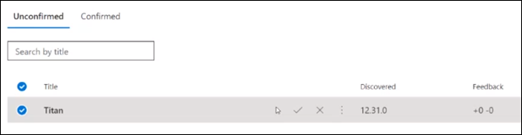
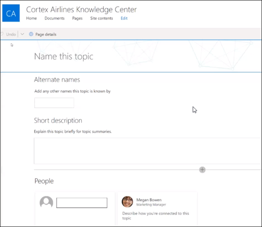

# Work with topics in the Topic Center (Preview)

> [!Note] 
> The content in this article is for Project Cortex Private Preview. [Find out more about Project Cortex](https://aka.ms/projectcortex).

In the Project Cortex Topic Center, a knowledge manager can review topics that have been mined and discovered in the SharePoint source locations you specified, and can either confirm or reject them. A knowledge manager can also create and publish new topic pages if one was not found in topic discovery, or edit existing ones if they need to be updated.

## Requirements

In order to work in the topic center, you need to have the required permissions. Your admin can add you during [knowledge management setup](set-up-knowledge-network.md), or new users can be [added afterwards](give-user-permissions-to-the-topic-center.md).

Topic center users can be given two sets of permissions:

- Create and edit topics: Create new topics or update topic content such as the description, documents and associated persons
- Manage topics: Use the Topic management dashboard to review topics across the organization. Users can perform actions such as confirm and reject topics

## Review unconfirmed topics

On the Knowledge Center home page, topics that were discovered in your specified SharePoint source locations will be listed in the **Unconfirmed** tab. A user with permissions to manage topics can review unconfirmed topics and choose to confirm or reject them.

To review an unconfirmed topic:

1. On the **Unconfirmed** tab, select the topic to open the topic page. 

      

1. On the topic page, review the topic page, and select **Edit** if you need to make any changes to the page.
2. On the Knowledge Center home page, for the selected topic, you can: 
    a. Select the check to confirm that you want to keep the topic. 
    b. Select the x if you want to reject the topic. 

    Confirmed topics will be removed from the **Unconfirmed** list and will now display in the **Confirmed** tab. 

    Rejected topics will be removed from the **Unconfirmed** list and will now display in the **Rejected or Excluded** tab. 
    
   
## Create a new topic

A user with create or edit topic permissions can create a new topic if needed. You might need to do this if the topic was not discovered through discovery or if the AI technology did not find enough evidence to establish it as a topic.

To create a new topic:
1. On the Knowledge Center page, select **New**, then select **Topic Page**. 

      

2. On the new topic page, you can fill in the information on the new topic template: 
    a. In the **Name this topic** section, type the name of the new topic. 
    b. In the **Alternate names** section, type names or acronyms that are also used to refer to the topic. 
    c. In the **Short description** section, type a one or two sentence description of the topic. This text will be used for the associated topic card. 
    d. In the **People** section, type the names of subject matter experts for the topic. 
    e. In the **Files and pages** section, select **Add** and then on the next page you can select associated OneDrive files or SharePoint Online pages. 
    f. In the **Sites** section, select **Add**. In the  **Sites** pane that displays, select the sites that are associated to the topic. 

      
3. When you are done, select **Publish** to publish the topic page. Published topic pages will display in the **Pages** tab.

> [!Note] 
> The new topic page is made up of web parts that are *knowledge network aware*. This means that as AI gathers more information on the topic, the information in these web parts will be updated with suggestions to make the page more useful to users.

Efren's note: Need info about user canvas. Check for latest info on this.

## Edit an existing topic page

Existing topic pages can be found in the **Pages** page. 

1. On the Topic Center page, select **Pages**.
2. On the **Pages** page, you will see a list of topic pages. Use the Search box to find the topic page you want to update. Click on the name of the topic page that you want to edit.
3. On the topic page, select **Edit**. 
4. Make the changes you need to the page. This includes updates to the following fields: 
    a. Alternate names 
    b. Description 
    c. People 
    d. Files and pages 
    e. Sites 
    You can also add static items to the page - such as text, images, or link - by selecting the canvas icon (show image of icon).
5. Select **Republish** to save your changes.

## See also

  

