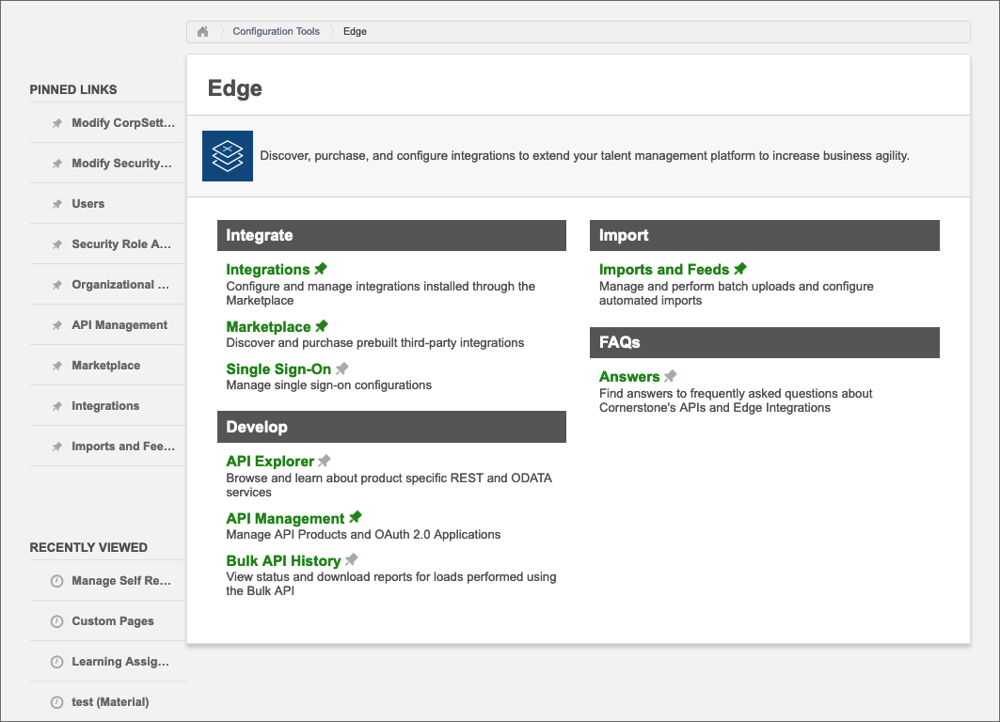
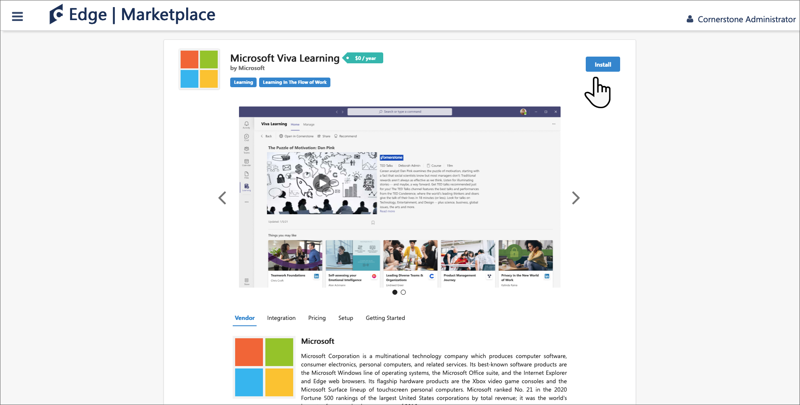

# Configure Cornerstone OnDemand as a content source for Microsoft Viva Learning

This article shows you how to configure Cornerstone OnDemand as a third-party learning content source in Viva Learning. First you'll need to enable Viva Learning and get your details from your Cornerstone Portal. Then you'll need to complete configuration in your Microsoft 365 admin center.

>[!NOTE]
>Content accessible through Viva Learning is subject to terms other than the Microsoft Product Terms. Cornerstone OnDemand content and any associated services are subject to Cornerstone OnDemand's privacy and service terms.

## Configure in your Cornerstone Portal

1. Log in to your Cornerstone Portal as an admin.

    

2. Choose **Edge**.

    

3. Go to **Marketplace** and search for Viva.

    

4. Select the Viva Learning tile.

    

5. Choose **Install**.

    

6. Check the box to confirm you agree to the Terms and Conditions, and choose **Install**.

    

7. Select **Configure Now**.

    

8. Copy the Client ID, Secret, Portal name, and base URL. Then go back and search for Viva.

    

9. Slide the toggle to enable Viva Learning integration.

    

## Configure in your Microsoft 365 admin center

1. Log in to your [Microsoft 365 admin center](https://admin.microsoft.com).
2. Navigate to **Settings**, then **Org settings**. Select Viva Learning, and enable Cornerstone OnDemand in the panel.
3. Fill in the configuration details that you retrieved from your Cornerstone Portal.

    >[!NOTE]
    >The display name is the name of the carousel under which Cornerstone learning content will appear for your organization in Viva Learning. If you don't enter a name, it will display the default name "Cornerstone OnDemand".

4. Select **Save** to activate Cornerstone content in Viva Learning. It may take up to 24 hours for the content to display in the Viva Learning app.

>[!NOTE]
>Currently, all the users within an organization can discover all the tenant-specific courses but they will only be able to consume the courses that they have access to. User-specific content discovery based on roles and permissions is planned for future releases.
